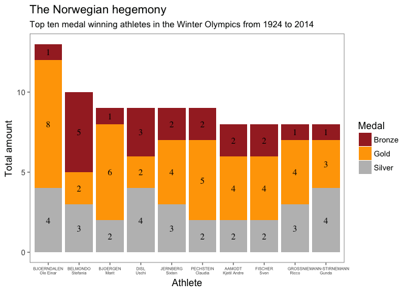

Winter Olympics Medals over Time
================================


## Scenario

Imagine you are the data scientist at a respected media outlet -- say the "New York Times". For the Winter Olympics coverage, your editor-in-chief asks you to analyze some data on the history of `Winter Olympics Medals by Year, Country, Event and Gender` and prepare some data visualizations in which you outline the main patterns around which to base the story.

Since there is **no way that all features of the data can be represented** in such a memo, feel free to pick and choose some patterns that would make for a good story -- outlining important patterns and presenting them in a visually pleasing way. 

The full background and text of the story will be researched by a writer of the magazine -- your input should be based on the data and some common sense (i.e. no need to read up on this). 

Provide **polished plots** that are refined enough to include in the magazine with very little further manipulation (already include variable descriptions [if necessary for understanding], titles, source [e.g. "International Olympic Committee"], right color etc.) and are understandable to the average reader of the "New York Times". The design does not need to be NYTimes-like. Just be consistent.

## Data

The main data is provided as an excel sheet, containing the following variables on all medal winners in all winter olympics from 1924 to 2014:

  - `Year`: year of the winter olympics  
  - `City`: city the olympics is held  
  - `Sport`: the type of sport   
  - `Discipline`: a grouping of disciplines  
  - `Event`:	the particular event / competition  
  - `Athlete`: name of the athlete  
  - `Country`: country origin of the athlete  
  - `Gender`: gender of the athlete  
  - `Medal`: type of medal won

For example, an `event` is a competition in a sport or discipline that gives rise to a ranking. Thus, _skiing_ is a `sport`, while _cross-country skiing, Alpine skiing, snowboarding, ski jumping_ and _Nordic combined_ are `disciplines`. _Alpine skiing_ is a `discipline`, while the _super-G, giant slalom, slalom_ and _combined_ are `events`.

In addition, you are provided with some additional information about the countries in a separate spreadsheet, including the `IOC Country	Code`, `Population`, and `GDP per capita`.


```r
winter <- read_csv('winter.csv', col_names = TRUE)
dictionary <- read_csv('dictionary.csv', col_names = TRUE)

colnames(dictionary)[1] <- "Country_full"
```

## Tasks

#### 1. Medal Counts over Time

Combine the information in the two spreadsheets `winter.csv` and `dictionary.csv`. Note, that the `dictionary.csv` is the set of current countries. You have to decide what to do with some [countries that competed under different designations in the past (e.g. Germany and Russia)](https://en.wikipedia.org/wiki/All-time_Olympic_Games_medal_table) and some defunct countries and whether and how to combine their totals.


```r
combined <- merge(winter, dictionary, by.x = "Country", by.y = "Code")
```

Calculate a summary of how many winter games each country competed in, and how many medals of each type the country won. Use that summary to provide a **visual comparison of medal count by country**. 


```r
summary_games_wide <- combined %>%
  group_by(Country_full, Medal) %>%
  tally() %>%
  spread(Medal, n) %>%
  replace(is.na(.), 0) %>% 
  as.data.frame() %>%
  mutate(Total = rowSums(.[2:4])) %>%
  arrange(desc(Total)) %>%
  select(Country = Country_full, Total, Gold, Silver, Bronze)
```

Feel free to focus on smaller set of countries (say top 10), highlight the United States or another country of your choice, consider gender of the medal winners etc. to make the visualization interesting. Please provide one visualization showing an over time comparison and one in which a total medal count (across all Winter Olympics) is used. Briefly discuss which visualization you recommend to your editor and why.

**Below are three visualizations of the success of countries in the Winter Olympics. The first one is a simple barplot, with the total amount of medals divided into medal types by colour in each bar. I added counts on the bars, to make the graph more legible. The second visualization shows the medals won by the five most successful countries over time. While doing this graph, I noticed something odd: all countries started winning a lot more towards the end of the 20th century. To clarify the issue, I made a graph with all the medals over time and, indeed, the amount of medals awarded has been rising steeply since the 1980s. With this in mind, the total amount of medals won is a slightly inaccurate measure of success. I instead calculated the share that of all medals that a country has won during a given year and plotted this in a similar fashion to the facetted plot on country success over time. This last graph in combination with the graph on the total amount of medals awarded over time would make an interesting article by itself and I would recommend it to the visual editor of any magazine covering the Winter Olympics in 2018.**


```r
summary_games_long <- summary_games_wide %>%
  gather(key = Medal, 
         value = Number, Total, Gold, Silver, Bronze) %>%
  arrange(desc(Medal), desc(Number))

top_countries <- summary_games_long[1:10,1]
summary_games_long <- summary_games_long %>% 
  filter(Medal != "Total")

ggplot(subset(summary_games_long, Country %in% top_countries), 
       aes(x = reorder(Country,-Number), fill = Medal)) + 
  geom_bar(stat="identity", aes(y = Number)) + 
  labs(title = "The rugged ten", 
       subtitle = "Top ten medal winning countries in the Winter Olympics from 1924 to 2014", 
       x = "County", y = "Total amount") +
  scale_fill_manual(values = c("brown", "orange", "gray")) +
  geom_text(aes(x = Country, y = Number, label = Number), 
            position = position_stack(vjust = 0.5), family =  "serif") +
  theme_tufte()
```

<!-- -->


```r
top_five_countries <- summary_games_long[1:5,1]

medals_per_year <- combined %>%
  group_by(Country_full, Year) %>%
  arrange(Country_full, Year) %>%
  tally() %>%
  as.data.frame() %>%
  select(Country = Country_full, Year, Medals = n)

ggplot(subset(medals_per_year, Country %in% top_five_countries), aes(x = Year, y = Medals, color = Country)) +
  geom_line() +
  facet_grid(Country ~. , scales = "free", space = "free") +
  labs(y = "Medals per year", x = "Olympic year") +
  scale_x_continuous(breaks = medals_per_year$Year) +
  theme_few() +
  theme(axis.text.x = element_text(size = 7, angle = 90), 
        strip.text.y = element_text(size = 8, angle = 90)) +
  scale_y_continuous(limits = c(0,100))
```

<!-- -->


```r
total_medals_per_year <- combined %>%
  group_by(Year, Medal) %>%
  group_by(Year) %>%
  tally() %>%
  as.data.frame()

ggplot(total_medals_per_year, aes(x = Year, y = n)) +
  geom_line() +
  labs(y = "Medals per year", x = "Olympic year") +
  theme_few()
```

<!-- -->


```r
share_of_medals_per_year <- setNames(data.frame(matrix(ncol = 3, nrow = 0)), c("Country", "Year", "Share"))

for(row in 1:nrow(medals_per_year)) {
  share_of_medals_per_year[row, 1] <- medals_per_year[row, 1]
  share_of_medals_per_year[row, 2] <- medals_per_year[row, 2]
  share_of_medals_per_year[row, 3] <- medals_per_year[row, 3] / total_medals_per_year[total_medals_per_year$Year == medals_per_year[row, 2],2]
}
  
ggplot(subset(share_of_medals_per_year, Country %in% top_five_countries), aes(x = Year, y = Share*100, color = Country)) +
  geom_line() +
  facet_grid(Country ~. , scales = "free", space = "free") +
  labs(y = "Medals per year (%)", x = "Olympic year") +
  scale_x_continuous(breaks = share_of_medals_per_year$Year) +
  theme_few() +
  theme(axis.text.x = element_text(size = 7, angle = 90), 
        strip.text.y = element_text(size = 8, angle = 90))
```

<!-- -->

#### 2. Medal Counts adjusted by Population, GDP

There are different ways to calculate "success". Consider the following variants and choose one (and make sure your choice is clear in the visualization):  
  - Just consider gold medals.  
  - Simply add up the number of medals of different types.    
  - Create an index in which medals are valued differently. (gold=3, silver=2, bronze=1).   
  - A reasonable other way that you prefer.
  
Now, adjust the ranking of medal success by (a) GDP per capita and (b) population. You have now three rankings: unadjusted ranking, adjusted by GDP per capita, and adjusted by population.


```r
weighted_success <- setNames(data.frame(matrix(ncol = 2, nrow = 0)), c("Country", "Score"))

for(row in 1:nrow(summary_games_long)) {
  weighted_success[row, 1] <- summary_games_long[row, 1]
  
  if(summary_games_long[row, 2] == "Gold"){
    weighted_success[row, 2] <- summary_games_long[row, 3]*3
  }
  if(summary_games_long[row, 2] == "Silver"){
    weighted_success[row, 2] <- summary_games_long[row, 3]*2
  }
  if(summary_games_long[row, 2] == "Bronze"){
    weighted_success[row, 2] <- summary_games_long[row, 3]*1
  }
}

weighted_success <- weighted_success %>%
  group_by(Country) %>%
  tally(Score) %>%
  as.data.frame() %>%
  select(Country, Score = n)
```


```r
countries_pop_gdp <- combined %>%
  group_by(Country_full, Population, `GDP per Capita`) %>%
  select(Country = Country_full, Population, GDP_pC = `GDP per Capita`) %>%
  unique()

success_by_pop_gdp <- setNames(data.frame(matrix(ncol = 3, nrow = 37)), 
                               c("Country", "Score_pop","Score_GDP"))

success_by_pop_gdp$Country <- countries_pop_gdp$Country
success_by_pop_gdp$Score_pop <- (weighted_success$Score / countries_pop_gdp$Population)*10000
success_by_pop_gdp$Score_GDP <- (weighted_success$Score / countries_pop_gdp$GDP_pC)*1000

success_by_pop <- success_by_pop_gdp %>%
  arrange(desc(Score_pop))

success_by_GDP <- success_by_pop_gdp %>%
  arrange(desc(Score_pop))
```


```r
ggplot(success_by_pop[1:10,], 
       aes(x = reorder(Country,-Score_pop))) + 
  geom_bar(stat="identity", aes(y = Score_pop), fill = "#A5F2F3") + 
  theme_few() +
  labs(title = "Estonia and Luxembourg – supreme rulers of the Winter Olympics?", 
       subtitle = 
         "Top ten medal winning countries weighted by population in the Winter Olympics from 1924 to 2014", 
       x = "County", y = "Score weighted by population") +
  theme(axis.text.x = element_text(size = 10, angle = 90))
```

<!-- -->

```r
ggplot(success_by_GDP[1:10,], 
       aes(x = reorder(Country,-Score_GDP))) + 
  geom_bar(stat="identity", aes(y = Score_GDP), fill = "#4DC5D6") + 
  theme_few() +
  labs(title = "A very different top 10 for the Winter Olympics", 
       subtitle = 
         "Top ten medal winning countries weighted by GDP in the Winter Olympics from 1924 to 2014", 
       x = "County", y = "Score weighted by GDP") +
  theme(axis.text.x = element_text(size = 10, angle = 90))
```

<!-- -->

Visualize how these rankings differ. Feel free to highlight a specific pattern (e.g. "Slovenia -- the hidden star of the Winter Olympics" or "The superpowers losing their grip").

#### 3. Host Country Advantage

Until the 2014 Winter Olympics (our data ends here), there were 19 host cities. Calculate whether the host nation had an advantage. That is calculate whether the host country did win more medals when the Winter Olympics was in their country compared to other times. 

Note, that the 19 host cities are noted in the data but not that the countries they are located in. This happens commonly and often Wikipedia has the [kind of additional data you want for the task](https://en.wikipedia.org/wiki/Winter_Olympic_Games). To save you some time, here is a quick way to get this kind of table from Wikipedia into R:


```r
wiki_hosts <- read_html("https://en.wikipedia.org/wiki/Winter_Olympic_Games")
hosts <- html_table(html_nodes(wiki_hosts, "table")[[5]], fill=TRUE)
hosts <- hosts[-1,1:3]
hosts$city <- str_split_fixed(hosts$Host, n=2, ",")[,1]
hosts$country <- str_split_fixed(hosts$Host, n=2, ",")[,2]

# Added code to remove the games that were cancelled due to WW II
hosts <- hosts[-c(5, 6), ]
#There was an extra space in the coutry names
hosts$country <- substring(hosts$country, 2)
hosts <- filter(hosts, Year < 2018)
```

Provide a visualization of the host country advantage (or abscence thereof). 

**The issue of advantage is difficult to visualize, due to the large amounts of data you would have to crosstabulate (hosting and winning). I chose to focus on a few countries and found ambigious evidence. The below graph clearly shows that the US has excelled during most games that have been hosted here. Russia had tremendous success during the 2014 games in Sochi, but this has been connected to an epic doping scandal. France seems to have had somewhat greater success during hosted games and Canada seems to provide inconclusive evidence, peaking during one hosted game and doing worse during another. Again, the graph on relative medals won might be more useful: In this case it corroborates the evidence for the US and shows that France has done actually much better when hosting games, while keeping the evidence inconclusive for Canada. All in all, the picture gets a bit clearer.**


```r
ggplot(subset(medals_per_year, Country %in% c("France", "United States", "Canada", "Russia")), aes(x = Year, y = Medals, color = Country)) +
  geom_line() +
  geom_vline(xintercept = as.integer(hosts[hosts$country == c("France"), 2]), lty=2, color = "yellow3") +
  geom_vline(xintercept = as.integer(hosts[hosts$country == c("United States"), 2]), lty=2, color = "violet") +
  geom_vline(xintercept = as.integer(hosts[hosts$country == c("Canada"), 2]), lty=2, color = "red") +
  geom_vline(xintercept = as.integer(hosts[hosts$country == c("Russia"), 2]), lty=2, color = "turquoise4") +
  facet_grid(Country ~. , scales = "free", space = "free") +
  theme(axis.text.x = element_text(size = 7, angle = 90), 
        strip.text.y = element_text(size = 8, angle = 90)) +
  scale_y_continuous(limits = c(0,100)) +
  labs(y = "Medals per year", x = "Olympic year", title = "Hosting for the wins?", subtitle = "The relationship between hosting the Winter Olympics and winning medals.") +
  theme_few()
```


```r
ggplot(subset(share_of_medals_per_year, Country %in% c("France", "United States", "Canada", "Russia")), aes(x = Year, y = Share*100, color = Country)) +
  geom_line() +
  geom_vline(xintercept = as.integer(hosts[hosts$country == c("France"), 2]), lty=2, color = "yellow3") +
  geom_vline(xintercept = as.integer(hosts[hosts$country == c("United States"), 2]), lty=2, color = "violet") +
  geom_vline(xintercept = as.integer(hosts[hosts$country == c("Canada"), 2]), lty=2, color = "red") +
  geom_vline(xintercept = as.integer(hosts[hosts$country == c("Russia"), 2]), lty=2, color = "turquoise4") +
  facet_grid(Country ~. , scales = "free", space = "free") +
  theme(axis.text.x = element_text(size = 7, angle = 90), 
        strip.text.y = element_text(size = 8, angle = 90)) +
  labs(y = "Share of medals per year (%)", x = "Olympic year", title = "Hosting for the wins?", subtitle = "The relationship between hosting the Winter Olympics and winning medals.") +
  theme_few()
```

#### 4. Country success by sport / discipline / event

As a last country level comparison, let's consider comparing countries' success by looking at particular sports, disciplines, and/or events. Make a choice of which kind of comparison reveals some interesting comparison here. Feel free to focus on a subset of data (say one specific sport), only look at a single country etc. 


```r
finland_data <- combined %>%
  filter(Country_full == "Finland") %>%
  group_by(Discipline, Year) %>%
  tally() %>%
  as.data.frame() %>%
  select(Discipline, Year, Medals = n)
  

ggplot(finland_data, aes(x = Year, y = Medals)) +
  geom_bar(stat = "identity", aes(fill = Discipline, colour = I("black"))) +
  #facet_grid(Discipline ~. , scales = "free", space = "free") +
  theme(axis.text.x = element_text(size = 7, angle = 90), 
        strip.text.y = element_text(size = 8, angle = 90)) +
#  geom_text(aes(x = Year, y = Medals, label = Medals), 
#        position = position_stack(vjust = 0.5), family =  "serif") +
  labs(title = "Ice hockey gives the goods", 
       subtitle = "Finnish medals in the winter olympics from 1924 to 2014.\nThe amount has gone up steeply with Ice hockey wins since the 1990s.", 
       x = "Athlete", y = "Total amount") +
  labs(y = "Medals per year", x = "Olympic year") +
  scale_fill_brewer(palette = "Paired") +
  theme_few()
```

<!-- -->

#### 5. Most successful athletes

Now, let's look at the most successful athletes. Provide a visual display of the most successful athletes of all time. Consider using other information on gender, sport, discipline, event, year, and country to make the display more informative.


```r
most_successful_athletes_wide <- combined %>%
  group_by(Athlete, Medal) %>%
  tally() %>%
  spread(Medal, n) %>%
  as.data.frame() %>%
  mutate(Total = rowSums(.[2:4])) %>%
  arrange(desc(Total))

most_successful_athletes_long <- most_successful_athletes_wide %>%
  gather(key = Medal, 
         value = Number, Total, Gold, Silver, Bronze) %>%
  arrange(desc(Medal), desc(Number))

top_athletes <- most_successful_athletes_long[1:10,1]

most_successful_athletes_long$Athlete <- gsub(", ", "\n", most_successful_athletes_long$Athlete)
top_athletes_formatted <- most_successful_athletes_long[1:10,1]

most_successful_athletes_long <- most_successful_athletes_long %>% 
  filter(Medal != "Total")

ggplot(subset(most_successful_athletes_long, Athlete %in% top_athletes_formatted), 
       aes(x = reorder(Athlete,-Number), fill = Medal)) + 
  geom_bar(stat="identity", aes(y = Number)) + 
  labs(title = "The Norwegian hegemony", 
       subtitle = "Top ten medal winning athletes in the Winter Olympics from 1924 to 2014", 
       x = "Athlete", y = "Total amount") +
  scale_fill_manual(values = c("brown", "orange", "gray")) +
  geom_text(aes(x = Athlete, y = Number, label = Number), 
            position = position_stack(vjust = 0.5), family =  "serif") +
  theme_few() +
  theme(axis.text.x = element_text(size = 5))
```

<!-- -->


```r
athlete_medals_per_year <- combined %>%
  group_by(Athlete, Year) %>%
  arrange(Athlete, Year) %>%
  tally() %>%
  as.data.frame() %>%
  select(Athlete, Year, Medals = n)

ggplot(subset(athlete_medals_per_year, Athlete %in% top_athletes), aes(x = Year, y = Medals, color = Athlete)) +
  geom_line() +
  labs(title = "The millennial triumph?", 
       subtitle = "Most top medal winning athletes have competed in the new millenium, \nbut this might also indicate how the amount of sports and medals has \ngone up dramatically since 1980.", 
       x = "Year", y = "Total amount") +
  scale_x_continuous(breaks = pretty(athlete_medals_per_year$Year, n = 25)) +
  theme_few()
```

<!-- -->

### Interactivity

#### 6. Make two plots interactive

Choose 2 of the plots you created above and add interactivity. Briefly describe to the editor why interactivity in these visualization is particularly helpful for a reader.

**I wanted to implement two charts with a lot of information as interactive. The first one shows how many medals the top 10 medal winning athletes have won from year to year. There are a lot of lines in the graph and having some interactivity would definitely help the user focus on the most essential parts. The second one is the graph with the Finnish medals for all the Winter Olympics. The bars in this chart pile up a lot of information, which makes it useful for grasping the big picture but a bit confusing when trying to focus on any detail. Adding interactivity should make it easier for the user to review victories in any given year.**


```r
p1 <- ggplot(subset(athlete_medals_per_year, Athlete %in% top_athletes), aes(x = Year, y = Medals, color = Athlete)) +
  geom_line() +
  labs(title = "The millennial triumph?", 
       subtitle = "Most top medal winning athletes have competed in the new millenium, \nbut this might also indicate how the amount of sports and medals has \ngone up dramatically since 1980.", 
       x = "Year", y = "Total amount") +
  scale_x_continuous(breaks = pretty(athlete_medals_per_year$Year, n = 25)) +
  theme_few()


ggplotly(p1)
```

<!--html_preserve--><div id="19794faef358" style="width:672px;height:480px;" class="plotly html-widget"></div>
<script type="application/json" data-for="19794faef358">{"x":{"data":[{"x":[1992,1994,2002,2006],"y":[2,3,2,1],"text":["Year: 1992<br />Medals: 2<br />Athlete: AAMODT, Kjetil Andre","Year: 1994<br />Medals: 3<br />Athlete: AAMODT, Kjetil Andre","Year: 2002<br />Medals: 2<br />Athlete: AAMODT, Kjetil Andre","Year: 2006<br />Medals: 1<br />Athlete: AAMODT, Kjetil Andre"],"type":"scatter","mode":"lines","line":{"width":1.88976377952756,"color":"rgba(248,118,109,1)","dash":"solid"},"hoveron":"points","name":"AAMODT, Kjetil Andre","legendgroup":"AAMODT, Kjetil Andre","showlegend":true,"xaxis":"x","yaxis":"y","hoverinfo":"text","frame":null},{"x":[1992,1994,1998,2002],"y":[3,2,2,3],"text":["Year: 1992<br />Medals: 3<br />Athlete: BELMONDO, Stefania","Year: 1994<br />Medals: 2<br />Athlete: BELMONDO, Stefania","Year: 1998<br />Medals: 2<br />Athlete: BELMONDO, Stefania","Year: 2002<br />Medals: 3<br />Athlete: BELMONDO, Stefania"],"type":"scatter","mode":"lines","line":{"width":1.88976377952756,"color":"rgba(216,144,0,1)","dash":"solid"},"hoveron":"points","name":"BELMONDO, Stefania","legendgroup":"BELMONDO, Stefania","showlegend":true,"xaxis":"x","yaxis":"y","hoverinfo":"text","frame":null},{"x":[2002,2010,2014],"y":[1,5,3],"text":["Year: 2002<br />Medals: 1<br />Athlete: BJOERGEN, Marit","Year: 2010<br />Medals: 5<br />Athlete: BJOERGEN, Marit","Year: 2014<br />Medals: 3<br />Athlete: BJOERGEN, Marit"],"type":"scatter","mode":"lines","line":{"width":1.88976377952756,"color":"rgba(163,165,0,1)","dash":"solid"},"hoveron":"points","name":"BJOERGEN, Marit","legendgroup":"BJOERGEN, Marit","showlegend":true,"xaxis":"x","yaxis":"y","hoverinfo":"text","frame":null},{"x":[1998,2002,2006,2010,2014],"y":[2,4,3,2,2],"text":["Year: 1998<br />Medals: 2<br />Athlete: BJOERNDALEN, Ole Einar","Year: 2002<br />Medals: 4<br />Athlete: BJOERNDALEN, Ole Einar","Year: 2006<br />Medals: 3<br />Athlete: BJOERNDALEN, Ole Einar","Year: 2010<br />Medals: 2<br />Athlete: BJOERNDALEN, Ole Einar","Year: 2014<br />Medals: 2<br />Athlete: BJOERNDALEN, Ole Einar"],"type":"scatter","mode":"lines","line":{"width":1.88976377952756,"color":"rgba(57,182,0,1)","dash":"solid"},"hoveron":"points","name":"BJOERNDALEN, Ole Einar","legendgroup":"BJOERNDALEN, Ole Einar","showlegend":true,"xaxis":"x","yaxis":"y","hoverinfo":"text","frame":null},{"x":[1992,1994,1998,2002,2006],"y":[1,2,3,2,1],"text":["Year: 1992<br />Medals: 1<br />Athlete: DISL, Uschi","Year: 1994<br />Medals: 2<br />Athlete: DISL, Uschi","Year: 1998<br />Medals: 3<br />Athlete: DISL, Uschi","Year: 2002<br />Medals: 2<br />Athlete: DISL, Uschi","Year: 2006<br />Medals: 1<br />Athlete: DISL, Uschi"],"type":"scatter","mode":"lines","line":{"width":1.88976377952756,"color":"rgba(0,191,125,1)","dash":"solid"},"hoveron":"points","name":"DISL, Uschi","legendgroup":"DISL, Uschi","showlegend":true,"xaxis":"x","yaxis":"y","hoverinfo":"text","frame":null},{"x":[1994,1998,2002,2006],"y":[2,1,2,3],"text":["Year: 1994<br />Medals: 2<br />Athlete: FISCHER, Sven","Year: 1998<br />Medals: 1<br />Athlete: FISCHER, Sven","Year: 2002<br />Medals: 2<br />Athlete: FISCHER, Sven","Year: 2006<br />Medals: 3<br />Athlete: FISCHER, Sven"],"type":"scatter","mode":"lines","line":{"width":1.88976377952756,"color":"rgba(0,191,196,1)","dash":"solid"},"hoveron":"points","name":"FISCHER, Sven","legendgroup":"FISCHER, Sven","showlegend":true,"xaxis":"x","yaxis":"y","hoverinfo":"text","frame":null},{"x":[1992,1994,1998,2002,2006],"y":[2,2,1,2,1],"text":["Year: 1992<br />Medals: 2<br />Athlete: GROSS, Ricco","Year: 1994<br />Medals: 2<br />Athlete: GROSS, Ricco","Year: 1998<br />Medals: 1<br />Athlete: GROSS, Ricco","Year: 2002<br />Medals: 2<br />Athlete: GROSS, Ricco","Year: 2006<br />Medals: 1<br />Athlete: GROSS, Ricco"],"type":"scatter","mode":"lines","line":{"width":1.88976377952756,"color":"rgba(0,176,246,1)","dash":"solid"},"hoveron":"points","name":"GROSS, Ricco","legendgroup":"GROSS, Ricco","showlegend":true,"xaxis":"x","yaxis":"y","hoverinfo":"text","frame":null},{"x":[1956,1960,1964],"y":[4,2,3],"text":["Year: 1956<br />Medals: 4<br />Athlete: JERNBERG, Sixten","Year: 1960<br />Medals: 2<br />Athlete: JERNBERG, Sixten","Year: 1964<br />Medals: 3<br />Athlete: JERNBERG, Sixten"],"type":"scatter","mode":"lines","line":{"width":1.88976377952756,"color":"rgba(149,144,255,1)","dash":"solid"},"hoveron":"points","name":"JERNBERG, Sixten","legendgroup":"JERNBERG, Sixten","showlegend":true,"xaxis":"x","yaxis":"y","hoverinfo":"text","frame":null},{"x":[1992,1994,1998],"y":[3,2,3],"text":["Year: 1992<br />Medals: 3<br />Athlete: NIEMANN-STIRNEMANN, Gunda","Year: 1994<br />Medals: 2<br />Athlete: NIEMANN-STIRNEMANN, Gunda","Year: 1998<br />Medals: 3<br />Athlete: NIEMANN-STIRNEMANN, Gunda"],"type":"scatter","mode":"lines","line":{"width":1.88976377952756,"color":"rgba(231,107,243,1)","dash":"solid"},"hoveron":"points","name":"NIEMANN-STIRNEMANN, Gunda","legendgroup":"NIEMANN-STIRNEMANN, Gunda","showlegend":true,"xaxis":"x","yaxis":"y","hoverinfo":"text","frame":null},{"x":[1992,1994,1998,2002,2006],"y":[1,2,2,2,2],"text":["Year: 1992<br />Medals: 1<br />Athlete: PECHSTEIN, Claudia","Year: 1994<br />Medals: 2<br />Athlete: PECHSTEIN, Claudia","Year: 1998<br />Medals: 2<br />Athlete: PECHSTEIN, Claudia","Year: 2002<br />Medals: 2<br />Athlete: PECHSTEIN, Claudia","Year: 2006<br />Medals: 2<br />Athlete: PECHSTEIN, Claudia"],"type":"scatter","mode":"lines","line":{"width":1.88976377952756,"color":"rgba(255,98,188,1)","dash":"solid"},"hoveron":"points","name":"PECHSTEIN, Claudia","legendgroup":"PECHSTEIN, Claudia","showlegend":true,"xaxis":"x","yaxis":"y","hoverinfo":"text","frame":null}],"layout":{"margin":{"t":46.2864259028643,"r":7.97011207970112,"b":43.8356164383562,"l":34.2714819427148},"plot_bgcolor":"rgba(255,255,255,1)","paper_bgcolor":"rgba(255,255,255,1)","font":{"color":"rgba(1,2,2,1)","family":"","size":15.9402241594022},"title":"The millennial triumph?","titlefont":{"color":"rgba(1,2,2,1)","family":"","size":19.1282689912827},"xaxis":{"domain":[0,1],"type":"linear","autorange":false,"tickmode":"array","range":[1953.1,2016.9],"ticktext":["1955","1960","1965","1970","1975","1980","1985","1990","1995","2000","2005","2010","2015"],"tickvals":[1955,1960,1965,1970,1975,1980,1985,1990,1995,2000,2005,2010,2015],"ticks":"outside","tickcolor":"rgba(115,115,115,1)","ticklen":3.98505603985056,"tickwidth":0.66417600664176,"showticklabels":true,"tickfont":{"color":"rgba(77,77,77,1)","family":"","size":12.7521793275218},"tickangle":-0,"showline":false,"linecolor":null,"linewidth":0,"showgrid":false,"gridcolor":null,"gridwidth":0,"zeroline":false,"anchor":"y","title":"Year","titlefont":{"color":"rgba(1,2,2,1)","family":"","size":15.9402241594022},"hoverformat":".2f"},"yaxis":{"domain":[0,1],"type":"linear","autorange":false,"tickmode":"array","range":[0.8,5.2],"ticktext":["1","2","3","4","5"],"tickvals":[1,2,3,4,5],"ticks":"outside","tickcolor":"rgba(115,115,115,1)","ticklen":3.98505603985056,"tickwidth":0.66417600664176,"showticklabels":true,"tickfont":{"color":"rgba(77,77,77,1)","family":"","size":12.7521793275218},"tickangle":-0,"showline":false,"linecolor":null,"linewidth":0,"showgrid":false,"gridcolor":null,"gridwidth":0,"zeroline":false,"anchor":"x","title":"Total amount","titlefont":{"color":"rgba(1,2,2,1)","family":"","size":15.9402241594022},"hoverformat":".2f"},"shapes":[{"type":"rect","fillcolor":"transparent","line":{"color":"rgba(115,115,115,1)","width":0.66417600664176,"linetype":"solid"},"yref":"paper","xref":"paper","x0":0,"x1":1,"y0":0,"y1":1}],"showlegend":true,"legend":{"bgcolor":"rgba(255,255,255,1)","bordercolor":"transparent","borderwidth":1.88976377952756,"font":{"color":"rgba(1,2,2,1)","family":"","size":12.7521793275218},"y":0.905511811023622},"annotations":[{"text":"Athlete","x":1.02,"y":1,"showarrow":false,"ax":0,"ay":0,"font":{"color":"rgba(1,2,2,1)","family":"","size":15.9402241594022},"xref":"paper","yref":"paper","textangle":-0,"xanchor":"left","yanchor":"bottom","legendTitle":true}],"hovermode":"closest"},"source":"A","attrs":{"19792235276b":{"x":{},"y":{},"colour":{},"type":"ggplotly"}},"cur_data":"19792235276b","visdat":{"19792235276b":["function (y) ","x"]},"config":{"modeBarButtonsToAdd":[{"name":"Collaborate","icon":{"width":1000,"ascent":500,"descent":-50,"path":"M487 375c7-10 9-23 5-36l-79-259c-3-12-11-23-22-31-11-8-22-12-35-12l-263 0c-15 0-29 5-43 15-13 10-23 23-28 37-5 13-5 25-1 37 0 0 0 3 1 7 1 5 1 8 1 11 0 2 0 4-1 6 0 3-1 5-1 6 1 2 2 4 3 6 1 2 2 4 4 6 2 3 4 5 5 7 5 7 9 16 13 26 4 10 7 19 9 26 0 2 0 5 0 9-1 4-1 6 0 8 0 2 2 5 4 8 3 3 5 5 5 7 4 6 8 15 12 26 4 11 7 19 7 26 1 1 0 4 0 9-1 4-1 7 0 8 1 2 3 5 6 8 4 4 6 6 6 7 4 5 8 13 13 24 4 11 7 20 7 28 1 1 0 4 0 7-1 3-1 6-1 7 0 2 1 4 3 6 1 1 3 4 5 6 2 3 3 5 5 6 1 2 3 5 4 9 2 3 3 7 5 10 1 3 2 6 4 10 2 4 4 7 6 9 2 3 4 5 7 7 3 2 7 3 11 3 3 0 8 0 13-1l0-1c7 2 12 2 14 2l218 0c14 0 25-5 32-16 8-10 10-23 6-37l-79-259c-7-22-13-37-20-43-7-7-19-10-37-10l-248 0c-5 0-9-2-11-5-2-3-2-7 0-12 4-13 18-20 41-20l264 0c5 0 10 2 16 5 5 3 8 6 10 11l85 282c2 5 2 10 2 17 7-3 13-7 17-13z m-304 0c-1-3-1-5 0-7 1-1 3-2 6-2l174 0c2 0 4 1 7 2 2 2 4 4 5 7l6 18c0 3 0 5-1 7-1 1-3 2-6 2l-173 0c-3 0-5-1-8-2-2-2-4-4-4-7z m-24-73c-1-3-1-5 0-7 2-2 3-2 6-2l174 0c2 0 5 0 7 2 3 2 4 4 5 7l6 18c1 2 0 5-1 6-1 2-3 3-5 3l-174 0c-3 0-5-1-7-3-3-1-4-4-5-6z"},"click":"function(gd) { \n        // is this being viewed in RStudio?\n        if (location.search == '?viewer_pane=1') {\n          alert('To learn about plotly for collaboration, visit:\\n https://cpsievert.github.io/plotly_book/plot-ly-for-collaboration.html');\n        } else {\n          window.open('https://cpsievert.github.io/plotly_book/plot-ly-for-collaboration.html', '_blank');\n        }\n      }"}],"cloud":false},"highlight":{"on":"plotly_click","persistent":false,"dynamic":false,"selectize":false,"opacityDim":0.2,"selected":{"opacity":1}},"base_url":"https://plot.ly"},"evals":["config.modeBarButtonsToAdd.0.click"],"jsHooks":{"render":[{"code":"function(el, x) { var ctConfig = crosstalk.var('plotlyCrosstalkOpts').set({\"on\":\"plotly_click\",\"persistent\":false,\"dynamic\":false,\"selectize\":false,\"opacityDim\":0.2,\"selected\":{\"opacity\":1}}); }","data":null}]}}</script><!--/html_preserve-->


```r
p2 <- ggplot(finland_data, aes(x = Year, y = Medals)) +
  geom_bar(stat = "identity", aes(fill = Discipline)) +
  #facet_grid(Discipline ~. , scales = "free", space = "free") +
  theme(axis.text.x = element_text(size = 7, angle = 90), 
        strip.text.y = element_text(size = 8, angle = 90)) +
#  geom_text(aes(x = Year, y = Medals, label = Medals), 
#        position = position_stack(vjust = 0.5), family =  "serif") +
  labs(title = "Ice hockey gives the goods", 
       subtitle = "Finnish medals in the winter olympics from 1924 to 2014.\nThe amount has gone up steeply with Ice hockey wins since the 1990s.", 
       x = "Athlete", y = "Total amount") +
  labs(y = "Medals per year", x = "Olympic year") +
  scale_fill_brewer(palette = "Paired") +
  theme_few()

ggplotly(p2)
```

<!--html_preserve--><div id="19791b0fcb6a" style="width:672px;height:480px;" class="plotly html-widget"></div>
<script type="application/json" data-for="19791b0fcb6a">{"x":{"data":[{"orientation":"v","width":1.80000000000018,"base":42,"x":[2006],"y":[1],"text":"Discipline: Alpine Skiing<br />Year: 2006<br />Medals:  1","type":"bar","marker":{"autocolorscale":false,"color":"rgba(166,206,227,1)","line":{"width":1.88976377952756,"color":"transparent"}},"name":"Alpine Skiing","legendgroup":"Alpine Skiing","showlegend":true,"xaxis":"x","yaxis":"y","hoverinfo":"text","frame":null},{"orientation":"v","width":[1.80000000000018,1.80000000000018,1.80000000000018,1.80000000000018,1.80000000000018,1.80000000000018],"base":[11,12,6,11,12,58],"x":[1924,1960,1972,1976,1992,1998],"y":[4,1,4,5,1,1],"text":["Discipline: Biathlon<br />Year: 1924<br />Medals:  4","Discipline: Biathlon<br />Year: 1960<br />Medals:  1","Discipline: Biathlon<br />Year: 1972<br />Medals:  4","Discipline: Biathlon<br />Year: 1976<br />Medals:  5","Discipline: Biathlon<br />Year: 1992<br />Medals:  1","Discipline: Biathlon<br />Year: 1998<br />Medals:  1"],"type":"bar","marker":{"autocolorscale":false,"color":"rgba(31,120,180,1)","line":{"width":1.88976377952756,"color":"transparent"}},"name":"Biathlon","legendgroup":"Biathlon","showlegend":true,"xaxis":"x","yaxis":"y","hoverinfo":"text","frame":null},{"orientation":"v","width":[1.80000000000018,1.80000000000018,1.80000000000018,1.80000000000018,1.80000000000018,1.80000000000018,1.80000000000018,1.80000000000018,1.80000000000018,1.80000000000018,1.80000000000018,1.80000000000018,1.80000000000018,1.80000000000018,1.80000000000018,1.80000000000018,1.80000000000018,1.80000000000018,1.80000000000018,1.80000000000018],"base":[10,0,4,4,1,3,2,4,2,1,0,3,5,28,6,23,52,40,45,26],"x":[1924,1932,1936,1948,1952,1956,1960,1964,1968,1972,1976,1980,1984,1988,1992,1994,1998,2006,2010,2014],"y":[1,3,5,5,11,9,10,11,6,5,11,9,14,6,6,8,6,2,5,8],"text":["Discipline: Cross Country Skiing<br />Year: 1924<br />Medals:  1","Discipline: Cross Country Skiing<br />Year: 1932<br />Medals:  3","Discipline: Cross Country Skiing<br />Year: 1936<br />Medals:  5","Discipline: Cross Country Skiing<br />Year: 1948<br />Medals:  5","Discipline: Cross Country Skiing<br />Year: 1952<br />Medals: 11","Discipline: Cross Country Skiing<br />Year: 1956<br />Medals:  9","Discipline: Cross Country Skiing<br />Year: 1960<br />Medals: 10","Discipline: Cross Country Skiing<br />Year: 1964<br />Medals: 11","Discipline: Cross Country Skiing<br />Year: 1968<br />Medals:  6","Discipline: Cross Country Skiing<br />Year: 1972<br />Medals:  5","Discipline: Cross Country Skiing<br />Year: 1976<br />Medals: 11","Discipline: Cross Country Skiing<br />Year: 1980<br />Medals:  9","Discipline: Cross Country Skiing<br />Year: 1984<br />Medals: 14","Discipline: Cross Country Skiing<br />Year: 1988<br />Medals:  6","Discipline: Cross Country Skiing<br />Year: 1992<br />Medals:  6","Discipline: Cross Country Skiing<br />Year: 1994<br />Medals:  8","Discipline: Cross Country Skiing<br />Year: 1998<br />Medals:  6","Discipline: Cross Country Skiing<br />Year: 2006<br />Medals:  2","Discipline: Cross Country Skiing<br />Year: 2010<br />Medals:  5","Discipline: Cross Country Skiing<br />Year: 2014<br />Medals:  8"],"type":"bar","marker":{"autocolorscale":false,"color":"rgba(178,223,138,1)","line":{"width":1.88976377952756,"color":"transparent"}},"name":"Cross Country Skiing","legendgroup":"Cross Country Skiing","showlegend":true,"xaxis":"x","yaxis":"y","hoverinfo":"text","frame":null},{"orientation":"v","width":1.80000000000018,"base":35,"x":[2006],"y":[5],"text":"Discipline: Curling<br />Year: 2006<br />Medals:  5","type":"bar","marker":{"autocolorscale":false,"color":"rgba(51,160,44,1)","line":{"width":1.88976377952756,"color":"transparent"}},"name":"Curling","legendgroup":"Curling","showlegend":true,"xaxis":"x","yaxis":"y","hoverinfo":"text","frame":null},{"orientation":"v","width":1.80000000000018,"base":8,"x":[1924],"y":[2],"text":"Discipline: Figure skating<br />Year: 1924<br />Medals:  2","type":"bar","marker":{"autocolorscale":false,"color":"rgba(251,154,153,1)","line":{"width":1.88976377952756,"color":"transparent"}},"name":"Figure skating","legendgroup":"Figure skating","showlegend":true,"xaxis":"x","yaxis":"y","hoverinfo":"text","frame":null},{"orientation":"v","width":[1.80000000000018,1.80000000000018,1.80000000000018],"base":[50,12,34],"x":[1998,2002,2006],"y":[2,1,1],"text":["Discipline: Freestyle Skiing<br />Year: 1998<br />Medals:  2","Discipline: Freestyle Skiing<br />Year: 2002<br />Medals:  1","Discipline: Freestyle Skiing<br />Year: 2006<br />Medals:  1"],"type":"bar","marker":{"autocolorscale":false,"color":"rgba(227,26,28,1)","line":{"width":1.88976377952756,"color":"transparent"}},"name":"Freestyle Skiing","legendgroup":"Freestyle Skiing","showlegend":true,"xaxis":"x","yaxis":"y","hoverinfo":"text","frame":null},{"orientation":"v","width":[1.80000000000018,1.80000000000018,1.80000000000018,1.80000000000018,1.80000000000018,1.80000000000018],"base":[6,0,7,10,1,1],"x":[1988,1994,1998,2006,2010,2014],"y":[22,23,43,24,44,25],"text":["Discipline: Ice Hockey<br />Year: 1988<br />Medals: 22","Discipline: Ice Hockey<br />Year: 1994<br />Medals: 23","Discipline: Ice Hockey<br />Year: 1998<br />Medals: 43","Discipline: Ice Hockey<br />Year: 2006<br />Medals: 24","Discipline: Ice Hockey<br />Year: 2010<br />Medals: 44","Discipline: Ice Hockey<br />Year: 2014<br />Medals: 25"],"type":"bar","marker":{"autocolorscale":false,"color":"rgba(253,191,111,1)","line":{"width":1.88976377952756,"color":"transparent"}},"name":"Ice Hockey","legendgroup":"Ice Hockey","showlegend":true,"xaxis":"x","yaxis":"y","hoverinfo":"text","frame":null},{"orientation":"v","width":[1.80000000000018,1.80000000000018,1.80000000000018,1.80000000000018,1.80000000000018,1.80000000000018,1.80000000000018,1.80000000000018],"base":[2,0,0,2,3,2,5,6],"x":[1948,1952,1972,1980,1984,1998,2002,2006],"y":[2,1,1,1,2,5,7,4],"text":["Discipline: Nordic Combined<br />Year: 1948<br />Medals:  2","Discipline: Nordic Combined<br />Year: 1952<br />Medals:  1","Discipline: Nordic Combined<br />Year: 1972<br />Medals:  1","Discipline: Nordic Combined<br />Year: 1980<br />Medals:  1","Discipline: Nordic Combined<br />Year: 1984<br />Medals:  2","Discipline: Nordic Combined<br />Year: 1998<br />Medals:  5","Discipline: Nordic Combined<br />Year: 2002<br />Medals:  7","Discipline: Nordic Combined<br />Year: 2006<br />Medals:  4"],"type":"bar","marker":{"autocolorscale":false,"color":"rgba(255,127,0,1)","line":{"width":1.88976377952756,"color":"transparent"}},"name":"Nordic Combined","legendgroup":"Nordic Combined","showlegend":true,"xaxis":"x","yaxis":"y","hoverinfo":"text","frame":null},{"orientation":"v","width":[1.80000000000018,1.80000000000018,1.80000000000018,1.80000000000018,1.80000000000018,1.80000000000018,1.80000000000018,1.80000000000018,1.80000000000018,1.80000000000018],"base":[1,1,2,0,0,0,0,0,0,1],"x":[1956,1960,1964,1980,1984,1988,1992,1998,2002,2006],"y":[2,1,2,2,3,6,6,2,5,5],"text":["Discipline: Ski Jumping<br />Year: 1956<br />Medals:  2","Discipline: Ski Jumping<br />Year: 1960<br />Medals:  1","Discipline: Ski Jumping<br />Year: 1964<br />Medals:  2","Discipline: Ski Jumping<br />Year: 1980<br />Medals:  2","Discipline: Ski Jumping<br />Year: 1984<br />Medals:  3","Discipline: Ski Jumping<br />Year: 1988<br />Medals:  6","Discipline: Ski Jumping<br />Year: 1992<br />Medals:  6","Discipline: Ski Jumping<br />Year: 1998<br />Medals:  2","Discipline: Ski Jumping<br />Year: 2002<br />Medals:  5","Discipline: Ski Jumping<br />Year: 2006<br />Medals:  5"],"type":"bar","marker":{"autocolorscale":false,"color":"rgba(202,178,214,1)","line":{"width":1.88976377952756,"color":"transparent"}},"name":"Ski Jumping","legendgroup":"Ski Jumping","showlegend":true,"xaxis":"x","yaxis":"y","hoverinfo":"text","frame":null},{"orientation":"v","width":[1.80000000000018,1.80000000000018,1.80000000000018],"base":[0,0,0],"x":[2006,2010,2014],"y":[1,1,1],"text":["Discipline: Snowboard<br />Year: 2006<br />Medals:  1","Discipline: Snowboard<br />Year: 2010<br />Medals:  1","Discipline: Snowboard<br />Year: 2014<br />Medals:  1"],"type":"bar","marker":{"autocolorscale":false,"color":"rgba(106,61,154,1)","line":{"width":1.88976377952756,"color":"transparent"}},"name":"Snowboard","legendgroup":"Snowboard","showlegend":true,"xaxis":"x","yaxis":"y","hoverinfo":"text","frame":null},{"orientation":"v","width":[1.80000000000018,1.80000000000018,1.80000000000018,1.80000000000018,1.80000000000018,1.80000000000018,1.80000000000018,1.80000000000018],"base":[0,0,0,0,0,0,0,0],"x":[1924,1928,1936,1948,1956,1960,1964,1968],"y":[8,4,4,2,1,1,2,2],"text":["Discipline: Speed skating<br />Year: 1924<br />Medals:  8","Discipline: Speed skating<br />Year: 1928<br />Medals:  4","Discipline: Speed skating<br />Year: 1936<br />Medals:  4","Discipline: Speed skating<br />Year: 1948<br />Medals:  2","Discipline: Speed skating<br />Year: 1956<br />Medals:  1","Discipline: Speed skating<br />Year: 1960<br />Medals:  1","Discipline: Speed skating<br />Year: 1964<br />Medals:  2","Discipline: Speed skating<br />Year: 1968<br />Medals:  2"],"type":"bar","marker":{"autocolorscale":false,"color":"rgba(255,255,153,1)","line":{"width":1.88976377952756,"color":"transparent"}},"name":"Speed skating","legendgroup":"Speed skating","showlegend":true,"xaxis":"x","yaxis":"y","hoverinfo":"text","frame":null}],"layout":{"margin":{"t":46.2864259028643,"r":7.97011207970112,"b":43.8356164383562,"l":40.6475716064757},"plot_bgcolor":"rgba(255,255,255,1)","paper_bgcolor":"rgba(255,255,255,1)","font":{"color":"rgba(1,2,2,1)","family":"","size":15.9402241594022},"title":"Ice hockey gives the goods","titlefont":{"color":"rgba(1,2,2,1)","family":"","size":19.1282689912827},"xaxis":{"domain":[0,1],"type":"linear","autorange":false,"tickmode":"array","range":[1918.51,2019.49],"ticktext":["1920","1940","1960","1980","2000"],"tickvals":[1920,1940,1960,1980,2000],"ticks":"outside","tickcolor":"rgba(115,115,115,1)","ticklen":3.98505603985056,"tickwidth":0.66417600664176,"showticklabels":true,"tickfont":{"color":"rgba(77,77,77,1)","family":"","size":12.7521793275218},"tickangle":-0,"showline":false,"linecolor":null,"linewidth":0,"showgrid":false,"gridcolor":null,"gridwidth":0,"zeroline":false,"anchor":"y","title":"Olympic year","titlefont":{"color":"rgba(1,2,2,1)","family":"","size":15.9402241594022},"hoverformat":".2f"},"yaxis":{"domain":[0,1],"type":"linear","autorange":false,"tickmode":"array","range":[-2.95,61.95],"ticktext":["0","20","40","60"],"tickvals":[0,20,40,60],"ticks":"outside","tickcolor":"rgba(115,115,115,1)","ticklen":3.98505603985056,"tickwidth":0.66417600664176,"showticklabels":true,"tickfont":{"color":"rgba(77,77,77,1)","family":"","size":12.7521793275218},"tickangle":-0,"showline":false,"linecolor":null,"linewidth":0,"showgrid":false,"gridcolor":null,"gridwidth":0,"zeroline":false,"anchor":"x","title":"Medals per year","titlefont":{"color":"rgba(1,2,2,1)","family":"","size":15.9402241594022},"hoverformat":".2f"},"shapes":[{"type":"rect","fillcolor":"transparent","line":{"color":"rgba(115,115,115,1)","width":0.66417600664176,"linetype":"solid"},"yref":"paper","xref":"paper","x0":0,"x1":1,"y0":0,"y1":1}],"showlegend":true,"legend":{"bgcolor":"rgba(255,255,255,1)","bordercolor":"transparent","borderwidth":1.88976377952756,"font":{"color":"rgba(1,2,2,1)","family":"","size":12.7521793275218},"y":0.905511811023622},"annotations":[{"text":"Discipline","x":1.02,"y":1,"showarrow":false,"ax":0,"ay":0,"font":{"color":"rgba(1,2,2,1)","family":"","size":15.9402241594022},"xref":"paper","yref":"paper","textangle":-0,"xanchor":"left","yanchor":"bottom","legendTitle":true}],"barmode":"stack","bargap":0,"hovermode":"closest"},"source":"A","attrs":{"197921699661":{"fill":{},"x":{},"y":{},"type":"ggplotly"}},"cur_data":"197921699661","visdat":{"197921699661":["function (y) ","x"]},"config":{"modeBarButtonsToAdd":[{"name":"Collaborate","icon":{"width":1000,"ascent":500,"descent":-50,"path":"M487 375c7-10 9-23 5-36l-79-259c-3-12-11-23-22-31-11-8-22-12-35-12l-263 0c-15 0-29 5-43 15-13 10-23 23-28 37-5 13-5 25-1 37 0 0 0 3 1 7 1 5 1 8 1 11 0 2 0 4-1 6 0 3-1 5-1 6 1 2 2 4 3 6 1 2 2 4 4 6 2 3 4 5 5 7 5 7 9 16 13 26 4 10 7 19 9 26 0 2 0 5 0 9-1 4-1 6 0 8 0 2 2 5 4 8 3 3 5 5 5 7 4 6 8 15 12 26 4 11 7 19 7 26 1 1 0 4 0 9-1 4-1 7 0 8 1 2 3 5 6 8 4 4 6 6 6 7 4 5 8 13 13 24 4 11 7 20 7 28 1 1 0 4 0 7-1 3-1 6-1 7 0 2 1 4 3 6 1 1 3 4 5 6 2 3 3 5 5 6 1 2 3 5 4 9 2 3 3 7 5 10 1 3 2 6 4 10 2 4 4 7 6 9 2 3 4 5 7 7 3 2 7 3 11 3 3 0 8 0 13-1l0-1c7 2 12 2 14 2l218 0c14 0 25-5 32-16 8-10 10-23 6-37l-79-259c-7-22-13-37-20-43-7-7-19-10-37-10l-248 0c-5 0-9-2-11-5-2-3-2-7 0-12 4-13 18-20 41-20l264 0c5 0 10 2 16 5 5 3 8 6 10 11l85 282c2 5 2 10 2 17 7-3 13-7 17-13z m-304 0c-1-3-1-5 0-7 1-1 3-2 6-2l174 0c2 0 4 1 7 2 2 2 4 4 5 7l6 18c0 3 0 5-1 7-1 1-3 2-6 2l-173 0c-3 0-5-1-8-2-2-2-4-4-4-7z m-24-73c-1-3-1-5 0-7 2-2 3-2 6-2l174 0c2 0 5 0 7 2 3 2 4 4 5 7l6 18c1 2 0 5-1 6-1 2-3 3-5 3l-174 0c-3 0-5-1-7-3-3-1-4-4-5-6z"},"click":"function(gd) { \n        // is this being viewed in RStudio?\n        if (location.search == '?viewer_pane=1') {\n          alert('To learn about plotly for collaboration, visit:\\n https://cpsievert.github.io/plotly_book/plot-ly-for-collaboration.html');\n        } else {\n          window.open('https://cpsievert.github.io/plotly_book/plot-ly-for-collaboration.html', '_blank');\n        }\n      }"}],"cloud":false},"highlight":{"on":"plotly_click","persistent":false,"dynamic":false,"selectize":false,"opacityDim":0.2,"selected":{"opacity":1}},"base_url":"https://plot.ly"},"evals":["config.modeBarButtonsToAdd.0.click"],"jsHooks":{"render":[{"code":"function(el, x) { var ctConfig = crosstalk.var('plotlyCrosstalkOpts').set({\"on\":\"plotly_click\",\"persistent\":false,\"dynamic\":false,\"selectize\":false,\"opacityDim\":0.2,\"selected\":{\"opacity\":1}}); }","data":null}]}}</script><!--/html_preserve-->

#### 7. Data Table

Prepare a selected dataset and add a datatable to the output. Make sure the columns are clearly labelled. Select the appropriate options for the data table (e.g. search bar, sorting, column filters etc.). Suggest to the editor which kind of information you would like to provide in a data table and why.

**This table provides maybe the most essential and sought after information about medals in the Winter Olympics. The ability for a user to not just see who has won the most medals is complemented through interactivity, which allows the user to arrange winners by different medal types, filter for countries or medals and so on. It is very basic but very useful. Adding the colours to the medal types adds some legibility, although it is not very elegant. This trade-off happens in the context of very basic HTML and is hard to overcome without adding custom CSS and so on.**


```r
datatable(summary_games_wide, 
          colnames = c("Country", "Total", "Gold", "Silver", "Bronze"), 
          options = list(language = list(sSearch = "Filter:"))) %>%
#  formatStyle("Country", fontWeight = 'bold') %>%
#  formatStyle("Total", fontWeight = 'bold') %>%
  formatStyle("Gold",  color = 'white', 
                backgroundColor = "#FFD700", fontWeight = 'bold') %>%
  formatStyle("Silver",  color = "white", 
                backgroundColor = "#C0C0C0", fontWeight = 'bold') %>%
  formatStyle("Bronze",  color = "white", 
                backgroundColor = "#B87333", fontWeight = 'bold')
```

<!--html_preserve--><div id="htmlwidget-20e01f4a329b7f9b3e5a" style="width:100%;height:auto;" class="datatables html-widget"></div>
<script type="application/json" data-for="htmlwidget-20e01f4a329b7f9b3e5a">{"x":{"filter":"none","data":[["1","2","3","4","5","6","7","8","9","10","11","12","13","14","15","16","17","18","19","20","21","22","23","24","25","26","27","28","29","30","31","32","33","34","35","36","37"],["United States","Canada","Norway","Finland","Sweden","Germany","Switzerland","Austria","Russia","Italy","France","Netherlands","Korea, South","China","United Kingdom","Czech Republic","Japan","Poland","Slovenia","Australia","Belarus","Latvia","Belgium","Hungary","Croatia","Ukraine","Liechtenstein","Estonia","Kazakhstan","Bulgaria","Denmark","Slovakia","Korea, North","Luxembourg","Spain","New Zealand","Uzbekistan"],[653,625,457,434,433,360,285,280,263,192,152,122,87,82,79,75,63,27,18,15,15,15,13,12,11,11,9,7,7,6,5,5,2,2,2,1,1],[167,315,159,66,127,137,76,79,94,58,36,42,51,16,34,28,17,6,2,5,6,0,2,0,4,5,2,4,1,1,0,2,0,0,1,0,1],[319,203,171,147,129,126,77,98,90,57,35,38,26,30,11,12,22,10,4,3,4,8,4,4,6,1,2,2,3,2,5,2,1,2,0,1,0],[167,107,127,221,177,97,132,103,79,77,81,42,10,36,34,35,24,11,12,7,5,7,7,8,1,5,5,1,3,3,0,1,1,0,1,0,0]],"container":"<table class=\"display\">\n  <thead>\n    <tr>\n      <th> <\/th>\n      <th>Country<\/th>\n      <th>Total<\/th>\n      <th>Gold<\/th>\n      <th>Silver<\/th>\n      <th>Bronze<\/th>\n    <\/tr>\n  <\/thead>\n<\/table>","options":{"language":{"sSearch":"Filter:"},"columnDefs":[{"className":"dt-right","targets":[2,3,4,5]},{"orderable":false,"targets":0}],"order":[],"autoWidth":false,"orderClasses":false,"rowCallback":"function(row, data) {\nvar value=data[5]; if (value!==null) $(this.api().cell(row, 5).node()).css({'font-weight':'bold','color':'white','background-color':'#B87333'});\nvar value=data[4]; if (value!==null) $(this.api().cell(row, 4).node()).css({'font-weight':'bold','color':'white','background-color':'#C0C0C0'});\nvar value=data[3]; if (value!==null) $(this.api().cell(row, 3).node()).css({'font-weight':'bold','color':'white','background-color':'#FFD700'});\n}"},"selection":{"mode":"multiple","selected":null,"target":"row"}},"evals":["options.rowCallback"],"jsHooks":[]}</script><!--/html_preserve-->

## Technical Details

The data comes in a reasonably clean Excel dataset. If needed for your visualization, you can add visual drapery like flag icons, icons for sports, icons for medals etc. but your are certainly not obligated to do that. 

Part of the your task will be transforming the dataset into a shape that allows you to plot what you want in ggplot2. For some plots, you will necessarily need to be selective in what to include and what to leave out. 

Make sure to use at least three different types of graphs, e.g. line graphs, scatter, histograms, bar chats, dot plots, heat maps etc.

## Submission

Please follow the [instructions](/Exercises/homework_submission_instructions.md) to submit your homework. The homework is due on Monday, February 19.

## Please stay honest!

Yes, the medal counts of the olympics have surely been analyzed before.  If you do come across something, please no wholesale copying of other ideas. We are trying to evaluate your abilities in using ggplot2 and data visualization not the ability to do internet searches. Also, this is an individually assigned exercise -- please keep your solution to yourself.
