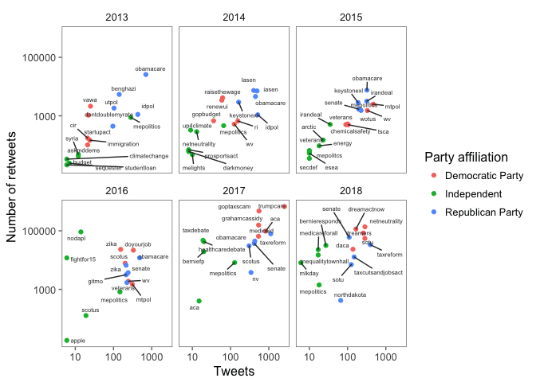

Network Analysis of U.S. Senate Tweets
================================


## Overview

Twitter is a great tool to analyze the public interactions of political actors. For this assignment, I want you to use the information about who follows whom on Twitter as well as past tweets of the current U.S. Senate members to analyze how they interact and what they tweet about. 

## Data

#### Twitter Handles of Senators

Twitter does not allow us to search for past tweets based on keywords, location, or topics (hashtags). However, we are able to obtain the past tweets of users if we specify their Twitter handle. The file `senators_twitter.csv` contains the Twitter handles of the current U.S. Senate members (obtained from [SocialSeer](https://www.socialseer.com/resources/us-senator-twitter-accounts/)). We will focus on the Senators' _official Twitter accounts_ (as opposed to campaign or staff members). I have also added information on the party affiliation of the Senators from [here](https://ballotpedia.org/List_of_current_members_of_the_U.S._Congress).

#### Followers

The file `senators_follow.csv` contains an edge list of connections between each pair of senators who are connected through a follower relationship (this information was obtained using the function `rtweet::lookup_friendships`). The file is encoded such that the `source` is a follower of the `target`. You will need to use the subset of `following = TRUE` to identify the connections for which the `source` follows the `target`.

#### Tweets by Senators

To make your life a bit easier, I have also already downloaded all available tweets for these Twitter accounts using the following code. You **do not need to repeat this step**. Simply rely on the file `senator_tweets.RDS` in the exercise folder.


```r
# Read in the Senator Data
senate <- read_csv("senators_twitter.csv")

# Get Tweets
#senator_tweets <- get_timelines(user = senate$`Official Twitter`,
#    n = 3200, ## number of tweets to download (max is 3,200)
#    )

#saveRDS(senator_tweets, "senator_tweets.RDS")
```


```r
# Read in the Tweets
senator_tweets <- readRDS("senator_tweets.RDS")
senator_follows <- read.csv("senators_follow.csv")

# How limiting is the API limit?
senator_tweets %>% 
  group_by(screen_name) %>% 
  summarize(n_tweet = n(),
            oldest_tweet = min(created_at)) %>%
  arrange(desc(oldest_tweet))
```

```
## # A tibble: 100 x 3
##       screen_name n_tweet        oldest_tweet
##             <chr>   <int>              <dttm>
##  1   SenDougJones     178 2018-01-05 18:18:46
##  2   SenTinaSmith     814 2018-01-03 16:21:07
##  3     JohnCornyn    3193 2017-05-31 02:56:50
##  4  SenWhitehouse    3206 2017-05-08 18:44:06
##  5  senorrinhatch    3212 2017-05-01 14:36:04
##  6    brianschatz    3211 2017-04-23 21:15:28
##  7  senrobportman    3237 2017-04-19 15:39:38
##  8      SenMarkey    3241 2017-03-21 18:44:15
##  9     CoryBooker    3206 2017-03-09 21:57:18
## 10 SenJeffMerkley    3248 2017-03-07 01:40:21
## # ... with 90 more rows
```

The data contains about 170k tweets and about 40 variables. Please note, that the API limit of 3,200 tweets per twitter handle actually cuts down the time period we can observe the most prolific Twitter users in the Senate down to only about one year into the past.

## Tasks for the Assignment

### 1. Who follows whom?

#### a) Network of Followers

Read in the edgelist of follower relationships from the file `senators_follow.csv`. Create a directed network graph. Identify the three senators who are followed by the most of their colleagues (i.e. the highest "in-degree") and the three senators who follow the most of their colleagues (i.e. the highest "out-degree"). [Hint: You can get this information simply from the data frame or use `igraph` to calculate the number of in and out connections: `indegree = igraph::degree(g, mode = "in")`.] Visualize the network of senators. In the visualization, highlight the party ID of the senator nodes with an appropriate color (blue = Democrat, red = Republican) and size the nodes by the centrality of the nodes to the network. Briefly comment.

**The top three senators in terms of in- and out-degree are shown in two datatables. The network visualization of these networks can be found after these. I've used ggnet, with complimentary versions through three other libraries. I did to vastly different data structures).**


```r
senator_follows_edges <- senator_follows %>%
  filter(following == TRUE) %>%
  select(source, target)

g <- graph_from_edgelist(as.matrix(senator_follows_edges))
V(g)$party <- as.character(senate$`Party affiliation`[match(V(g)$name, as.character(senate$`Official Twitter`))])

indegree <- igraph::degree(g, mode = "in")
outdegree <- igraph::degree(g, mode = "out")

degrees_df <- data.frame(matrix(vector(), 100, 3,
                dimnames=list(c(), c("name", "indegree", "outdegree"))),
                stringsAsFactors=F)

degrees_df$name <- names(indegree)
degrees_df$indegree <- indegree
degrees_df$outdegree <- outdegree

datatable(arrange(degrees_df, desc(indegree)), colnames = c("Senator", "In-degree", "Out-degree"))
```

<!--html_preserve--><div id="htmlwidget-a0622d6917a4a425d0c6" style="width:100%;height:auto;" class="datatables html-widget"></div>
<script type="application/json" data-for="htmlwidget-a0622d6917a4a425d0c6">{"x":{"filter":"none","data":[["1","2","3","4","5","6","7","8","9","10","11","12","13","14","15","16","17","18","19","20","21","22","23","24","25","26","27","28","29","30","31","32","33","34","35","36","37","38","39","40","41","42","43","44","45","46","47","48","49","50","51","52","53","54","55","56","57","58","59","60","61","62","63","64","65","66","67","68","69","70","71","72","73","74","75","76","77","78","79","80","81","82","83","84","85","86","87","88","89","90","91","92","93","94","95","96","97","98","99","100"],["SenJeffMerkley","SenJohnKennedy","SenMarkey","MarkWarner","SenatorEnzi","MikeCrapo","SenDeanHeller","SenSherrodBrown","SenatorHassan","SenBobCasey","SenatorTimScott","lisamurkowski","sendavidperdue","SenatorCardin","SenThomTillis","amyklobuchar","CoryBooker","SenatorFischer","SenatorBaldwin","SenBennetCO","SenCortezMasto","JohnCornyn","SenAngusKing","SenatorTomUdall","SenatorLankford","Sen_JoeManchin","SenatorRounds","SenatorTester","ChrisCoons","SenDuckworth","SenatorCollins","SenatorCarper","SenatorBurr","SenGaryPeters","PattyMurray","SenatorDurbin","senrobportman","SenMikeLee","SenFeinstein","SenDanSullivan","SenToomey","SenatorMenendez","SenWhitehouse","SenJohnHoeven","SenWarren","RonWyden","SenBlumenthal","JerryMoran","maziehirono","SenatorShaheen","SenPatRoberts","SenSchumer","MartinHeinrich","SenShelby","SenStabenow","RoyBlunt","SenJohnBarrasso","SenatorIsakson","SenatorCantwell","SenRonJohnson","SenTedCruz","SenTinaSmith","SteveDaines","SenateMajLdr","ChrisVanHollen","SenGillibrand","SenThadCochran","SenKamalaHarris","SenatorRisch","JohnBoozman","SenCoryGardner","SenTomCotton","SenatorWicker","brianschatz","SenDougJones","RandPaul","SenAlexander","SenatorLeahy","SenSanders","SenatorHeitkamp","GrahamBlog","timkaine","SenCapito","SenJohnThune","ChuckGrassley","senorrinhatch","SenJackReed","SenJohnMcCain","SenToddYoung","ChrisMurphyCT","JimInhofe","BillCassidy","SenDonnelly","BobCorker","BenSasse","JeffFlake","marcorubio","joniernst","clairecmc","SenBillNelson"],[97,96,96,96,95,94,94,94,93,93,91,90,90,89,89,88,88,87,87,87,86,85,84,83,82,82,81,80,78,78,77,77,75,73,72,71,71,71,71,70,70,68,68,67,66,64,61,61,61,60,59,59,57,52,52,51,51,50,50,49,48,48,48,47,47,47,45,45,44,42,42,41,40,40,39,39,37,37,36,33,30,30,28,26,25,23,18,18,16,14,13,12,11,11,10,7,1,1,1,0],[61,33,49,66,65,69,71,61,39,63,66,76,56,62,55,51,64,63,57,61,35,68,66,63,53,70,49,53,62,39,82,62,73,54,61,63,70,61,58,47,71,61,62,67,55,63,64,66,61,59,64,63,58,60,62,71,72,67,55,67,48,32,47,48,38,56,63,30,61,63,52,49,66,35,32,60,67,62,55,63,66,59,51,65,70,60,60,79,30,54,48,35,65,1,32,63,57,15,58,57]],"container":"<table class=\"display\">\n  <thead>\n    <tr>\n      <th> <\/th>\n      <th>Senator<\/th>\n      <th>In-degree<\/th>\n      <th>Out-degree<\/th>\n    <\/tr>\n  <\/thead>\n<\/table>","options":{"columnDefs":[{"className":"dt-right","targets":[2,3]},{"orderable":false,"targets":0}],"order":[],"autoWidth":false,"orderClasses":false}},"evals":[],"jsHooks":[]}</script><!--/html_preserve-->

```r
datatable(arrange(degrees_df, desc(outdegree)), colnames = c("Senator", "In-degree", "Out-degree"))
```

<!--html_preserve--><div id="htmlwidget-6f6822543a52f8142d9e" style="width:100%;height:auto;" class="datatables html-widget"></div>
<script type="application/json" data-for="htmlwidget-6f6822543a52f8142d9e">{"x":{"filter":"none","data":[["1","2","3","4","5","6","7","8","9","10","11","12","13","14","15","16","17","18","19","20","21","22","23","24","25","26","27","28","29","30","31","32","33","34","35","36","37","38","39","40","41","42","43","44","45","46","47","48","49","50","51","52","53","54","55","56","57","58","59","60","61","62","63","64","65","66","67","68","69","70","71","72","73","74","75","76","77","78","79","80","81","82","83","84","85","86","87","88","89","90","91","92","93","94","95","96","97","98","99","100"],["SenatorCollins","SenJohnMcCain","lisamurkowski","SenatorBurr","SenJohnBarrasso","RoyBlunt","SenDeanHeller","SenToomey","senrobportman","Sen_JoeManchin","ChuckGrassley","MikeCrapo","JohnCornyn","SenatorIsakson","SenJohnHoeven","SenAlexander","SenRonJohnson","JerryMoran","SenAngusKing","SenatorWicker","GrahamBlog","SenatorTimScott","MarkWarner","SenatorEnzi","SenDonnelly","SenJohnThune","SenBlumenthal","SenPatRoberts","CoryBooker","JohnBoozman","SenatorDurbin","SenThadCochran","SenatorFischer","SenatorTomUdall","RonWyden","SenBobCasey","SenSchumer","SenatorHeitkamp","JeffFlake","ChrisCoons","SenatorCardin","SenatorCarper","SenStabenow","SenWhitehouse","SenatorLeahy","SenatorRisch","SenSherrodBrown","SenJeffMerkley","SenMikeLee","PattyMurray","SenBennetCO","SenatorMenendez","maziehirono","SenShelby","SenJackReed","senorrinhatch","RandPaul","SenatorShaheen","timkaine","SenFeinstein","MartinHeinrich","clairecmc","SenatorBaldwin","SenBillNelson","marcorubio","sendavidperdue","SenGillibrand","SenWarren","SenThomTillis","SenatorCantwell","SenSanders","SenGaryPeters","ChrisMurphyCT","SenatorTester","SenatorLankford","SenCoryGardner","amyklobuchar","SenCapito","SenTomCotton","SenMarkey","SenatorRounds","SenateMajLdr","SenTedCruz","JimInhofe","SenDanSullivan","SteveDaines","SenDuckworth","SenatorHassan","ChrisVanHollen","SenCortezMasto","brianschatz","BillCassidy","SenJohnKennedy","SenDougJones","SenTinaSmith","BenSasse","SenToddYoung","SenKamalaHarris","joniernst","BobCorker"],[77,18,90,75,51,51,94,70,71,82,25,94,85,50,67,37,49,61,84,40,30,91,96,95,11,26,61,59,88,42,71,45,87,83,64,93,59,33,7,78,89,77,52,68,37,44,94,97,71,72,87,68,61,52,18,23,39,60,30,71,57,1,87,0,1,90,47,66,89,50,36,73,14,80,82,42,88,28,41,96,81,47,48,13,70,48,78,93,47,86,40,12,96,39,48,10,16,45,1,11],[82,79,76,73,72,71,71,71,70,70,70,69,68,67,67,67,67,66,66,66,66,66,66,65,65,65,64,64,64,63,63,63,63,63,63,63,63,63,63,62,62,62,62,62,62,61,61,61,61,61,61,61,61,60,60,60,60,59,59,58,58,58,57,57,57,56,56,55,55,55,55,54,54,53,53,52,51,51,49,49,49,48,48,48,47,47,39,39,38,35,35,35,33,32,32,32,30,30,15,1]],"container":"<table class=\"display\">\n  <thead>\n    <tr>\n      <th> <\/th>\n      <th>Senator<\/th>\n      <th>In-degree<\/th>\n      <th>Out-degree<\/th>\n    <\/tr>\n  <\/thead>\n<\/table>","options":{"columnDefs":[{"className":"dt-right","targets":[2,3]},{"orderable":false,"targets":0}],"order":[],"autoWidth":false,"orderClasses":false}},"evals":[],"jsHooks":[]}</script><!--/html_preserve-->


```r
adj <- get.adjacency(g, names = TRUE)
net <- network(adj, directed = TRUE)

network::set.vertex.attribute(net, "party", V(g)$party)
network::set.vertex.attribute(net, "color", ifelse((net %v% "party") == "Republican Party", "#E91D0E", "#232066"))
network::set.vertex.attribute(net, "name", V(g)$name)

for(i in 1:length((net %v% "party"))) {
  if(is.na((net %v% "color")[[i]])) {
    set.vertex.attribute(net, "color", "#206621", v = i)
  }
  if("Independent" %in% (net %v% "party")[[i]]) {
    set.vertex.attribute(net, "color", "#616620", v = i)
  }
}

ggnet2(net, size = "indegree", arrow.size = 2, 
       label = TRUE, label.size = 2, 
       edge.size = 0.05, legend.position = "none",
       node.color = (net %v% "color"), node.label = "name")
```

<!-- -->

```r
ggnet2(net, size = "outdegree", arrow.size = 2, 
       label = TRUE, label.size = 2, 
       edge.size = 0.05, legend.position = "none",
       node.color = (net %v% "color"), node.label = "name")
```

<!-- -->

```r
senators_tidy <- as_tbl_graph(g, directed = TRUE)

ggraph(senators_tidy, layout = 'fr') + 
  geom_node_point(aes(colour = party)) +
  geom_edge_link(aes(edge_width = 0.05), alpha = 0.8) + 
  geom_node_text(aes(label = name, size = 0.5), repel = TRUE) +
  theme_graph()
```

<!-- -->

```r
nodes <- senators_tidy %>% 
  activate(nodes) %>% 
  as_tibble() %>% 
  dplyr::mutate(id = row_number())

edges <- senators_tidy %>% 
  activate(edges) %>% 
  as_tibble()

simpleNetwork(senator_follows_edges, 
              nodeColour = "red", 
              zoom=T,
              fontSize = 16)
```

<!--html_preserve--><div id="htmlwidget-4939c5037e81f7e8ffee" style="width:672px;height:480px;" class="forceNetwork html-widget"></div>
<script type="application/json" data-for="htmlwidget-4939c5037e81f7e8ffee">{"x":{"links":{"source":[86,86,86,86,86,86,86,86,86,86,86,86,86,86,86,86,86,86,86,86,86,86,86,86,86,86,86,86,86,86,86,86,86,86,86,86,86,86,86,86,86,86,86,86,86,86,86,86,86,86,86,86,86,86,86,86,86,86,86,86,65,65,65,65,65,65,65,65,65,65,65,65,65,65,65,65,65,65,65,65,65,65,65,65,65,65,65,65,65,65,65,65,18,18,18,18,18,18,18,18,18,18,18,18,18,18,18,18,18,18,18,18,18,18,18,18,18,18,18,18,18,18,18,18,18,18,18,18,18,18,18,18,18,18,18,18,18,18,18,18,18,18,18,18,18,18,18,18,18,18,18,18,18,18,18,18,18,18,18,18,18,18,18,18,18,18,18,18,61,61,61,61,61,61,61,61,61,61,61,61,61,61,61,61,61,61,61,61,61,61,61,61,61,61,61,61,61,61,61,61,61,61,61,61,61,61,61,61,61,61,61,61,61,61,61,75,75,75,75,75,75,75,75,75,75,75,75,75,75,75,75,75,75,75,75,75,75,75,75,75,75,75,75,75,75,75,75,75,75,75,75,75,75,75,75,75,75,75,75,75,75,75,75,75,75,75,75,75,75,75,75,75,75,75,75,75,75,75,75,75,75,75,75,75,75,75,75,75,75,75,75,75,75,12,12,12,12,12,12,12,12,12,12,12,12,12,12,12,12,12,12,12,12,12,12,12,12,12,12,12,12,12,12,12,12,12,12,12,12,12,12,12,12,12,12,12,12,12,12,12,12,12,12,12,12,12,12,12,12,12,12,12,12,12,12,12,94,94,94,94,94,94,94,94,94,94,94,94,94,94,94,94,94,94,94,94,94,94,94,94,94,94,94,94,94,94,94,94,94,94,94,94,94,94,94,94,94,94,94,94,94,94,94,94,94,15,15,15,15,15,15,15,15,15,15,15,15,15,15,15,15,15,15,15,15,15,15,15,15,15,15,15,15,15,15,15,15,15,15,15,15,15,15,15,15,15,15,15,15,15,15,15,15,15,15,15,15,15,15,15,15,15,15,15,15,15,15,15,67,67,67,67,67,67,67,67,67,67,67,67,67,67,67,67,67,67,67,67,67,67,67,67,67,67,67,67,67,67,67,67,67,67,67,67,67,67,67,67,67,67,67,67,67,67,67,67,67,67,67,67,67,67,67,67,67,77,77,77,77,77,77,77,77,77,77,77,77,77,77,77,77,77,77,77,77,77,77,77,77,77,77,77,77,77,54,54,54,54,54,54,54,54,54,54,54,54,54,54,54,54,54,54,54,54,54,54,54,54,54,54,54,54,54,54,54,54,54,54,54,54,54,54,54,54,54,54,54,54,54,54,54,54,54,54,54,54,54,54,54,54,54,54,54,54,54,60,60,60,60,60,60,60,60,60,60,60,60,60,60,60,60,60,60,60,60,60,60,60,60,60,60,60,60,60,60,60,60,60,60,60,60,60,60,60,60,60,60,60,60,60,60,60,60,60,60,60,60,6,6,6,6,6,6,6,6,6,6,6,6,6,6,6,6,6,6,6,6,6,6,6,6,6,6,6,6,6,6,6,6,6,6,6,6,6,6,6,6,6,6,6,6,6,6,6,6,6,6,6,6,6,56,56,56,56,56,56,56,56,56,56,56,56,56,56,56,56,56,56,56,56,56,56,56,56,56,56,56,56,56,56,56,56,56,56,56,56,56,56,56,56,56,56,56,56,56,56,56,56,56,56,56,56,56,56,56,56,56,56,56,56,56,56,56,36,36,36,36,36,36,36,36,36,36,36,36,36,36,36,36,36,36,36,36,36,36,36,36,36,36,36,36,36,36,36,36,36,36,36,36,36,36,36,36,36,36,36,36,36,36,36,36,36,36,36,36,36,36,36,36,36,36,36,36,36,36,5,5,5,5,5,5,5,5,5,5,5,5,5,5,5,5,5,5,5,5,5,5,5,5,5,5,5,5,5,5,5,5,5,5,5,5,5,5,5,5,5,5,5,5,5,5,5,5,5,5,5,5,5,5,5,5,5,5,5,5,5,55,55,55,55,55,55,55,55,55,55,55,55,55,55,55,55,55,55,55,55,55,55,55,55,55,55,55,55,55,55,55,55,55,55,55,55,55,55,55,55,55,55,55,55,55,55,55,55,55,55,55,55,55,55,55,55,19,19,19,19,19,19,19,19,19,19,19,19,19,19,19,19,19,19,19,19,19,19,19,19,19,19,19,19,19,19,19,19,19,19,19,19,19,19,19,19,19,19,19,19,19,19,19,19,19,19,19,19,19,19,19,19,19,62,62,62,62,62,62,62,62,62,62,62,62,62,62,62,62,62,62,62,62,62,62,62,62,62,62,62,62,62,62,62,62,62,62,62,62,62,62,62,62,62,62,62,62,62,62,62,62,62,62,62,62,62,62,62,62,43,43,43,43,43,43,43,43,43,43,43,43,43,43,43,43,43,43,43,43,43,43,43,43,43,43,43,43,43,43,43,43,43,43,43,43,43,43,43,43,43,43,43,43,43,43,43,43,43,43,43,43,43,43,43,43,43,43,43,43,43,43,43,43,43,43,4,4,4,4,4,4,4,4,4,4,4,4,4,4,4,4,4,4,4,4,4,4,4,4,4,4,4,4,4,4,4,4,4,4,4,22,22,22,22,22,22,22,22,22,22,22,22,22,22,22,22,22,22,22,22,22,22,22,22,22,22,22,22,22,22,22,22,22,22,22,22,22,22,22,22,22,22,22,22,22,22,22,22,22,22,22,22,22,22,22,22,22,22,22,22,23,23,23,23,23,23,23,23,23,23,23,23,23,23,23,23,23,23,23,23,23,23,23,23,23,23,23,23,23,23,23,23,23,23,23,23,23,23,23,23,23,23,23,23,23,23,23,23,23,23,23,23,23,23,23,23,23,23,23,23,23,23,23,23,23,23,23,23,23,47,47,47,47,47,47,47,47,47,47,47,47,47,47,47,47,47,47,47,47,47,47,47,47,47,47,47,47,47,47,47,47,47,47,47,47,47,47,47,47,47,47,47,47,47,47,47,47,47,47,47,47,47,47,47,47,47,47,47,47,47,66,66,66,66,66,66,66,66,66,66,66,66,66,66,66,66,66,66,66,66,66,66,66,66,66,66,66,66,66,66,66,66,66,66,66,66,66,66,66,38,38,38,38,38,38,38,38,38,38,38,38,38,38,38,38,38,38,38,38,38,38,38,38,38,38,38,38,38,38,38,38,38,38,38,38,38,38,38,38,38,38,38,38,38,38,38,38,38,38,38,38,38,38,38,38,38,38,38,38,38,38,64,64,64,64,64,64,64,64,64,64,64,64,64,64,64,64,64,64,64,64,64,64,64,64,64,64,64,64,64,64,64,64,64,64,64,64,64,64,64,64,64,64,64,64,64,64,64,64,64,64,64,64,64,64,64,64,64,64,64,64,64,64,64,64,93,93,93,93,93,93,93,93,93,93,93,93,93,93,93,93,93,93,93,93,93,93,93,93,93,93,93,93,93,93,8,8,8,8,8,8,8,8,8,8,8,8,8,8,8,8,8,8,8,8,8,8,8,8,8,8,8,8,8,8,8,8,8,8,8,8,8,8,8,8,8,8,8,8,8,8,8,8,8,8,8,8,8,8,8,8,8,8,8,8,8,8,8,8,8,8,8,8,8,8,17,17,17,17,17,17,17,17,17,17,17,17,17,17,17,81,81,81,81,81,81,81,81,81,81,81,81,81,81,81,81,81,81,81,81,81,81,81,81,81,81,81,81,81,81,81,81,81,81,81,81,81,81,81,81,81,81,81,81,81,81,81,81,81,81,81,81,81,81,81,81,81,81,81,81,81,81,81,81,13,13,13,13,13,13,13,13,13,13,13,13,13,13,13,13,13,13,13,13,13,13,13,13,13,13,13,13,13,13,13,13,13,13,13,13,13,13,13,13,13,13,13,13,13,13,13,13,13,13,13,13,13,13,13,13,13,13,13,13,13,13,13,13,13,13,31,31,31,31,31,31,31,31,31,31,31,31,31,31,31,31,31,31,31,31,31,31,31,31,31,31,31,31,31,31,31,31,31,31,31,31,31,31,31,31,31,31,31,31,31,31,31,31,25,25,25,25,25,25,25,25,25,25,25,25,25,25,25,25,25,25,25,25,25,25,25,25,25,25,25,25,25,25,25,25,25,25,25,25,25,25,25,25,25,25,25,25,25,25,25,25,25,25,25,25,25,25,25,25,25,25,25,25,2,2,2,2,2,2,2,2,2,2,2,2,2,2,2,2,2,2,2,2,2,2,2,2,2,2,2,2,2,2,2,2,2,2,2,74,74,74,74,74,74,74,74,74,74,74,74,74,74,74,74,74,74,74,74,74,74,74,74,74,74,74,74,74,74,74,74,74,30,30,30,30,30,30,30,30,30,30,30,30,30,30,30,30,30,30,30,30,30,30,30,30,30,30,30,30,30,30,30,30,30,30,30,30,30,30,30,30,30,30,30,30,30,30,30,30,30,30,30,30,30,30,30,30,30,30,30,30,30,30,30,30,30,37,37,37,37,37,37,37,37,37,37,37,37,37,37,37,37,37,37,37,37,37,37,37,37,37,37,37,37,37,37,37,37,37,37,37,37,37,37,37,37,37,37,37,37,37,37,37,37,37,37,37,37,37,37,37,37,37,37,37,37,37,37,37,37,37,37,37,37,37,37,37,37,37,37,37,37,37,37,37,37,37,37,7,7,7,7,7,7,7,7,7,7,7,7,7,7,7,7,7,7,7,7,7,7,7,7,7,7,7,7,7,7,7,7,7,7,7,7,7,35,35,35,35,35,35,35,35,35,35,35,35,35,35,35,35,35,35,35,35,35,35,35,35,35,35,35,35,35,35,35,35,35,35,35,35,35,35,35,35,35,35,35,35,35,35,35,35,35,35,35,35,35,35,35,35,35,35,35,35,35,78,78,78,78,78,78,78,78,78,78,78,78,78,78,78,78,78,78,78,78,78,78,78,78,78,78,78,78,78,78,78,78,78,78,78,78,78,78,78,78,78,78,78,78,78,78,78,78,96,96,96,96,96,96,96,96,96,96,96,96,96,96,96,96,96,96,96,96,96,96,96,96,96,96,96,96,96,96,96,96,96,96,96,96,96,96,96,96,96,96,96,96,96,96,96,96,96,96,96,96,96,96,68,68,68,68,68,68,68,68,68,68,68,68,68,68,68,68,68,68,68,68,68,68,68,68,68,68,68,68,68,68,68,68,68,68,68,68,68,68,68,68,68,68,68,68,68,68,68,68,68,68,68,68,68,68,88,88,88,88,88,88,88,88,88,88,88,88,88,88,88,88,88,88,88,88,88,88,88,88,88,88,88,88,88,88,88,88,88,88,88,88,88,88,88,88,88,88,88,88,88,88,88,88,88,88,88,88,88,88,88,88,88,88,88,88,88,88,0,0,0,0,0,0,0,0,0,0,0,0,0,0,0,0,0,0,0,0,0,0,0,0,0,0,0,0,0,0,0,0,0,0,0,0,0,0,0,0,0,0,0,0,0,0,0,0,0,0,92,92,92,92,92,92,92,92,92,92,92,92,92,92,92,92,92,92,92,92,92,92,92,92,92,92,92,92,92,92,92,92,90,90,90,90,90,90,90,90,90,90,90,90,90,90,90,90,90,90,90,90,90,90,90,90,90,90,90,90,90,90,90,90,90,90,90,90,90,90,90,90,90,90,90,90,90,90,90,90,90,90,90,90,90,90,90,90,90,90,90,90,90,90,90,53,53,53,53,53,53,53,53,53,53,53,53,53,53,53,53,53,53,53,53,53,53,53,53,53,53,53,53,53,53,53,53,53,53,53,53,53,53,53,53,53,53,53,53,53,53,53,53,53,53,53,53,53,53,53,53,53,53,53,53,53,53,53,53,53,53,9,9,9,9,9,9,9,9,9,9,9,9,9,9,9,9,9,9,9,9,9,9,9,9,9,9,9,9,9,9,9,9,9,9,9,9,9,9,9,9,9,9,9,9,9,9,9,9,9,9,9,9,9,9,9,9,9,27,27,27,27,27,27,27,27,27,27,27,27,27,27,27,27,27,27,27,27,27,27,27,27,27,27,27,27,27,27,27,27,27,27,27,27,27,27,27,27,27,27,27,27,27,27,27,27,27,27,27,27,27,27,27,27,27,27,27,27,27,27,27,27,27,27,27,27,27,27,27,98,98,98,98,98,98,98,98,98,98,98,98,98,98,98,98,98,98,98,98,98,98,98,98,98,98,98,98,98,98,98,98,98,98,98,98,98,98,98,98,98,98,98,98,98,98,98,50,50,50,50,50,50,50,50,50,50,50,50,50,50,50,50,50,50,50,50,50,50,50,50,50,50,50,50,50,50,50,50,50,50,50,50,50,50,50,50,50,50,50,50,50,50,50,50,50,50,50,50,40,40,40,40,40,40,40,40,40,40,40,40,40,40,40,40,40,40,40,40,40,40,40,40,40,40,40,40,40,40,40,40,40,40,40,40,40,40,40,40,40,40,40,40,40,40,40,40,40,40,40,40,40,40,40,40,40,40,40,40,40,40,40,1,1,1,1,1,1,1,1,1,1,1,1,1,1,1,1,1,1,1,1,1,1,1,1,1,1,1,1,1,1,1,1,59,59,59,59,59,59,59,59,59,59,59,59,59,59,59,59,59,59,59,59,59,59,59,59,59,59,59,59,59,59,59,59,59,59,59,63,63,63,63,63,63,63,63,63,63,63,63,63,63,63,63,63,63,63,63,63,63,63,63,63,63,63,63,63,63,63,63,63,63,63,63,63,63,63,63,63,63,63,63,63,63,63,63,63,63,63,63,63,63,63,63,63,63,63,63,63,63,63,63,63,63,63,63,63,63,63,49,49,49,49,49,49,49,49,49,49,49,49,49,49,49,49,49,49,49,49,49,49,49,49,49,49,49,49,49,49,49,49,49,49,49,49,49,49,49,49,49,49,49,49,49,49,49,49,49,49,49,49,49,49,49,49,49,49,49,41,41,41,41,41,41,41,41,41,41,41,41,41,41,41,41,41,41,41,41,41,41,41,41,41,41,41,41,41,41,41,41,41,41,41,41,41,41,41,10,10,10,10,10,10,10,10,10,10,10,10,10,10,10,10,10,10,10,10,10,10,10,10,10,10,10,10,10,10,10,10,10,10,10,10,10,10,10,10,10,10,10,10,10,10,10,10,10,10,10,10,10,10,10,10,10,10,10,10,10,10,10,46,46,46,46,46,46,46,46,46,46,46,46,46,46,46,46,46,46,46,46,46,46,46,46,46,46,46,46,46,46,46,46,46,46,46,46,46,46,46,46,46,46,46,46,46,46,46,46,46,46,46,46,46,46,46,46,46,46,46,46,21,21,21,21,21,21,21,21,21,21,21,21,21,21,21,21,21,21,21,21,21,21,21,21,21,21,21,21,21,21,21,21,21,21,21,21,21,21,21,21,21,21,21,21,21,21,21,21,21,21,21,21,21,21,21,21,21,52,52,52,52,52,52,52,52,52,52,52,52,52,52,52,52,52,52,52,52,52,52,52,52,52,52,52,52,52,52,52,52,52,52,52,52,52,52,52,52,52,52,52,52,52,52,52,52,52,52,52,52,52,52,52,52,52,52,52,52,52,52,85,85,85,85,85,85,85,85,85,85,85,85,85,85,85,85,85,85,85,85,85,85,85,85,85,85,85,85,85,85,85,85,85,85,85,85,85,85,85,85,85,85,85,85,85,85,85,85,85,85,85,85,85,85,85,85,85,85,85,85,85,85,69,69,69,69,69,69,69,69,69,69,69,69,69,69,69,69,69,69,69,69,69,69,69,69,69,69,69,69,69,69,69,69,69,69,69,69,69,69,69,69,69,69,69,69,69,69,69,69,69,69,69,69,69,69,69,33,33,33,33,33,33,33,33,33,33,33,33,33,33,33,33,33,33,33,33,33,33,33,33,33,33,33,33,33,33,33,33,33,33,33,33,33,33,33,33,33,33,33,33,33,33,33,33,33,33,33,33,33,33,33,33,33,33,33,33,33,33,33,33,33,33,33,33,33,33,33,33,91,91,91,91,91,91,91,91,91,91,91,91,91,91,91,91,91,91,91,91,91,91,91,91,91,91,91,91,91,91,91,91,91,91,91,91,91,91,91,91,91,91,91,91,91,91,91,91,91,91,91,91,91,91,91,42,42,42,42,42,42,42,42,42,42,42,42,42,42,42,42,42,42,42,42,42,42,42,42,42,42,42,42,42,42,42,42,42,42,42,42,42,42,42,42,42,42,42,42,42,42,42,42,42,42,42,42,42,42,42,42,42,42,42,42,42,42,42,73,73,73,73,73,73,73,73,73,73,73,73,73,73,73,73,73,73,73,73,73,73,73,73,73,73,73,73,73,73,73,73,73,73,73,73,73,73,73,73,73,73,73,73,73,73,73,73,73,73,73,73,73,73,73,73,73,73,73,73,73,73,73,73,73,73,73,87,87,87,87,87,87,87,87,87,87,87,87,87,87,87,87,87,87,87,87,87,87,87,87,87,87,87,87,87,87,87,87,87,87,87,87,87,87,87,87,87,87,87,87,87,87,87,87,87,87,87,87,87,87,87,87,87,87,87,87,82,82,82,82,82,82,82,82,82,82,82,82,82,82,82,82,82,82,82,82,82,82,82,82,82,82,82,82,82,82,82,82,82,82,82,82,82,82,82,82,82,82,82,82,82,82,82,82,82,82,82,82,82,82,82,82,82,82,82,82,82,82,82,82,82,82,82,82,82,82,14,14,14,14,14,14,14,14,14,14,14,14,14,14,14,14,14,14,14,14,14,14,14,14,14,14,14,14,14,14,14,14,14,14,14,14,14,14,14,14,14,14,14,14,14,14,14,14,44,44,44,44,44,44,44,44,44,44,44,44,44,44,44,44,44,44,44,44,44,44,44,44,44,44,44,44,44,44,44,44,44,44,44,44,44,44,44,44,44,44,44,44,44,44,44,44,44,44,44,44,44,26,26,26,26,26,26,26,26,26,26,26,26,26,26,26,26,26,26,26,26,26,26,26,26,26,26,26,26,26,26,26,26,26,26,26,26,26,26,26,26,26,26,26,26,26,26,26,26,26,26,26,26,26,26,26,26,26,26,26,26,26,26,71,71,71,71,71,71,71,71,71,71,71,71,71,71,71,71,71,71,71,71,71,71,71,71,71,71,71,71,71,71,71,71,71,71,71,71,71,71,71,71,71,71,71,71,71,71,71,71,71,71,71,71,71,71,71,71,71,71,71,71,57,57,57,57,57,57,57,57,57,57,57,57,57,57,57,57,57,57,57,57,57,57,57,57,57,57,57,57,57,57,57,57,57,57,57,57,57,57,57,57,57,57,57,57,57,57,57,57,57,57,57,57,57,57,57,57,57,57,57,57,57,57,95,95,95,95,95,95,95,95,95,95,95,95,95,95,95,95,95,95,95,95,95,95,95,95,95,95,95,95,95,95,95,95,95,95,95,95,95,95,95,95,95,95,95,95,95,95,95,95,95,95,95,95,95,95,95,95,95,95,95,95,95,95,95,95,95,95,95,95,95,95,95,70,70,70,70,70,70,70,70,70,70,70,70,70,70,70,70,70,70,70,70,70,70,70,70,70,70,70,70,70,70,70,70,70,70,70,70,70,70,70,70,70,70,70,70,70,70,70,70,70,70,70,70,70,70,70,70,70,70,70,97,97,97,97,97,97,97,97,97,97,97,97,97,97,97,97,97,97,97,97,97,97,97,97,97,97,97,97,97,97,97,97,97,97,97,97,97,97,97,97,97,97,97,97,97,97,97,97,97,97,97,97,97,97,97,97,97,97,97,97,97,11,11,11,11,11,11,11,11,11,11,11,11,11,11,11,11,11,11,11,11,11,11,11,11,11,11,11,11,11,11,11,11,11,11,11,11,11,11,11,11,11,11,11,11,11,11,11,11,11,11,11,11,11,11,11,11,11,11,11,11,11,11,11,11,11,11,51,51,51,51,51,51,51,51,51,51,51,51,51,51,51,51,51,51,51,51,51,51,51,51,51,51,51,51,51,51,51,51,51,51,51,51,51,51,51,51,51,51,51,51,51,51,51,51,51,51,51,51,51,51,51,51,51,51,51,51,51,51,51,51,51,51,48,48,48,48,48,48,48,48,48,48,48,48,48,48,48,48,48,48,48,48,48,48,48,48,48,48,48,48,48,48,48,48,48,48,48,48,48,48,48,48,48,48,48,48,48,48,48,48,48,76,76,76,76,76,76,76,76,76,76,76,76,76,76,76,76,76,76,76,76,76,76,76,76,76,76,76,76,76,76,76,76,76,76,76,76,76,76,76,76,76,76,76,76,76,76,76,76,76,76,76,76,76,76,76,76,76,76,76,76,76,76,76,76,76,29,29,29,29,29,29,29,29,29,29,29,29,29,29,29,29,29,29,29,29,29,29,29,29,29,29,29,29,29,29,29,29,29,29,29,29,29,29,29,29,29,29,29,29,29,29,29,29,29,29,29,29,29,29,29,29,29,29,29,29,29,29,29,29,29,29,29,3,16,16,16,16,16,16,16,16,16,16,16,16,16,16,16,16,16,16,16,16,16,16,16,16,16,16,16,16,16,16,16,16,16,16,16,16,16,16,16,16,16,16,16,16,16,16,16,16,16,16,16,16,16,16,16,16,16,16,16,16,16,16,16,16,16,16,16,16,89,89,89,89,89,89,89,89,89,89,89,89,89,89,89,89,89,89,89,89,89,89,89,89,89,89,89,89,89,89,89,89,89,89,89,89,89,89,89,89,89,89,89,89,89,89,89,89,80,80,80,80,80,80,80,80,80,80,80,80,80,80,80,80,80,80,80,80,80,80,80,80,80,80,80,80,80,80,80,80,80,80,80,80,80,80,80,80,80,80,80,80,80,80,80,80,80,80,80,80,80,80,80,80,80,80,80,80,79,79,79,79,79,79,79,79,79,79,79,79,79,79,79,79,79,79,79,79,79,79,79,79,79,79,79,79,79,79,79,79,79,79,79,79,79,79,79,79,79,79,79,79,79,79,79,79,79,79,79,79,79,79,79,79,79,79,79,79,79,45,45,45,45,45,45,45,45,45,45,45,45,45,45,45,45,45,45,45,45,45,45,45,45,45,45,45,45,45,45,45,45,45,45,45,45,45,45,45,45,45,45,45,45,45,45,45,45,45,45,45,45,45,45,45,45,45,45,45,45,45,99,99,99,99,99,99,99,99,99,99,99,99,99,99,99,99,99,99,99,99,99,99,99,99,99,99,99,99,99,99,99,99,99,99,99,99,99,99,99,99,99,99,99,99,99,99,99,99,99,99,99,99,99,99,99,99,99,99,20,20,20,20,20,20,20,20,20,20,20,20,20,20,20,20,20,20,20,20,20,20,20,20,20,20,20,20,20,20,20,20,20,20,20,20,20,20,20,20,20,20,20,20,20,20,20,20,20,20,20,20,20,20,20,20,20,20,20,20,20,20,20,20,20,20,24,24,24,24,24,24,24,24,24,24,24,24,24,24,24,24,24,24,24,24,24,24,24,24,24,24,24,24,24,24,24,24,24,24,24,24,24,24,24,24,24,24,24,24,24,24,24,24,24,24,24,24,24,24,24,24,24,24,24,24,34,34,34,34,34,34,34,34,34,34,34,34,34,34,34,34,34,34,34,34,34,34,34,34,34,34,34,34,34,34,34,34,34,34,34,34,34,34,34,34,34,34,34,34,34,34,34,34,34,34,34,34,34,34,34,58,58,58,58,58,58,58,58,58,58,58,58,58,58,58,58,58,58,58,58,58,58,58,58,58,58,58,58,58,58,58,58,58,58,58,58,58,58,58,58,58,58,58,58,58,58,58,58,58,58,58,28,28,28,28,28,28,28,28,28,28,28,28,28,28,28,28,28,28,28,28,28,28,28,28,28,28,28,28,28,28,28,28,28,28,28,28,28,28,28,28,28,28,28,28,28,28,28,28,28,28,28,28,28,28,28,28,28,28,28,28,28,28,28,28,28,28,28,28,28,28,32,32,32,32,32,32,32,32,32,32,32,32,32,32,32,32,32,32,32,32,32,32,32,32,32,32,32,32,32,32,32,32,32,32,32,32,32,32,32,32,32,32,32,32,32,32,32,32,32,32,32,32,32,32,32,32,83,83,83,83,83,83,83,83,83,83,83,83,83,83,83,83,83,83,83,83,83,83,83,83,83,83,83,83,83,83,83,83,83,83,83,83,83,83,83,83,83,83,83,83,83,83,83,83,83,83,83,83,83,83,83,83,83,83,83,83,83,83,83,83,83,83,83,39,39,39,39,39,39,39,39,39,39,39,39,39,39,39,39,39,39,39,39,39,39,39,39,39,39,39,39,39,39,39,39,39,39,39,39,39,39,39,39,39,39,39,39,39,39,39,39,39,39,39,39,39,39,39,39,39,39,39,39,39,39,39,39,39,72,72,72,72,72,72,72,72,72,72,72,72,72,72,72,72,72,72,72,72,72,72,72,72,72,72,72,72,72,72,72,72,72,72,72,72,72,72,72,72,72,72,72,72,72,72,72,72,72,72,72,72,72,72,72,72,72,72,72,72,72,72,72,72,72,72,72,72,72,72,72,72,84,84,84,84,84,84,84,84,84,84,84,84,84,84,84,84,84,84,84,84,84,84,84,84,84,84,84,84,84,84,84,84,84,84,84,84,84,84,84,84,84,84,84,84,84,84,84,84,84,84,84,84,84,84,84,75,67,77,6,56,5,55,43,22,38,64,30,7,35,78,96,0,9,50,10,46,21,52,85,69,33,87,26,71,57,70,97,45,99,24,32],"target":[65,18,61,94,15,60,56,5,62,43,23,47,66,38,81,13,31,74,30,37,35,78,96,0,90,53,27,50,40,59,63,49,41,10,52,33,91,73,87,82,44,26,71,57,95,70,11,51,48,29,16,89,80,79,20,24,28,32,83,39,86,67,54,56,36,23,66,74,7,35,78,96,68,88,92,50,59,49,41,46,21,85,42,87,71,97,51,20,24,34,28,39,86,61,15,67,54,60,56,36,5,62,43,4,22,23,47,66,38,64,93,81,13,31,25,74,37,35,78,96,68,88,0,90,53,27,98,50,40,59,63,49,41,10,46,21,52,85,33,91,42,73,87,82,44,26,71,57,95,97,11,51,48,29,16,89,80,79,45,20,24,34,58,28,32,83,39,72,18,94,15,54,36,62,43,22,23,47,66,81,31,74,30,35,78,68,0,90,27,98,59,63,41,10,52,33,91,73,87,82,14,44,71,57,97,51,48,16,79,20,28,32,83,39,72,86,18,61,12,94,15,67,54,60,6,56,36,5,62,43,22,23,66,38,8,81,13,31,74,30,37,35,78,96,88,0,90,53,27,98,50,40,59,63,49,41,10,46,21,52,85,69,33,91,73,87,82,44,71,57,95,70,97,11,51,48,76,29,3,16,89,80,79,45,99,20,24,58,28,32,83,39,72,86,18,61,75,94,77,54,60,6,5,62,43,22,23,47,66,93,81,13,31,25,74,37,7,35,78,96,0,90,53,27,98,50,40,63,41,10,46,21,52,33,91,73,87,82,44,71,57,95,51,48,76,16,89,79,45,99,20,58,32,83,39,72,86,18,61,75,15,54,60,62,23,47,81,13,31,74,30,37,35,78,0,90,53,27,98,40,1,59,63,41,10,52,91,73,87,82,44,71,57,95,51,48,16,89,79,58,28,32,83,39,72,86,18,61,94,67,54,60,36,5,62,43,23,66,64,8,81,13,31,25,74,30,37,35,78,96,0,90,53,27,98,50,40,59,63,41,10,46,52,33,91,73,87,82,44,26,71,57,95,11,51,48,29,16,89,79,20,24,58,28,32,83,39,72,65,18,61,77,54,56,36,5,62,22,23,66,38,13,74,30,37,7,35,78,96,88,0,92,50,40,59,63,49,41,10,46,21,52,85,69,33,91,73,87,44,26,71,57,95,97,51,48,16,45,99,20,24,34,28,32,39,67,54,56,36,22,23,66,38,74,30,7,35,78,96,0,92,59,49,10,46,21,85,87,71,97,20,34,32,39,65,18,75,67,77,60,56,36,5,62,4,22,23,66,38,81,74,30,37,7,35,78,96,68,88,0,92,50,40,59,63,49,41,10,46,21,52,85,69,33,91,73,87,82,44,26,71,57,95,97,51,48,29,16,79,20,24,34,28,32,39,86,18,61,94,15,54,62,23,47,31,25,2,74,30,37,78,68,0,90,27,98,50,40,59,63,41,10,52,33,91,73,87,82,44,26,71,57,95,51,48,29,16,89,80,79,20,58,28,32,83,39,72,65,18,67,77,54,56,36,5,62,4,22,23,66,38,74,30,37,35,78,68,88,0,92,50,40,59,63,49,41,10,46,21,52,85,69,33,91,87,44,26,71,57,97,51,79,45,99,20,24,34,28,32,39,65,18,67,77,54,6,36,5,62,43,4,22,23,66,38,81,13,25,74,30,37,7,35,78,96,68,88,0,92,98,50,40,59,63,49,41,10,46,21,52,85,69,33,91,87,82,44,26,71,57,97,51,48,16,79,45,99,20,24,34,28,32,39,65,18,61,15,67,77,54,56,5,62,43,4,22,23,66,38,81,74,30,37,7,35,78,96,68,88,0,92,50,40,59,63,49,41,10,46,21,52,85,69,33,91,87,82,14,44,26,71,57,95,97,51,16,79,45,20,24,34,58,28,32,39,18,67,77,54,6,56,36,62,43,4,22,23,66,38,8,13,74,30,37,7,35,78,68,88,0,92,27,50,40,59,63,49,41,10,46,21,52,85,69,33,91,73,87,82,44,26,71,57,95,97,51,16,79,45,99,20,24,34,28,32,39,18,15,67,77,54,56,36,5,62,22,23,66,38,81,74,30,37,7,35,78,96,68,88,0,92,50,40,59,63,49,41,10,46,52,85,69,91,87,44,26,71,57,70,97,51,16,89,79,45,99,20,24,34,28,32,39,86,18,61,75,94,15,67,54,60,6,5,62,43,23,47,93,81,13,31,25,74,30,37,78,53,27,98,40,1,63,41,10,85,33,91,73,87,82,44,71,57,95,11,51,48,76,29,3,16,89,79,20,58,28,32,39,72,86,65,18,61,94,15,67,54,60,36,43,23,47,81,13,31,2,74,30,35,78,68,0,90,27,98,50,40,59,63,41,10,52,33,91,73,87,82,14,44,71,57,95,97,51,48,29,16,89,80,79,20,28,83,39,72,86,18,61,94,15,67,54,60,36,5,62,23,47,66,8,81,13,31,25,74,30,37,35,78,68,0,90,53,27,98,50,59,63,49,41,10,46,52,33,91,42,73,87,82,14,44,26,71,57,95,97,11,51,48,29,16,89,80,79,20,24,28,32,83,39,72,18,54,6,36,22,23,66,74,30,7,35,78,92,40,59,63,41,10,46,21,85,69,87,26,71,57,97,51,45,20,24,34,32,39,72,18,61,67,77,54,56,36,5,62,43,4,23,66,38,13,74,30,37,7,35,78,68,88,0,92,50,40,59,63,49,41,10,46,21,52,85,69,33,91,42,87,82,44,26,71,57,95,70,97,51,48,16,99,20,24,34,28,32,83,39,86,65,18,61,12,94,15,67,54,60,56,36,5,62,43,22,47,66,38,81,13,31,25,74,30,37,35,78,96,68,0,90,53,27,98,50,40,59,63,41,10,46,52,33,91,73,87,82,44,26,71,57,95,70,97,11,51,48,16,89,79,45,20,24,28,32,83,39,72,86,18,61,94,67,54,5,62,43,23,66,81,13,31,25,74,30,37,35,78,68,0,90,53,27,98,50,40,59,63,41,10,46,21,52,69,33,91,73,87,82,44,26,71,57,95,97,51,48,76,16,89,80,79,20,24,28,32,83,39,72,65,67,77,54,56,36,5,22,23,38,74,7,35,78,96,68,88,0,92,59,63,49,41,10,46,21,85,69,87,71,57,97,45,20,24,34,32,83,39,65,18,61,67,77,54,56,36,5,62,43,4,22,23,66,81,13,74,30,37,7,35,78,96,68,88,0,92,50,40,59,63,49,41,10,46,21,52,85,69,33,91,42,87,44,26,71,57,95,97,51,48,16,79,45,99,20,24,34,28,32,39,86,65,18,61,15,67,77,54,56,36,5,62,4,22,23,66,38,93,81,13,74,30,37,7,35,78,96,68,88,0,92,50,40,59,63,49,41,10,52,85,69,33,91,42,73,87,82,44,26,71,57,95,97,51,48,16,79,20,24,34,28,32,39,72,18,61,54,62,43,47,64,31,74,35,78,27,98,40,59,63,41,91,73,87,82,44,71,57,51,48,16,20,58,39,86,18,61,94,15,67,60,6,5,62,43,4,22,23,66,38,17,81,13,31,25,74,30,37,35,78,96,88,0,90,53,27,98,50,40,1,59,63,49,41,10,52,85,33,91,73,87,82,44,26,71,57,95,97,11,51,48,76,29,16,89,79,45,20,24,28,32,83,39,72,86,18,61,62,23,8,13,0,63,10,95,48,16,79,20,86,18,61,67,54,60,36,5,62,43,23,66,38,8,13,31,25,74,30,37,78,96,68,88,0,90,53,27,98,40,59,63,49,41,10,46,52,33,91,73,87,82,44,26,71,57,95,97,11,51,48,76,29,16,89,80,79,20,24,28,32,83,39,72,86,18,61,94,15,67,54,60,56,36,5,62,43,22,23,47,66,38,93,8,81,31,25,74,30,37,78,96,0,90,53,27,98,50,40,59,63,41,10,46,52,33,91,73,87,82,44,26,71,57,95,11,51,48,76,29,16,89,79,20,24,28,32,83,39,72,86,65,18,61,75,15,54,62,43,23,47,93,81,13,2,74,78,68,90,53,27,98,50,40,59,63,41,10,52,91,73,87,82,44,71,57,95,11,51,48,76,29,16,20,32,83,39,72,86,61,12,94,77,54,60,56,5,62,23,47,38,8,81,13,31,2,74,30,37,35,78,96,90,53,27,98,50,40,63,41,10,46,85,33,91,73,87,82,44,71,57,95,11,51,48,76,29,3,16,89,80,79,20,24,32,83,39,72,18,61,94,6,62,23,93,31,74,78,68,53,27,98,40,63,41,52,33,91,73,87,82,44,71,57,95,51,48,29,16,89,20,58,32,65,61,62,4,23,47,38,31,2,30,35,78,0,90,53,27,59,41,33,91,73,87,82,71,57,95,97,51,48,16,20,83,39,18,61,15,67,77,54,56,36,5,62,4,22,23,47,66,38,81,13,74,37,35,78,96,68,88,0,92,50,40,59,63,49,41,10,46,21,52,85,69,91,42,73,87,82,44,26,71,57,95,97,51,48,29,16,89,80,45,99,20,24,34,28,32,39,72,86,18,61,75,12,94,15,67,77,54,60,56,36,5,62,43,4,22,23,47,66,38,8,81,13,31,25,74,30,7,35,78,96,68,88,0,90,53,27,98,50,40,59,63,49,41,10,46,21,52,85,69,33,91,42,73,87,82,44,26,71,57,95,97,11,51,48,76,29,3,16,89,80,79,20,24,34,28,32,83,39,72,65,18,67,77,54,56,36,5,4,22,66,38,74,35,78,96,68,0,92,59,63,49,41,10,46,21,85,87,26,71,57,95,97,20,24,34,28,65,18,75,67,77,54,56,36,5,62,4,22,23,66,38,74,30,37,7,78,96,68,88,0,92,50,40,59,63,49,41,10,46,21,52,85,69,33,91,42,87,82,44,26,71,57,95,70,97,51,48,16,79,45,99,20,24,34,28,32,39,65,18,77,54,56,36,62,22,66,38,74,30,37,7,35,96,68,0,92,40,59,63,49,41,10,46,21,52,85,69,91,42,87,26,71,57,70,97,51,48,16,45,99,20,34,28,32,39,65,61,67,77,54,6,56,36,5,62,22,23,66,38,13,74,30,37,7,35,78,68,0,92,50,40,59,63,49,41,10,46,21,52,85,69,91,42,73,87,26,71,57,70,97,51,79,45,20,24,34,28,32,39,65,18,61,67,77,54,60,56,36,5,62,4,22,23,66,38,74,30,37,7,35,78,88,0,92,50,40,59,63,49,41,10,46,52,85,69,33,91,87,82,44,26,71,57,95,97,51,48,20,34,58,28,32,39,65,18,67,77,54,56,36,5,62,4,22,23,66,38,81,74,30,37,7,35,78,96,68,0,92,27,50,40,59,63,49,41,10,46,21,52,85,69,33,91,42,73,87,82,44,26,71,57,95,70,97,51,48,79,45,99,20,24,34,28,32,39,18,61,15,67,77,54,56,36,5,62,22,23,66,13,74,30,37,7,35,78,68,88,92,50,40,59,63,49,41,10,46,21,52,85,69,33,91,42,73,71,57,97,51,48,16,20,34,28,32,39,65,67,54,56,36,22,23,66,7,35,78,96,68,88,0,50,59,49,41,10,46,21,69,42,87,71,97,20,24,34,28,39,86,18,61,94,15,67,54,60,36,5,62,43,23,47,38,81,13,31,25,74,30,37,78,96,68,0,53,27,98,50,40,59,63,41,10,46,52,85,33,91,73,87,82,44,26,71,57,95,97,11,51,48,16,89,79,45,20,24,28,32,83,39,72,86,18,61,75,94,15,67,54,60,36,5,62,43,23,47,66,38,8,81,13,31,25,74,30,37,35,78,96,0,90,27,98,50,40,59,63,49,41,10,52,33,91,73,87,82,44,26,71,57,95,97,11,51,48,76,29,16,89,79,20,24,28,32,83,39,72,18,75,67,77,54,6,56,36,5,4,22,23,66,38,8,81,74,37,7,35,78,96,88,0,92,50,40,59,63,49,41,10,46,21,52,85,69,91,42,87,82,44,26,71,57,95,97,51,16,79,20,24,34,58,28,32,39,86,18,61,94,15,67,54,60,36,5,62,43,23,47,66,38,64,93,8,81,13,31,25,2,74,30,37,35,78,96,68,88,0,90,53,9,98,50,40,59,63,41,10,52,85,33,91,73,87,82,44,26,71,57,95,11,51,48,76,29,16,89,80,79,20,24,58,32,83,39,72,18,61,94,15,54,60,62,23,47,66,93,81,31,74,30,78,68,0,90,53,27,50,40,63,41,52,33,91,73,87,82,44,71,57,95,51,48,16,89,79,20,58,28,32,83,39,72,65,18,61,54,60,56,36,5,62,22,23,66,38,13,74,30,7,35,78,68,88,0,92,98,40,59,63,49,41,10,46,21,52,85,33,91,42,73,87,71,57,97,51,48,16,79,20,24,34,32,39,72,86,18,61,75,94,15,67,54,60,36,5,62,43,22,23,47,66,81,13,31,25,74,30,37,35,78,68,0,90,53,27,98,50,1,59,63,41,10,46,52,33,91,73,87,82,44,26,71,57,51,48,76,16,89,79,20,24,58,28,32,83,39,72,86,18,61,54,62,4,23,47,74,35,78,90,98,50,59,63,41,10,33,91,82,44,71,57,95,51,48,16,89,79,20,39,65,67,77,54,56,36,5,62,23,66,38,74,7,35,78,96,0,92,50,63,49,41,46,21,85,69,87,82,71,57,97,20,34,28,39,86,18,61,12,94,15,67,54,60,56,36,5,62,43,4,22,23,47,66,38,81,13,31,25,74,30,37,7,35,78,96,68,0,90,53,27,98,50,40,59,41,10,21,52,33,91,73,87,82,44,26,71,57,95,70,97,51,48,29,16,89,80,79,20,24,58,28,32,83,39,72,65,18,67,77,54,56,36,5,62,43,4,22,23,66,38,81,74,30,37,7,35,78,96,68,88,0,92,50,40,59,63,41,10,46,21,52,85,69,91,87,82,44,26,71,57,95,70,97,51,48,16,45,20,24,34,28,32,39,72,65,18,67,77,54,56,36,5,22,23,66,38,74,7,35,78,96,68,0,92,50,40,59,63,49,10,46,21,85,69,87,82,26,71,57,97,20,34,39,18,61,75,67,77,54,6,56,36,5,62,4,22,23,66,38,13,25,74,30,7,35,78,96,68,88,0,92,27,50,40,1,59,63,49,41,46,21,52,85,69,91,42,87,82,44,71,57,95,97,51,48,29,16,89,79,45,20,24,34,28,32,39,86,65,18,67,54,56,36,5,62,43,4,22,23,66,38,74,30,37,7,35,78,96,68,88,0,92,50,40,59,63,49,41,10,21,52,85,69,33,91,87,82,44,26,71,57,95,97,51,16,89,79,45,99,20,24,34,28,32,39,72,65,18,67,77,54,56,36,5,62,4,22,23,47,66,38,81,13,74,30,37,7,35,78,96,68,0,92,50,40,59,63,49,41,10,46,52,85,69,33,91,42,73,87,44,26,71,57,95,97,51,48,45,20,24,34,32,39,65,18,67,54,6,56,36,5,62,4,22,23,66,38,81,13,74,30,37,7,35,78,96,68,88,0,92,50,40,59,63,49,41,10,46,21,85,69,33,91,42,73,87,82,44,26,71,57,97,51,48,16,79,45,99,20,24,34,28,32,39,72,65,18,61,67,77,54,6,56,36,5,62,4,22,23,66,38,81,25,74,30,37,7,35,78,96,68,88,0,92,50,40,59,63,49,41,10,46,21,52,69,91,42,87,82,44,26,71,57,70,97,51,48,16,79,45,99,20,24,34,28,32,39,18,61,67,77,54,56,36,5,62,22,23,66,25,74,30,37,35,78,68,88,0,92,50,40,59,63,49,41,10,46,21,52,85,33,91,42,87,44,26,71,57,97,51,48,16,89,79,45,99,20,24,34,28,32,39,86,18,61,94,15,67,54,60,36,5,62,43,23,47,66,38,8,81,13,31,25,2,74,30,37,35,78,96,68,0,90,53,27,98,50,40,59,63,49,41,10,46,21,52,91,42,73,87,82,44,26,71,57,95,70,11,51,48,76,29,3,16,89,80,79,20,24,28,32,83,39,72,86,18,61,75,94,15,67,60,36,5,62,43,23,47,81,31,25,2,74,30,37,35,78,68,0,90,53,27,98,50,40,59,63,41,21,52,85,33,73,87,82,44,71,57,95,51,48,29,16,20,28,32,83,39,72,86,65,18,61,67,54,56,36,5,62,4,22,23,66,38,64,81,13,74,30,37,35,78,68,88,0,92,50,40,59,63,49,41,10,46,21,52,85,69,33,91,73,87,82,44,26,71,57,97,51,48,16,80,79,45,20,24,34,28,32,83,39,72,86,18,61,94,15,67,54,60,56,5,62,43,23,47,66,38,81,13,31,25,74,30,37,35,78,96,68,0,90,53,27,98,50,40,59,63,41,10,21,52,85,33,91,42,87,82,14,44,26,71,57,95,11,51,48,29,16,89,80,79,20,24,28,32,83,39,72,86,65,18,67,77,54,56,36,5,62,4,22,23,66,38,74,30,37,7,35,78,96,68,88,0,92,50,40,59,63,49,41,10,46,21,52,85,69,91,73,82,44,26,71,57,95,70,97,51,48,16,79,45,99,20,24,34,28,32,39,86,18,61,75,94,15,67,54,60,56,36,5,62,43,23,47,66,38,93,8,81,13,31,25,74,30,37,35,78,96,68,0,90,53,27,98,50,40,59,63,49,41,10,46,33,91,73,87,14,44,71,57,95,11,51,48,76,29,3,16,89,79,20,24,58,28,32,83,39,72,86,18,61,15,77,36,62,43,47,81,13,31,74,30,37,35,68,88,0,90,27,98,40,63,41,10,52,33,91,73,87,82,44,71,11,51,48,29,3,16,89,79,20,24,28,83,39,72,86,18,61,94,15,54,60,36,62,23,47,66,93,81,13,31,2,74,30,35,78,68,0,90,27,98,50,40,1,63,41,21,52,33,91,42,73,87,82,14,71,57,95,51,48,16,79,20,58,28,32,83,39,65,18,67,77,54,56,36,5,62,4,22,23,47,66,38,8,13,25,74,30,37,7,35,78,96,68,88,0,92,50,40,59,63,49,41,10,46,21,52,85,69,91,73,87,44,71,57,70,97,51,48,16,79,45,20,24,34,58,28,32,83,39,86,65,18,67,77,54,56,36,5,62,4,22,23,66,38,64,13,74,30,37,7,35,78,96,68,88,0,92,50,40,59,63,49,41,10,46,21,52,85,69,33,91,73,87,44,26,57,97,51,48,16,79,45,99,20,24,34,28,32,39,18,61,67,77,54,56,36,5,62,43,4,22,23,66,38,64,81,74,30,37,7,35,78,96,68,88,0,92,50,40,59,63,49,41,10,46,21,52,85,69,33,91,42,73,87,44,26,71,95,97,51,48,16,79,99,20,24,34,28,32,39,72,86,18,61,12,94,15,54,60,36,5,62,43,23,47,66,38,8,81,13,31,25,74,30,37,7,35,78,96,68,0,90,53,27,98,50,40,59,63,49,41,10,46,52,33,91,73,87,82,44,26,71,57,11,51,48,76,29,3,16,89,80,79,99,20,24,58,28,32,83,39,72,86,18,61,67,77,54,56,36,5,62,43,4,22,23,66,38,13,74,30,37,35,78,96,68,88,0,92,50,40,59,63,49,41,10,46,21,52,85,69,33,91,42,87,44,26,71,57,95,97,51,16,45,99,20,24,34,28,32,39,65,18,61,75,67,77,54,56,36,5,62,43,4,22,23,66,38,13,74,30,37,7,35,78,96,68,88,0,92,50,40,59,63,49,41,10,46,21,52,85,69,33,91,42,87,44,26,71,57,95,70,51,48,16,45,20,24,34,28,32,39,86,18,61,75,94,15,54,60,56,5,62,43,22,23,38,64,93,8,81,13,31,25,74,30,37,35,78,96,68,88,0,90,53,27,98,40,1,63,10,46,52,85,33,91,73,82,71,57,95,51,48,76,29,16,89,80,79,99,20,24,58,28,32,83,39,72,86,65,18,61,94,15,60,56,36,5,19,62,43,22,23,47,66,38,93,81,13,31,25,2,74,30,37,35,78,96,0,90,53,27,98,50,40,1,63,41,10,46,52,33,91,73,87,82,44,71,57,95,97,11,48,76,16,89,79,20,58,28,32,83,39,72,18,61,75,94,15,54,56,36,5,62,43,23,47,31,74,30,35,78,68,0,90,53,27,98,40,63,41,10,52,33,91,42,73,87,82,14,44,71,57,95,51,76,29,16,20,28,32,39,72,86,18,61,94,15,67,54,60,36,5,62,43,23,47,38,81,13,31,25,74,30,37,35,78,96,68,0,90,53,27,98,50,40,63,49,41,10,52,33,91,73,87,82,44,26,71,57,95,97,11,51,48,29,3,16,89,79,20,24,58,28,32,83,39,72,86,18,61,94,15,67,60,36,5,62,43,23,47,66,38,8,81,13,31,25,2,74,30,37,35,78,96,68,88,0,90,53,27,98,40,59,63,41,10,21,52,33,91,73,87,82,14,44,71,57,95,11,51,48,76,3,16,89,80,79,20,24,28,32,83,39,72,37,86,18,61,75,12,94,15,60,56,5,62,43,22,23,47,38,93,8,81,13,31,25,74,30,37,35,78,88,0,90,53,27,98,50,40,59,63,49,41,46,52,33,91,73,87,82,14,44,71,57,95,97,11,51,48,76,29,3,89,79,20,24,58,28,32,83,39,72,86,18,61,94,54,60,62,23,47,38,81,13,31,25,74,30,35,78,96,90,53,27,98,50,40,1,59,63,10,52,33,91,73,87,82,14,71,57,11,51,48,76,16,79,28,32,83,39,86,18,61,94,54,60,5,62,43,22,23,47,8,81,13,31,25,74,30,37,35,78,96,88,90,53,27,98,50,40,59,63,10,46,52,33,91,73,87,82,44,26,71,57,95,97,11,51,48,29,16,89,79,20,24,28,32,83,39,72,86,18,61,94,60,5,62,22,23,47,66,38,93,8,81,13,31,25,74,30,37,35,78,96,0,90,53,27,98,50,40,1,59,63,41,10,52,85,33,91,73,87,82,44,71,57,95,11,51,48,76,29,16,89,80,20,28,32,83,39,72,86,18,61,67,77,54,56,36,5,62,43,4,22,23,66,38,25,74,30,37,7,35,78,96,88,0,92,50,40,59,63,49,41,10,46,21,52,85,69,33,91,42,87,44,26,71,57,95,97,51,48,16,89,79,99,20,24,34,28,32,39,18,67,77,54,6,56,36,5,62,4,22,23,66,38,13,74,30,37,7,35,78,68,88,0,92,50,40,59,63,49,41,10,46,21,52,85,69,33,91,42,87,82,44,71,57,70,97,51,48,16,45,20,24,34,58,28,32,39,65,18,61,67,77,54,56,36,5,62,4,22,23,66,38,8,13,74,30,37,7,35,78,96,68,88,0,92,27,50,40,59,63,49,41,10,46,21,52,85,69,33,91,42,73,87,82,44,26,71,57,70,97,51,48,29,16,80,79,45,99,24,34,28,32,39,65,18,67,77,54,56,36,5,62,43,4,22,23,66,38,81,74,30,37,7,35,78,96,68,88,0,92,50,40,59,63,49,41,10,46,21,52,85,69,33,91,73,87,44,26,71,57,95,97,51,48,16,79,45,99,20,34,28,32,39,65,18,67,77,54,56,36,5,62,4,22,23,66,38,74,30,37,7,35,78,96,68,88,0,92,50,40,59,63,49,41,10,46,21,52,85,69,33,91,87,44,26,71,57,95,97,51,48,16,79,20,24,28,32,39,86,18,61,94,54,60,36,62,23,47,66,64,81,31,2,74,30,37,35,78,68,0,90,27,98,40,59,63,41,52,33,91,73,87,82,44,26,71,57,95,51,48,76,16,99,20,28,32,83,39,72,86,65,18,61,15,67,77,54,56,36,5,62,43,4,22,23,66,38,64,8,81,13,74,30,37,7,35,78,96,68,88,0,92,50,40,59,63,49,41,10,46,21,52,85,69,33,91,42,73,87,82,44,26,71,57,95,97,51,48,16,79,99,20,24,34,58,32,83,39,72,18,61,67,77,54,56,36,5,62,22,23,66,38,74,30,37,7,35,78,68,88,0,92,50,40,59,63,49,41,10,46,21,52,85,69,33,91,73,87,44,26,71,57,95,97,51,48,16,89,99,20,24,34,28,83,39,86,18,61,94,15,67,54,60,36,5,62,43,23,66,38,64,8,81,13,31,25,74,30,37,35,78,96,68,0,90,53,27,98,50,40,59,63,41,10,46,52,33,91,73,87,82,44,26,71,57,95,11,51,48,76,29,16,89,80,79,20,24,58,28,32,39,72,86,65,18,61,94,15,67,54,60,36,5,62,43,23,47,66,38,93,81,13,31,25,74,30,37,35,78,96,68,0,90,53,27,98,50,40,59,63,41,10,21,52,33,91,73,87,82,14,44,26,71,57,95,97,51,48,29,16,89,79,20,24,32,83,72,86,18,61,75,94,15,67,54,60,36,5,62,43,4,23,47,66,38,8,81,13,31,25,74,30,37,35,78,96,68,88,0,90,53,27,98,50,40,59,63,41,10,52,33,91,42,73,87,82,14,44,26,71,57,95,97,11,51,48,76,29,16,89,80,79,20,24,58,28,32,83,39,18,67,77,54,56,36,5,62,22,23,66,38,13,74,30,37,7,35,78,96,68,88,0,92,50,40,59,63,49,41,10,46,21,52,85,69,91,87,44,26,71,57,97,51,16,89,79,45,99,20,24,34,28,32,39,84,84,84,84,84,84,84,84,84,84,84,84,84,84,84,84,84,84,84,84,84,84,84,84,84,84,84,84,84,84,84,84,84,84,84,84],"value":[1,1,1,1,1,1,1,1,1,1,1,1,1,1,1,1,1,1,1,1,1,1,1,1,1,1,1,1,1,1,1,1,1,1,1,1,1,1,1,1,1,1,1,1,1,1,1,1,1,1,1,1,1,1,1,1,1,1,1,1,1,1,1,1,1,1,1,1,1,1,1,1,1,1,1,1,1,1,1,1,1,1,1,1,1,1,1,1,1,1,1,1,1,1,1,1,1,1,1,1,1,1,1,1,1,1,1,1,1,1,1,1,1,1,1,1,1,1,1,1,1,1,1,1,1,1,1,1,1,1,1,1,1,1,1,1,1,1,1,1,1,1,1,1,1,1,1,1,1,1,1,1,1,1,1,1,1,1,1,1,1,1,1,1,1,1,1,1,1,1,1,1,1,1,1,1,1,1,1,1,1,1,1,1,1,1,1,1,1,1,1,1,1,1,1,1,1,1,1,1,1,1,1,1,1,1,1,1,1,1,1,1,1,1,1,1,1,1,1,1,1,1,1,1,1,1,1,1,1,1,1,1,1,1,1,1,1,1,1,1,1,1,1,1,1,1,1,1,1,1,1,1,1,1,1,1,1,1,1,1,1,1,1,1,1,1,1,1,1,1,1,1,1,1,1,1,1,1,1,1,1,1,1,1,1,1,1,1,1,1,1,1,1,1,1,1,1,1,1,1,1,1,1,1,1,1,1,1,1,1,1,1,1,1,1,1,1,1,1,1,1,1,1,1,1,1,1,1,1,1,1,1,1,1,1,1,1,1,1,1,1,1,1,1,1,1,1,1,1,1,1,1,1,1,1,1,1,1,1,1,1,1,1,1,1,1,1,1,1,1,1,1,1,1,1,1,1,1,1,1,1,1,1,1,1,1,1,1,1,1,1,1,1,1,1,1,1,1,1,1,1,1,1,1,1,1,1,1,1,1,1,1,1,1,1,1,1,1,1,1,1,1,1,1,1,1,1,1,1,1,1,1,1,1,1,1,1,1,1,1,1,1,1,1,1,1,1,1,1,1,1,1,1,1,1,1,1,1,1,1,1,1,1,1,1,1,1,1,1,1,1,1,1,1,1,1,1,1,1,1,1,1,1,1,1,1,1,1,1,1,1,1,1,1,1,1,1,1,1,1,1,1,1,1,1,1,1,1,1,1,1,1,1,1,1,1,1,1,1,1,1,1,1,1,1,1,1,1,1,1,1,1,1,1,1,1,1,1,1,1,1,1,1,1,1,1,1,1,1,1,1,1,1,1,1,1,1,1,1,1,1,1,1,1,1,1,1,1,1,1,1,1,1,1,1,1,1,1,1,1,1,1,1,1,1,1,1,1,1,1,1,1,1,1,1,1,1,1,1,1,1,1,1,1,1,1,1,1,1,1,1,1,1,1,1,1,1,1,1,1,1,1,1,1,1,1,1,1,1,1,1,1,1,1,1,1,1,1,1,1,1,1,1,1,1,1,1,1,1,1,1,1,1,1,1,1,1,1,1,1,1,1,1,1,1,1,1,1,1,1,1,1,1,1,1,1,1,1,1,1,1,1,1,1,1,1,1,1,1,1,1,1,1,1,1,1,1,1,1,1,1,1,1,1,1,1,1,1,1,1,1,1,1,1,1,1,1,1,1,1,1,1,1,1,1,1,1,1,1,1,1,1,1,1,1,1,1,1,1,1,1,1,1,1,1,1,1,1,1,1,1,1,1,1,1,1,1,1,1,1,1,1,1,1,1,1,1,1,1,1,1,1,1,1,1,1,1,1,1,1,1,1,1,1,1,1,1,1,1,1,1,1,1,1,1,1,1,1,1,1,1,1,1,1,1,1,1,1,1,1,1,1,1,1,1,1,1,1,1,1,1,1,1,1,1,1,1,1,1,1,1,1,1,1,1,1,1,1,1,1,1,1,1,1,1,1,1,1,1,1,1,1,1,1,1,1,1,1,1,1,1,1,1,1,1,1,1,1,1,1,1,1,1,1,1,1,1,1,1,1,1,1,1,1,1,1,1,1,1,1,1,1,1,1,1,1,1,1,1,1,1,1,1,1,1,1,1,1,1,1,1,1,1,1,1,1,1,1,1,1,1,1,1,1,1,1,1,1,1,1,1,1,1,1,1,1,1,1,1,1,1,1,1,1,1,1,1,1,1,1,1,1,1,1,1,1,1,1,1,1,1,1,1,1,1,1,1,1,1,1,1,1,1,1,1,1,1,1,1,1,1,1,1,1,1,1,1,1,1,1,1,1,1,1,1,1,1,1,1,1,1,1,1,1,1,1,1,1,1,1,1,1,1,1,1,1,1,1,1,1,1,1,1,1,1,1,1,1,1,1,1,1,1,1,1,1,1,1,1,1,1,1,1,1,1,1,1,1,1,1,1,1,1,1,1,1,1,1,1,1,1,1,1,1,1,1,1,1,1,1,1,1,1,1,1,1,1,1,1,1,1,1,1,1,1,1,1,1,1,1,1,1,1,1,1,1,1,1,1,1,1,1,1,1,1,1,1,1,1,1,1,1,1,1,1,1,1,1,1,1,1,1,1,1,1,1,1,1,1,1,1,1,1,1,1,1,1,1,1,1,1,1,1,1,1,1,1,1,1,1,1,1,1,1,1,1,1,1,1,1,1,1,1,1,1,1,1,1,1,1,1,1,1,1,1,1,1,1,1,1,1,1,1,1,1,1,1,1,1,1,1,1,1,1,1,1,1,1,1,1,1,1,1,1,1,1,1,1,1,1,1,1,1,1,1,1,1,1,1,1,1,1,1,1,1,1,1,1,1,1,1,1,1,1,1,1,1,1,1,1,1,1,1,1,1,1,1,1,1,1,1,1,1,1,1,1,1,1,1,1,1,1,1,1,1,1,1,1,1,1,1,1,1,1,1,1,1,1,1,1,1,1,1,1,1,1,1,1,1,1,1,1,1,1,1,1,1,1,1,1,1,1,1,1,1,1,1,1,1,1,1,1,1,1,1,1,1,1,1,1,1,1,1,1,1,1,1,1,1,1,1,1,1,1,1,1,1,1,1,1,1,1,1,1,1,1,1,1,1,1,1,1,1,1,1,1,1,1,1,1,1,1,1,1,1,1,1,1,1,1,1,1,1,1,1,1,1,1,1,1,1,1,1,1,1,1,1,1,1,1,1,1,1,1,1,1,1,1,1,1,1,1,1,1,1,1,1,1,1,1,1,1,1,1,1,1,1,1,1,1,1,1,1,1,1,1,1,1,1,1,1,1,1,1,1,1,1,1,1,1,1,1,1,1,1,1,1,1,1,1,1,1,1,1,1,1,1,1,1,1,1,1,1,1,1,1,1,1,1,1,1,1,1,1,1,1,1,1,1,1,1,1,1,1,1,1,1,1,1,1,1,1,1,1,1,1,1,1,1,1,1,1,1,1,1,1,1,1,1,1,1,1,1,1,1,1,1,1,1,1,1,1,1,1,1,1,1,1,1,1,1,1,1,1,1,1,1,1,1,1,1,1,1,1,1,1,1,1,1,1,1,1,1,1,1,1,1,1,1,1,1,1,1,1,1,1,1,1,1,1,1,1,1,1,1,1,1,1,1,1,1,1,1,1,1,1,1,1,1,1,1,1,1,1,1,1,1,1,1,1,1,1,1,1,1,1,1,1,1,1,1,1,1,1,1,1,1,1,1,1,1,1,1,1,1,1,1,1,1,1,1,1,1,1,1,1,1,1,1,1,1,1,1,1,1,1,1,1,1,1,1,1,1,1,1,1,1,1,1,1,1,1,1,1,1,1,1,1,1,1,1,1,1,1,1,1,1,1,1,1,1,1,1,1,1,1,1,1,1,1,1,1,1,1,1,1,1,1,1,1,1,1,1,1,1,1,1,1,1,1,1,1,1,1,1,1,1,1,1,1,1,1,1,1,1,1,1,1,1,1,1,1,1,1,1,1,1,1,1,1,1,1,1,1,1,1,1,1,1,1,1,1,1,1,1,1,1,1,1,1,1,1,1,1,1,1,1,1,1,1,1,1,1,1,1,1,1,1,1,1,1,1,1,1,1,1,1,1,1,1,1,1,1,1,1,1,1,1,1,1,1,1,1,1,1,1,1,1,1,1,1,1,1,1,1,1,1,1,1,1,1,1,1,1,1,1,1,1,1,1,1,1,1,1,1,1,1,1,1,1,1,1,1,1,1,1,1,1,1,1,1,1,1,1,1,1,1,1,1,1,1,1,1,1,1,1,1,1,1,1,1,1,1,1,1,1,1,1,1,1,1,1,1,1,1,1,1,1,1,1,1,1,1,1,1,1,1,1,1,1,1,1,1,1,1,1,1,1,1,1,1,1,1,1,1,1,1,1,1,1,1,1,1,1,1,1,1,1,1,1,1,1,1,1,1,1,1,1,1,1,1,1,1,1,1,1,1,1,1,1,1,1,1,1,1,1,1,1,1,1,1,1,1,1,1,1,1,1,1,1,1,1,1,1,1,1,1,1,1,1,1,1,1,1,1,1,1,1,1,1,1,1,1,1,1,1,1,1,1,1,1,1,1,1,1,1,1,1,1,1,1,1,1,1,1,1,1,1,1,1,1,1,1,1,1,1,1,1,1,1,1,1,1,1,1,1,1,1,1,1,1,1,1,1,1,1,1,1,1,1,1,1,1,1,1,1,1,1,1,1,1,1,1,1,1,1,1,1,1,1,1,1,1,1,1,1,1,1,1,1,1,1,1,1,1,1,1,1,1,1,1,1,1,1,1,1,1,1,1,1,1,1,1,1,1,1,1,1,1,1,1,1,1,1,1,1,1,1,1,1,1,1,1,1,1,1,1,1,1,1,1,1,1,1,1,1,1,1,1,1,1,1,1,1,1,1,1,1,1,1,1,1,1,1,1,1,1,1,1,1,1,1,1,1,1,1,1,1,1,1,1,1,1,1,1,1,1,1,1,1,1,1,1,1,1,1,1,1,1,1,1,1,1,1,1,1,1,1,1,1,1,1,1,1,1,1,1,1,1,1,1,1,1,1,1,1,1,1,1,1,1,1,1,1,1,1,1,1,1,1,1,1,1,1,1,1,1,1,1,1,1,1,1,1,1,1,1,1,1,1,1,1,1,1,1,1,1,1,1,1,1,1,1,1,1,1,1,1,1,1,1,1,1,1,1,1,1,1,1,1,1,1,1,1,1,1,1,1,1,1,1,1,1,1,1,1,1,1,1,1,1,1,1,1,1,1,1,1,1,1,1,1,1,1,1,1,1,1,1,1,1,1,1,1,1,1,1,1,1,1,1,1,1,1,1,1,1,1,1,1,1,1,1,1,1,1,1,1,1,1,1,1,1,1,1,1,1,1,1,1,1,1,1,1,1,1,1,1,1,1,1,1,1,1,1,1,1,1,1,1,1,1,1,1,1,1,1,1,1,1,1,1,1,1,1,1,1,1,1,1,1,1,1,1,1,1,1,1,1,1,1,1,1,1,1,1,1,1,1,1,1,1,1,1,1,1,1,1,1,1,1,1,1,1,1,1,1,1,1,1,1,1,1,1,1,1,1,1,1,1,1,1,1,1,1,1,1,1,1,1,1,1,1,1,1,1,1,1,1,1,1,1,1,1,1,1,1,1,1,1,1,1,1,1,1,1,1,1,1,1,1,1,1,1,1,1,1,1,1,1,1,1,1,1,1,1,1,1,1,1,1,1,1,1,1,1,1,1,1,1,1,1,1,1,1,1,1,1,1,1,1,1,1,1,1,1,1,1,1,1,1,1,1,1,1,1,1,1,1,1,1,1,1,1,1,1,1,1,1,1,1,1,1,1,1,1,1,1,1,1,1,1,1,1,1,1,1,1,1,1,1,1,1,1,1,1,1,1,1,1,1,1,1,1,1,1,1,1,1,1,1,1,1,1,1,1,1,1,1,1,1,1,1,1,1,1,1,1,1,1,1,1,1,1,1,1,1,1,1,1,1,1,1,1,1,1,1,1,1,1,1,1,1,1,1,1,1,1,1,1,1,1,1,1,1,1,1,1,1,1,1,1,1,1,1,1,1,1,1,1,1,1,1,1,1,1,1,1,1,1,1,1,1,1,1,1,1,1,1,1,1,1,1,1,1,1,1,1,1,1,1,1,1,1,1,1,1,1,1,1,1,1,1,1,1,1,1,1,1,1,1,1,1,1,1,1,1,1,1,1,1,1,1,1,1,1,1,1,1,1,1,1,1,1,1,1,1,1,1,1,1,1,1,1,1,1,1,1,1,1,1,1,1,1,1,1,1,1,1,1,1,1,1,1,1,1,1,1,1,1,1,1,1,1,1,1,1,1,1,1,1,1,1,1,1,1,1,1,1,1,1,1,1,1,1,1,1,1,1,1,1,1,1,1,1,1,1,1,1,1,1,1,1,1,1,1,1,1,1,1,1,1,1,1,1,1,1,1,1,1,1,1,1,1,1,1,1,1,1,1,1,1,1,1,1,1,1,1,1,1,1,1,1,1,1,1,1,1,1,1,1,1,1,1,1,1,1,1,1,1,1,1,1,1,1,1,1,1,1,1,1,1,1,1,1,1,1,1,1,1,1,1,1,1,1,1,1,1,1,1,1,1,1,1,1,1,1,1,1,1,1,1,1,1,1,1,1,1,1,1,1,1,1,1,1,1,1,1,1,1,1,1,1,1,1,1,1,1,1,1,1,1,1,1,1,1,1,1,1,1,1,1,1,1,1,1,1,1,1,1,1,1,1,1,1,1,1,1,1,1,1,1,1,1,1,1,1,1,1,1,1,1,1,1,1,1,1,1,1,1,1,1,1,1,1,1,1,1,1,1,1,1,1,1,1,1,1,1,1,1,1,1,1,1,1,1,1,1,1,1,1,1,1,1,1,1,1,1,1,1,1,1,1,1,1,1,1,1,1,1,1,1,1,1,1,1,1,1,1,1,1,1,1,1,1,1,1,1,1,1,1,1,1,1,1,1,1,1,1,1,1,1,1,1,1,1,1,1,1,1,1,1,1,1,1,1,1,1,1,1,1,1,1,1,1,1,1,1,1,1,1,1,1,1,1,1,1,1,1,1,1,1,1,1,1,1,1,1,1,1,1,1,1,1,1,1,1,1,1,1,1,1,1,1,1,1,1,1,1,1,1,1,1,1,1,1,1,1,1,1,1,1,1,1,1,1,1,1,1,1,1,1,1,1,1,1,1,1,1,1,1,1,1,1,1,1,1,1,1,1,1,1,1,1,1,1,1,1,1,1,1,1,1,1,1,1,1,1,1,1,1,1,1,1,1,1,1,1,1,1,1,1,1,1,1,1,1,1,1,1,1,1,1,1,1,1,1,1,1,1,1,1,1,1,1,1,1,1,1,1,1,1,1,1,1,1,1,1,1,1,1,1,1,1,1,1,1,1,1,1,1,1,1,1,1,1,1,1,1,1,1,1,1,1,1,1,1,1,1,1,1,1,1,1,1,1,1,1,1,1,1,1,1,1,1,1,1,1,1,1,1,1,1,1,1,1,1,1,1,1,1,1,1,1,1,1,1,1,1,1,1,1,1,1,1,1,1,1,1,1,1,1,1,1,1,1,1,1,1,1,1,1,1,1,1,1,1,1,1,1,1,1,1,1,1,1,1,1,1,1,1,1,1,1,1,1,1,1,1,1,1,1,1,1,1,1,1,1,1,1,1,1,1,1,1,1,1,1,1,1,1,1,1,1,1,1,1,1,1,1,1,1,1,1,1,1,1,1,1,1,1,1,1,1,1,1,1,1,1,1,1,1,1,1,1,1,1,1,1,1,1,1,1,1,1,1,1,1,1,1,1,1,1,1,1,1,1,1,1,1,1,1,1,1,1,1,1,1,1,1,1,1,1,1,1,1,1,1,1,1,1,1,1,1,1,1,1,1,1,1,1,1,1,1,1,1,1,1,1,1,1,1,1,1,1,1,1,1,1,1,1,1,1,1,1,1,1,1,1,1,1,1,1,1,1,1,1,1,1,1,1,1,1,1,1,1,1,1,1,1,1,1,1,1,1,1,1,1,1,1,1,1,1,1,1,1,1,1,1,1,1,1,1,1,1,1,1,1,1,1,1,1,1,1,1,1,1,1,1,1,1,1,1,1,1,1,1,1,1,1,1,1,1,1,1,1,1,1,1,1,1,1,1,1,1,1,1,1,1,1,1,1,1,1,1,1,1,1,1,1,1,1,1,1,1,1,1,1,1,1,1,1,1,1,1,1,1,1,1,1,1,1,1,1,1,1,1,1,1,1,1,1,1,1,1,1,1,1,1,1,1,1,1,1,1,1,1,1,1,1,1,1,1,1,1,1,1,1,1,1,1,1,1,1,1,1,1,1,1,1,1,1,1,1,1,1,1,1,1,1,1,1,1,1,1,1,1,1,1,1,1,1,1,1,1,1,1,1,1,1,1,1,1,1,1,1,1,1,1,1,1,1,1,1,1,1,1,1,1,1,1,1,1,1,1,1,1,1,1,1,1,1,1,1,1,1,1,1,1,1,1,1,1,1,1,1,1,1,1,1,1,1,1,1,1,1,1,1,1,1,1,1,1,1,1,1,1,1,1,1,1,1,1,1,1,1,1,1,1,1,1,1,1,1,1,1,1,1,1,1,1,1,1,1,1,1,1,1,1,1,1,1,1,1,1,1,1,1,1,1,1,1,1,1,1,1,1,1,1,1,1,1,1,1,1,1,1,1,1,1,1,1,1,1,1,1,1,1,1,1,1,1,1,1,1,1,1,1,1,1,1,1,1,1,1,1,1,1,1,1,1,1,1,1,1,1,1,1,1,1,1,1,1,1,1,1,1,1,1,1,1,1,1,1,1,1,1,1,1,1,1,1,1,1,1,1,1,1,1,1,1,1,1,1,1,1,1,1,1,1,1,1,1,1,1,1,1,1,1,1,1,1,1,1,1,1,1,1,1,1,1,1,1,1,1,1,1,1,1,1,1,1,1,1,1,1,1,1,1,1,1,1,1,1,1,1,1,1,1,1,1,1,1,1,1,1,1,1,1,1,1,1,1,1,1,1,1,1,1,1,1,1,1,1,1,1,1,1,1,1,1,1,1,1,1,1,1,1,1,1,1,1,1,1,1,1,1,1,1,1,1,1,1,1,1,1,1,1,1,1,1,1,1,1,1,1,1,1,1,1,1,1,1,1,1,1,1,1,1,1,1,1,1,1,1,1,1,1,1,1,1,1,1,1,1,1,1,1,1,1,1,1,1,1,1,1,1,1,1,1,1,1,1,1,1,1,1,1,1,1,1,1,1,1,1,1,1,1,1,1,1,1,1,1,1,1,1,1,1,1,1,1,1,1,1,1,1,1,1,1,1,1,1,1,1,1,1,1,1,1,1,1,1,1,1,1,1,1,1,1,1,1,1,1,1,1,1,1,1,1,1,1,1,1,1,1,1,1,1,1,1,1,1,1,1,1,1,1,1,1,1,1,1,1,1,1,1,1,1,1,1,1,1,1,1,1,1,1,1,1,1,1,1,1,1,1,1,1,1,1,1,1,1,1,1,1,1,1,1,1,1,1,1,1,1,1,1,1,1,1,1,1,1,1,1,1,1,1,1,1,1,1,1,1,1,1,1,1,1,1,1,1,1,1,1,1,1,1,1,1,1,1,1,1,1,1,1,1,1,1,1,1,1,1,1,1,1,1,1,1,1,1,1,1,1,1,1,1,1,1,1,1,1,1,1,1,1,1,1,1,1,1,1,1,1,1,1,1,1,1,1,1,1,1,1,1,1,1,1,1,1,1,1,1,1,1,1,1,1,1,1,1,1,1,1,1,1,1,1,1,1,1,1,1,1,1,1,1,1,1,1,1,1,1,1,1,1,1,1,1,1,1,1,1,1,1,1,1,1,1,1,1,1,1,1,1,1,1,1,1,1,1,1,1,1,1,1,1,1,1,1,1,1,1,1,1,1,1,1,1,1,1,1,1,1,1,1,1,1,1,1,1,1,1,1,1,1,1,1,1,1,1,1,1,1,1,1,1,1,1,1,1,1,1,1,1,1,1,1,1,1,1,1,1,1,1,1,1,1,1,1,1,1,1,1,1,1,1,1,1,1,1,1,1,1,1,1,1,1,1,1,1,1,1,1,1,1,1,1,1,1,1,1,1,1,1,1,1,1,1,1,1,1,1,1,1,1,1,1,1,1,1,1,1,1,1,1,1,1,1,1,1,1,1,1,1,1,1,1,1,1,1,1,1,1,1,1,1,1,1,1,1,1,1,1,1,1,1,1,1,1,1,1,1,1,1,1,1,1,1,1,1,1,1,1,1,1,1,1,1,1,1,1,1,1,1,1,1,1,1,1,1,1,1,1,1,1,1,1,1,1,1,1,1,1,1,1,1,1,1,1,1,1,1,1,1,1,1,1,1,1,1,1,1,1,1,1,1,1,1,1,1,1,1,1,1,1,1,1,1,1,1,1,1,1,1,1,1,1,1,1,1,1,1,1,1,1,1,1,1,1,1,1,1,1,1,1,1,1,1,1,1,1,1,1,1,1,1,1,1,1,1,1,1,1,1,1,1,1,1,1,1,1,1,1,1,1,1,1,1,1,1,1,1,1,1,1,1,1,1,1,1,1,1,1,1,1,1,1,1,1,1,1,1,1,1,1,1,1,1,1,1,1,1,1,1,1,1,1,1,1,1,1,1,1,1,1,1,1,1,1,1,1,1,1,1,1,1,1,1,1,1,1,1,1,1,1,1,1,1,1,1,1,1,1,1,1,1,1,1,1,1,1,1,1,1,1,1,1,1,1,1,1,1,1,1,1,1,1,1,1,1,1,1,1,1,1,1,1,1,1,1,1,1,1,1,1,1,1,1,1,1,1,1,1,1,1,1,1,1,1,1,1,1,1,1,1,1,1,1,1,1,1,1,1,1,1,1,1,1,1,1,1,1,1,1,1,1,1,1,1,1,1,1,1,1,1,1,1,1,1,1,1,1,1,1,1,1,1,1,1,1,1,1,1,1,1,1,1,1,1,1,1,1,1,1,1,1,1,1,1,1,1,1,1,1,1,1,1,1,1,1,1,1,1,1,1,1,1,1,1,1,1,1,1,1,1,1,1,1,1,1,1,1,1,1,1,1,1,1,1,1,1,1,1,1,1,1,1,1,1,1,1,1,1,1,1,1,1,1,1,1,1,1,1,1,1,1,1,1,1,1,1,1,1,1,1,1,1,1,1,1,1,1,1,1,1,1,1,1,1,1,1,1,1,1,1,1,1,1,1,1,1,1,1,1,1,1,1,1,1,1,1,1,1,1,1,1,1,1,1,1,1,1,1,1,1,1,1,1,1,1,1,1,1,1,1,1,1,1,1,1,1,1,1,1,1,1,1,1,1,1,1,1,1,1,1,1,1,1,1,1,1,1,1,1,1,1,1,1,1,1,1,1,1,1,1,1,1,1,1,1,1,1,1,1,1,1,1,1,1,1,1,1,1,1,1,1,1,1,1,1,1,1,1,1,1,1,1,1,1,1,1,1,1,1,1,1,1,1,1,1,1,1,1,1,1,1,1,1,1,1,1,1,1,1,1,1,1,1,1,1,1,1,1,1,1,1,1,1,1,1,1,1,1,1,1,1,1,1,1,1,1,1,1,1,1,1,1,1,1,1,1,1,1,1,1,1,1,1,1,1,1,1,1,1,1,1,1,1,1,1,1,1,1,1,1,1,1,1,1,1,1,1,1,1,1,1,1,1,1,1,1,1,1,1,1,1,1,1,1,1,1,1,1,1,1,1,1,1,1,1,1,1,1,1,1,1,1,1,1,1,1,1,1,1,1,1,1,1,1,1,1,1,1,1,1,1,1,1,1,1,1,1,1,1,1,1,1,1,1,1,1,1,1,1,1,1,1,1,1,1,1,1,1,1,1,1,1,1,1,1,1,1,1,1,1,1,1,1,1,1,1,1,1,1,1,1,1,1,1,1,1,1,1,1,1,1,1,1,1,1,1,1,1,1,1,1,1,1,1,1,1,1,1,1,1,1,1,1,1,1,1,1,1,1,1,1,1,1,1,1,1,1,1,1,1,1,1,1,1,1,1,1,1,1,1,1,1,1,1,1,1,1,1,1,1,1,1,1,1,1,1,1,1,1,1,1,1,1,1,1,1,1,1,1,1,1,1,1,1,1,1,1,1,1,1,1,1,1,1,1,1,1,1,1,1,1,1,1,1,1,1,1,1,1,1,1,1,1,1,1,1,1,1,1,1,1,1,1,1,1,1,1,1,1,1,1,1,1,1,1,1,1,1,1,1,1,1,1,1,1,1,1,1,1,1,1,1,1,1,1,1,1,1,1,1,1,1,1,1,1,1,1,1,1,1,1,1,1,1,1,1,1,1,1,1,1,1,1,1,1,1,1,1,1,1,1,1,1,1,1,1,1,1,1,1,1,1,1,1,1,1,1,1,1,1,1,1,1,1,1,1,1,1,1,1,1,1,1,1,1,1,1,1,1,1,1,1,1,1,1,1,1,1,1,1,1,1,1,1,1,1,1,1,1,1,1,1,1,1,1,1,1,1,1,1,1,1,1,1,1,1,1,1,1,1,1,1,1,1,1,1,1,1,1,1,1,1,1,1,1,1,1,1,1,1,1,1,1,1,1,1,1,1,1,1,1,1,1,1,1,1,1,1,1,1,1,1,1,1,1,1,1,1,1,1,1,1,1,1,1,1,1,1,1,1,1,1,1,1,1,1,1,1,1,1,1,1,1,1,1,1,1,1,1,1,1,1,1,1,1,1,1,1,1,1,1,1,1,1,1,1,1,1,1,1,1,1,1,1,1,1,1,1,1,1,1,1,1,1,1,1,1,1,1,1,1,1,1,1,1,1,1,1,1,1],"colour":["#666","#666","#666","#666","#666","#666","#666","#666","#666","#666","#666","#666","#666","#666","#666","#666","#666","#666","#666","#666","#666","#666","#666","#666","#666","#666","#666","#666","#666","#666","#666","#666","#666","#666","#666","#666","#666","#666","#666","#666","#666","#666","#666","#666","#666","#666","#666","#666","#666","#666","#666","#666","#666","#666","#666","#666","#666","#666","#666","#666","#666","#666","#666","#666","#666","#666","#666","#666","#666","#666","#666","#666","#666","#666","#666","#666","#666","#666","#666","#666","#666","#666","#666","#666","#666","#666","#666","#666","#666","#666","#666","#666","#666","#666","#666","#666","#666","#666","#666","#666","#666","#666","#666","#666","#666","#666","#666","#666","#666","#666","#666","#666","#666","#666","#666","#666","#666","#666","#666","#666","#666","#666","#666","#666","#666","#666","#666","#666","#666","#666","#666","#666","#666","#666","#666","#666","#666","#666","#666","#666","#666","#666","#666","#666","#666","#666","#666","#666","#666","#666","#666","#666","#666","#666","#666","#666","#666","#666","#666","#666","#666","#666","#666","#666","#666","#666","#666","#666","#666","#666","#666","#666","#666","#666","#666","#666","#666","#666","#666","#666","#666","#666","#666","#666","#666","#666","#666","#666","#666","#666","#666","#666","#666","#666","#666","#666","#666","#666","#666","#666","#666","#666","#666","#666","#666","#666","#666","#666","#666","#666","#666","#666","#666","#666","#666","#666","#666","#666","#666","#666","#666","#666","#666","#666","#666","#666","#666","#666","#666","#666","#666","#666","#666","#666","#666","#666","#666","#666","#666","#666","#666","#666","#666","#666","#666","#666","#666","#666","#666","#666","#666","#666","#666","#666","#666","#666","#666","#666","#666","#666","#666","#666","#666","#666","#666","#666","#666","#666","#666","#666","#666","#666","#666","#666","#666","#666","#666","#666","#666","#666","#666","#666","#666","#666","#666","#666","#666","#666","#666","#666","#666","#666","#666","#666","#666","#666","#666","#666","#666","#666","#666","#666","#666","#666","#666","#666","#666","#666","#666","#666","#666","#666","#666","#666","#666","#666","#666","#666","#666","#666","#666","#666","#666","#666","#666","#666","#666","#666","#666","#666","#666","#666","#666","#666","#666","#666","#666","#666","#666","#666","#666","#666","#666","#666","#666","#666","#666","#666","#666","#666","#666","#666","#666","#666","#666","#666","#666","#666","#666","#666","#666","#666","#666","#666","#666","#666","#666","#666","#666","#666","#666","#666","#666","#666","#666","#666","#666","#666","#666","#666","#666","#666","#666","#666","#666","#666","#666","#666","#666","#666","#666","#666","#666","#666","#666","#666","#666","#666","#666","#666","#666","#666","#666","#666","#666","#666","#666","#666","#666","#666","#666","#666","#666","#666","#666","#666","#666","#666","#666","#666","#666","#666","#666","#666","#666","#666","#666","#666","#666","#666","#666","#666","#666","#666","#666","#666","#666","#666","#666","#666","#666","#666","#666","#666","#666","#666","#666","#666","#666","#666","#666","#666","#666","#666","#666","#666","#666","#666","#666","#666","#666","#666","#666","#666","#666","#666","#666","#666","#666","#666","#666","#666","#666","#666","#666","#666","#666","#666","#666","#666","#666","#666","#666","#666","#666","#666","#666","#666","#666","#666","#666","#666","#666","#666","#666","#666","#666","#666","#666","#666","#666","#666","#666","#666","#666","#666","#666","#666","#666","#666","#666","#666","#666","#666","#666","#666","#666","#666","#666","#666","#666","#666","#666","#666","#666","#666","#666","#666","#666","#666","#666","#666","#666","#666","#666","#666","#666","#666","#666","#666","#666","#666","#666","#666","#666","#666","#666","#666","#666","#666","#666","#666","#666","#666","#666","#666","#666","#666","#666","#666","#666","#666","#666","#666","#666","#666","#666","#666","#666","#666","#666","#666","#666","#666","#666","#666","#666","#666","#666","#666","#666","#666","#666","#666","#666","#666","#666","#666","#666","#666","#666","#666","#666","#666","#666","#666","#666","#666","#666","#666","#666","#666","#666","#666","#666","#666","#666","#666","#666","#666","#666","#666","#666","#666","#666","#666","#666","#666","#666","#666","#666","#666","#666","#666","#666","#666","#666","#666","#666","#666","#666","#666","#666","#666","#666","#666","#666","#666","#666","#666","#666","#666","#666","#666","#666","#666","#666","#666","#666","#666","#666","#666","#666","#666","#666","#666","#666","#666","#666","#666","#666","#666","#666","#666","#666","#666","#666","#666","#666","#666","#666","#666","#666","#666","#666","#666","#666","#666","#666","#666","#666","#666","#666","#666","#666","#666","#666","#666","#666","#666","#666","#666","#666","#666","#666","#666","#666","#666","#666","#666","#666","#666","#666","#666","#666","#666","#666","#666","#666","#666","#666","#666","#666","#666","#666","#666","#666","#666","#666","#666","#666","#666","#666","#666","#666","#666","#666","#666","#666","#666","#666","#666","#666","#666","#666","#666","#666","#666","#666","#666","#666","#666","#666","#666","#666","#666","#666","#666","#666","#666","#666","#666","#666","#666","#666","#666","#666","#666","#666","#666","#666","#666","#666","#666","#666","#666","#666","#666","#666","#666","#666","#666","#666","#666","#666","#666","#666","#666","#666","#666","#666","#666","#666","#666","#666","#666","#666","#666","#666","#666","#666","#666","#666","#666","#666","#666","#666","#666","#666","#666","#666","#666","#666","#666","#666","#666","#666","#666","#666","#666","#666","#666","#666","#666","#666","#666","#666","#666","#666","#666","#666","#666","#666","#666","#666","#666","#666","#666","#666","#666","#666","#666","#666","#666","#666","#666","#666","#666","#666","#666","#666","#666","#666","#666","#666","#666","#666","#666","#666","#666","#666","#666","#666","#666","#666","#666","#666","#666","#666","#666","#666","#666","#666","#666","#666","#666","#666","#666","#666","#666","#666","#666","#666","#666","#666","#666","#666","#666","#666","#666","#666","#666","#666","#666","#666","#666","#666","#666","#666","#666","#666","#666","#666","#666","#666","#666","#666","#666","#666","#666","#666","#666","#666","#666","#666","#666","#666","#666","#666","#666","#666","#666","#666","#666","#666","#666","#666","#666","#666","#666","#666","#666","#666","#666","#666","#666","#666","#666","#666","#666","#666","#666","#666","#666","#666","#666","#666","#666","#666","#666","#666","#666","#666","#666","#666","#666","#666","#666","#666","#666","#666","#666","#666","#666","#666","#666","#666","#666","#666","#666","#666","#666","#666","#666","#666","#666","#666","#666","#666","#666","#666","#666","#666","#666","#666","#666","#666","#666","#666","#666","#666","#666","#666","#666","#666","#666","#666","#666","#666","#666","#666","#666","#666","#666","#666","#666","#666","#666","#666","#666","#666","#666","#666","#666","#666","#666","#666","#666","#666","#666","#666","#666","#666","#666","#666","#666","#666","#666","#666","#666","#666","#666","#666","#666","#666","#666","#666","#666","#666","#666","#666","#666","#666","#666","#666","#666","#666","#666","#666","#666","#666","#666","#666","#666","#666","#666","#666","#666","#666","#666","#666","#666","#666","#666","#666","#666","#666","#666","#666","#666","#666","#666","#666","#666","#666","#666","#666","#666","#666","#666","#666","#666","#666","#666","#666","#666","#666","#666","#666","#666","#666","#666","#666","#666","#666","#666","#666","#666","#666","#666","#666","#666","#666","#666","#666","#666","#666","#666","#666","#666","#666","#666","#666","#666","#666","#666","#666","#666","#666","#666","#666","#666","#666","#666","#666","#666","#666","#666","#666","#666","#666","#666","#666","#666","#666","#666","#666","#666","#666","#666","#666","#666","#666","#666","#666","#666","#666","#666","#666","#666","#666","#666","#666","#666","#666","#666","#666","#666","#666","#666","#666","#666","#666","#666","#666","#666","#666","#666","#666","#666","#666","#666","#666","#666","#666","#666","#666","#666","#666","#666","#666","#666","#666","#666","#666","#666","#666","#666","#666","#666","#666","#666","#666","#666","#666","#666","#666","#666","#666","#666","#666","#666","#666","#666","#666","#666","#666","#666","#666","#666","#666","#666","#666","#666","#666","#666","#666","#666","#666","#666","#666","#666","#666","#666","#666","#666","#666","#666","#666","#666","#666","#666","#666","#666","#666","#666","#666","#666","#666","#666","#666","#666","#666","#666","#666","#666","#666","#666","#666","#666","#666","#666","#666","#666","#666","#666","#666","#666","#666","#666","#666","#666","#666","#666","#666","#666","#666","#666","#666","#666","#666","#666","#666","#666","#666","#666","#666","#666","#666","#666","#666","#666","#666","#666","#666","#666","#666","#666","#666","#666","#666","#666","#666","#666","#666","#666","#666","#666","#666","#666","#666","#666","#666","#666","#666","#666","#666","#666","#666","#666","#666","#666","#666","#666","#666","#666","#666","#666","#666","#666","#666","#666","#666","#666","#666","#666","#666","#666","#666","#666","#666","#666","#666","#666","#666","#666","#666","#666","#666","#666","#666","#666","#666","#666","#666","#666","#666","#666","#666","#666","#666","#666","#666","#666","#666","#666","#666","#666","#666","#666","#666","#666","#666","#666","#666","#666","#666","#666","#666","#666","#666","#666","#666","#666","#666","#666","#666","#666","#666","#666","#666","#666","#666","#666","#666","#666","#666","#666","#666","#666","#666","#666","#666","#666","#666","#666","#666","#666","#666","#666","#666","#666","#666","#666","#666","#666","#666","#666","#666","#666","#666","#666","#666","#666","#666","#666","#666","#666","#666","#666","#666","#666","#666","#666","#666","#666","#666","#666","#666","#666","#666","#666","#666","#666","#666","#666","#666","#666","#666","#666","#666","#666","#666","#666","#666","#666","#666","#666","#666","#666","#666","#666","#666","#666","#666","#666","#666","#666","#666","#666","#666","#666","#666","#666","#666","#666","#666","#666","#666","#666","#666","#666","#666","#666","#666","#666","#666","#666","#666","#666","#666","#666","#666","#666","#666","#666","#666","#666","#666","#666","#666","#666","#666","#666","#666","#666","#666","#666","#666","#666","#666","#666","#666","#666","#666","#666","#666","#666","#666","#666","#666","#666","#666","#666","#666","#666","#666","#666","#666","#666","#666","#666","#666","#666","#666","#666","#666","#666","#666","#666","#666","#666","#666","#666","#666","#666","#666","#666","#666","#666","#666","#666","#666","#666","#666","#666","#666","#666","#666","#666","#666","#666","#666","#666","#666","#666","#666","#666","#666","#666","#666","#666","#666","#666","#666","#666","#666","#666","#666","#666","#666","#666","#666","#666","#666","#666","#666","#666","#666","#666","#666","#666","#666","#666","#666","#666","#666","#666","#666","#666","#666","#666","#666","#666","#666","#666","#666","#666","#666","#666","#666","#666","#666","#666","#666","#666","#666","#666","#666","#666","#666","#666","#666","#666","#666","#666","#666","#666","#666","#666","#666","#666","#666","#666","#666","#666","#666","#666","#666","#666","#666","#666","#666","#666","#666","#666","#666","#666","#666","#666","#666","#666","#666","#666","#666","#666","#666","#666","#666","#666","#666","#666","#666","#666","#666","#666","#666","#666","#666","#666","#666","#666","#666","#666","#666","#666","#666","#666","#666","#666","#666","#666","#666","#666","#666","#666","#666","#666","#666","#666","#666","#666","#666","#666","#666","#666","#666","#666","#666","#666","#666","#666","#666","#666","#666","#666","#666","#666","#666","#666","#666","#666","#666","#666","#666","#666","#666","#666","#666","#666","#666","#666","#666","#666","#666","#666","#666","#666","#666","#666","#666","#666","#666","#666","#666","#666","#666","#666","#666","#666","#666","#666","#666","#666","#666","#666","#666","#666","#666","#666","#666","#666","#666","#666","#666","#666","#666","#666","#666","#666","#666","#666","#666","#666","#666","#666","#666","#666","#666","#666","#666","#666","#666","#666","#666","#666","#666","#666","#666","#666","#666","#666","#666","#666","#666","#666","#666","#666","#666","#666","#666","#666","#666","#666","#666","#666","#666","#666","#666","#666","#666","#666","#666","#666","#666","#666","#666","#666","#666","#666","#666","#666","#666","#666","#666","#666","#666","#666","#666","#666","#666","#666","#666","#666","#666","#666","#666","#666","#666","#666","#666","#666","#666","#666","#666","#666","#666","#666","#666","#666","#666","#666","#666","#666","#666","#666","#666","#666","#666","#666","#666","#666","#666","#666","#666","#666","#666","#666","#666","#666","#666","#666","#666","#666","#666","#666","#666","#666","#666","#666","#666","#666","#666","#666","#666","#666","#666","#666","#666","#666","#666","#666","#666","#666","#666","#666","#666","#666","#666","#666","#666","#666","#666","#666","#666","#666","#666","#666","#666","#666","#666","#666","#666","#666","#666","#666","#666","#666","#666","#666","#666","#666","#666","#666","#666","#666","#666","#666","#666","#666","#666","#666","#666","#666","#666","#666","#666","#666","#666","#666","#666","#666","#666","#666","#666","#666","#666","#666","#666","#666","#666","#666","#666","#666","#666","#666","#666","#666","#666","#666","#666","#666","#666","#666","#666","#666","#666","#666","#666","#666","#666","#666","#666","#666","#666","#666","#666","#666","#666","#666","#666","#666","#666","#666","#666","#666","#666","#666","#666","#666","#666","#666","#666","#666","#666","#666","#666","#666","#666","#666","#666","#666","#666","#666","#666","#666","#666","#666","#666","#666","#666","#666","#666","#666","#666","#666","#666","#666","#666","#666","#666","#666","#666","#666","#666","#666","#666","#666","#666","#666","#666","#666","#666","#666","#666","#666","#666","#666","#666","#666","#666","#666","#666","#666","#666","#666","#666","#666","#666","#666","#666","#666","#666","#666","#666","#666","#666","#666","#666","#666","#666","#666","#666","#666","#666","#666","#666","#666","#666","#666","#666","#666","#666","#666","#666","#666","#666","#666","#666","#666","#666","#666","#666","#666","#666","#666","#666","#666","#666","#666","#666","#666","#666","#666","#666","#666","#666","#666","#666","#666","#666","#666","#666","#666","#666","#666","#666","#666","#666","#666","#666","#666","#666","#666","#666","#666","#666","#666","#666","#666","#666","#666","#666","#666","#666","#666","#666","#666","#666","#666","#666","#666","#666","#666","#666","#666","#666","#666","#666","#666","#666","#666","#666","#666","#666","#666","#666","#666","#666","#666","#666","#666","#666","#666","#666","#666","#666","#666","#666","#666","#666","#666","#666","#666","#666","#666","#666","#666","#666","#666","#666","#666","#666","#666","#666","#666","#666","#666","#666","#666","#666","#666","#666","#666","#666","#666","#666","#666","#666","#666","#666","#666","#666","#666","#666","#666","#666","#666","#666","#666","#666","#666","#666","#666","#666","#666","#666","#666","#666","#666","#666","#666","#666","#666","#666","#666","#666","#666","#666","#666","#666","#666","#666","#666","#666","#666","#666","#666","#666","#666","#666","#666","#666","#666","#666","#666","#666","#666","#666","#666","#666","#666","#666","#666","#666","#666","#666","#666","#666","#666","#666","#666","#666","#666","#666","#666","#666","#666","#666","#666","#666","#666","#666","#666","#666","#666","#666","#666","#666","#666","#666","#666","#666","#666","#666","#666","#666","#666","#666","#666","#666","#666","#666","#666","#666","#666","#666","#666","#666","#666","#666","#666","#666","#666","#666","#666","#666","#666","#666","#666","#666","#666","#666","#666","#666","#666","#666","#666","#666","#666","#666","#666","#666","#666","#666","#666","#666","#666","#666","#666","#666","#666","#666","#666","#666","#666","#666","#666","#666","#666","#666","#666","#666","#666","#666","#666","#666","#666","#666","#666","#666","#666","#666","#666","#666","#666","#666","#666","#666","#666","#666","#666","#666","#666","#666","#666","#666","#666","#666","#666","#666","#666","#666","#666","#666","#666","#666","#666","#666","#666","#666","#666","#666","#666","#666","#666","#666","#666","#666","#666","#666","#666","#666","#666","#666","#666","#666","#666","#666","#666","#666","#666","#666","#666","#666","#666","#666","#666","#666","#666","#666","#666","#666","#666","#666","#666","#666","#666","#666","#666","#666","#666","#666","#666","#666","#666","#666","#666","#666","#666","#666","#666","#666","#666","#666","#666","#666","#666","#666","#666","#666","#666","#666","#666","#666","#666","#666","#666","#666","#666","#666","#666","#666","#666","#666","#666","#666","#666","#666","#666","#666","#666","#666","#666","#666","#666","#666","#666","#666","#666","#666","#666","#666","#666","#666","#666","#666","#666","#666","#666","#666","#666","#666","#666","#666","#666","#666","#666","#666","#666","#666","#666","#666","#666","#666","#666","#666","#666","#666","#666","#666","#666","#666","#666","#666","#666","#666","#666","#666","#666","#666","#666","#666","#666","#666","#666","#666","#666","#666","#666","#666","#666","#666","#666","#666","#666","#666","#666","#666","#666","#666","#666","#666","#666","#666","#666","#666","#666","#666","#666","#666","#666","#666","#666","#666","#666","#666","#666","#666","#666","#666","#666","#666","#666","#666","#666","#666","#666","#666","#666","#666","#666","#666","#666","#666","#666","#666","#666","#666","#666","#666","#666","#666","#666","#666","#666","#666","#666","#666","#666","#666","#666","#666","#666","#666","#666","#666","#666","#666","#666","#666","#666","#666","#666","#666","#666","#666","#666","#666","#666","#666","#666","#666","#666","#666","#666","#666","#666","#666","#666","#666","#666","#666","#666","#666","#666","#666","#666","#666","#666","#666","#666","#666","#666","#666","#666","#666","#666","#666","#666","#666","#666","#666","#666","#666","#666","#666","#666","#666","#666","#666","#666","#666","#666","#666","#666","#666","#666","#666","#666","#666","#666","#666","#666","#666","#666","#666","#666","#666","#666","#666","#666","#666","#666","#666","#666","#666","#666","#666","#666","#666","#666","#666","#666","#666","#666","#666","#666","#666","#666","#666","#666","#666","#666","#666","#666","#666","#666","#666","#666","#666","#666","#666","#666","#666","#666","#666","#666","#666","#666","#666","#666","#666","#666","#666","#666","#666","#666","#666","#666","#666","#666","#666","#666","#666","#666","#666","#666","#666","#666","#666","#666","#666","#666","#666","#666","#666","#666","#666","#666","#666","#666","#666","#666","#666","#666","#666","#666","#666","#666","#666","#666","#666","#666","#666","#666","#666","#666","#666","#666","#666","#666","#666","#666","#666","#666","#666","#666","#666","#666","#666","#666","#666","#666","#666","#666","#666","#666","#666","#666","#666","#666","#666","#666","#666","#666","#666","#666","#666","#666","#666","#666","#666","#666","#666","#666","#666","#666","#666","#666","#666","#666","#666","#666","#666","#666","#666","#666","#666","#666","#666","#666","#666","#666","#666","#666","#666","#666","#666","#666","#666","#666","#666","#666","#666","#666","#666","#666","#666","#666","#666","#666","#666","#666","#666","#666","#666","#666","#666","#666","#666","#666","#666","#666","#666","#666","#666","#666","#666","#666","#666","#666","#666","#666","#666","#666","#666","#666","#666","#666","#666","#666","#666","#666","#666","#666","#666","#666","#666","#666","#666","#666","#666","#666","#666","#666","#666","#666","#666","#666","#666","#666","#666","#666","#666","#666","#666","#666","#666","#666","#666","#666","#666","#666","#666","#666","#666","#666","#666","#666","#666","#666","#666","#666","#666","#666","#666","#666","#666","#666","#666","#666","#666","#666","#666","#666","#666","#666","#666","#666","#666","#666","#666","#666","#666","#666","#666","#666","#666","#666","#666","#666","#666","#666","#666","#666","#666","#666","#666","#666","#666","#666","#666","#666","#666","#666","#666","#666","#666","#666","#666","#666","#666","#666","#666","#666","#666","#666","#666","#666","#666","#666","#666","#666","#666","#666","#666","#666","#666","#666","#666","#666","#666","#666","#666","#666","#666","#666","#666","#666","#666","#666","#666","#666","#666","#666","#666","#666","#666","#666","#666","#666","#666","#666","#666","#666","#666","#666","#666","#666","#666","#666","#666","#666","#666","#666","#666","#666","#666","#666","#666","#666","#666","#666","#666","#666","#666","#666","#666","#666","#666","#666","#666","#666","#666","#666","#666","#666","#666","#666","#666","#666","#666","#666","#666","#666","#666","#666","#666","#666","#666","#666","#666","#666","#666","#666","#666","#666","#666","#666","#666","#666","#666","#666","#666","#666","#666","#666","#666","#666","#666","#666","#666","#666","#666","#666","#666","#666","#666","#666","#666","#666","#666","#666","#666","#666","#666","#666","#666","#666","#666","#666","#666","#666","#666","#666","#666","#666","#666","#666","#666","#666","#666","#666","#666","#666","#666","#666","#666","#666","#666","#666","#666","#666","#666","#666","#666","#666","#666","#666","#666","#666","#666","#666","#666","#666","#666","#666","#666","#666","#666","#666","#666","#666","#666","#666","#666","#666","#666","#666","#666","#666","#666","#666","#666","#666","#666","#666","#666","#666","#666","#666","#666","#666","#666","#666","#666","#666","#666","#666","#666","#666","#666","#666","#666","#666","#666","#666","#666","#666","#666","#666","#666","#666","#666","#666","#666","#666","#666","#666","#666","#666","#666","#666","#666","#666","#666","#666","#666","#666","#666","#666","#666","#666","#666","#666","#666","#666","#666","#666","#666","#666","#666","#666","#666","#666","#666","#666","#666","#666","#666","#666","#666","#666","#666","#666","#666","#666","#666","#666","#666","#666","#666","#666","#666","#666","#666","#666","#666","#666","#666","#666","#666","#666","#666","#666","#666","#666","#666","#666","#666","#666","#666","#666","#666","#666","#666","#666","#666","#666","#666","#666","#666","#666","#666","#666","#666","#666","#666","#666","#666","#666","#666","#666","#666","#666","#666","#666","#666","#666","#666","#666","#666","#666","#666","#666","#666","#666","#666","#666","#666","#666","#666","#666","#666","#666","#666","#666","#666","#666","#666","#666","#666","#666","#666","#666","#666","#666","#666","#666","#666","#666","#666","#666","#666","#666","#666","#666","#666","#666","#666","#666","#666","#666","#666","#666","#666","#666","#666","#666","#666","#666","#666","#666","#666","#666","#666","#666","#666","#666","#666","#666","#666","#666","#666","#666","#666","#666","#666","#666","#666","#666","#666","#666","#666","#666","#666","#666","#666","#666","#666","#666","#666","#666","#666","#666","#666","#666","#666","#666","#666","#666","#666","#666","#666","#666","#666","#666","#666","#666","#666","#666","#666","#666","#666","#666","#666","#666","#666","#666","#666","#666","#666","#666","#666","#666","#666","#666","#666","#666","#666","#666","#666","#666","#666","#666","#666","#666","#666","#666","#666","#666","#666","#666","#666","#666","#666","#666","#666","#666","#666","#666","#666","#666","#666","#666","#666","#666","#666","#666","#666","#666","#666","#666","#666","#666","#666","#666","#666","#666","#666","#666","#666","#666","#666","#666","#666","#666","#666","#666","#666","#666","#666","#666","#666","#666","#666","#666","#666","#666","#666","#666","#666","#666","#666","#666","#666","#666","#666","#666","#666","#666","#666","#666","#666","#666","#666","#666","#666","#666","#666","#666","#666","#666","#666","#666","#666","#666","#666","#666","#666","#666","#666","#666","#666","#666","#666","#666","#666","#666","#666","#666","#666","#666","#666","#666","#666","#666","#666","#666","#666","#666","#666","#666","#666","#666","#666","#666","#666","#666","#666","#666","#666","#666","#666","#666","#666","#666","#666","#666","#666","#666","#666","#666","#666","#666","#666","#666","#666","#666","#666","#666","#666","#666","#666","#666","#666","#666","#666","#666","#666","#666","#666","#666","#666","#666","#666","#666","#666","#666","#666","#666","#666","#666","#666","#666","#666","#666","#666","#666","#666","#666","#666","#666","#666","#666","#666","#666","#666","#666","#666","#666","#666","#666","#666","#666","#666","#666","#666","#666","#666","#666","#666","#666","#666","#666","#666","#666","#666","#666","#666","#666","#666","#666","#666","#666","#666","#666","#666","#666","#666","#666","#666","#666","#666","#666","#666","#666","#666","#666","#666","#666","#666","#666","#666","#666","#666","#666","#666","#666","#666","#666","#666","#666","#666","#666","#666","#666","#666","#666","#666","#666","#666","#666","#666","#666","#666","#666","#666","#666","#666","#666","#666","#666","#666","#666","#666","#666","#666","#666","#666","#666","#666","#666","#666","#666","#666","#666","#666","#666","#666","#666","#666","#666","#666","#666","#666","#666","#666","#666","#666","#666","#666","#666","#666","#666","#666","#666","#666","#666","#666","#666","#666","#666","#666","#666","#666","#666","#666","#666","#666","#666","#666","#666","#666","#666","#666","#666","#666","#666","#666","#666","#666","#666","#666","#666","#666","#666","#666","#666","#666","#666","#666","#666","#666","#666","#666","#666","#666","#666","#666","#666","#666","#666","#666","#666","#666","#666","#666","#666","#666","#666","#666","#666","#666","#666","#666","#666","#666","#666","#666","#666","#666","#666","#666","#666","#666","#666","#666","#666","#666","#666","#666","#666","#666","#666","#666","#666","#666","#666","#666","#666","#666","#666","#666","#666","#666","#666","#666","#666","#666","#666","#666","#666","#666","#666","#666","#666","#666","#666","#666","#666","#666","#666","#666","#666","#666","#666","#666","#666","#666","#666","#666","#666","#666","#666","#666","#666","#666","#666","#666","#666","#666","#666","#666","#666","#666","#666","#666","#666","#666","#666","#666","#666","#666","#666","#666","#666","#666","#666","#666","#666","#666","#666","#666","#666","#666","#666","#666","#666","#666","#666","#666","#666","#666","#666","#666","#666","#666","#666","#666","#666","#666","#666","#666","#666","#666","#666","#666","#666","#666","#666","#666","#666","#666","#666","#666","#666","#666","#666","#666","#666","#666","#666","#666","#666","#666","#666","#666","#666","#666","#666","#666","#666","#666","#666","#666","#666","#666","#666","#666","#666","#666","#666","#666","#666","#666","#666","#666","#666","#666","#666","#666","#666","#666","#666","#666","#666","#666","#666","#666","#666","#666","#666","#666","#666","#666","#666","#666","#666","#666","#666","#666","#666","#666","#666","#666","#666","#666","#666","#666","#666","#666","#666","#666","#666","#666","#666","#666","#666","#666","#666","#666","#666","#666","#666","#666","#666","#666","#666","#666","#666","#666","#666","#666","#666","#666","#666","#666","#666","#666","#666","#666","#666","#666","#666","#666","#666","#666","#666","#666","#666","#666","#666","#666","#666","#666","#666","#666","#666","#666","#666","#666","#666","#666","#666","#666","#666","#666","#666","#666","#666","#666","#666","#666","#666","#666","#666","#666","#666","#666","#666","#666","#666","#666","#666","#666","#666","#666","#666","#666","#666","#666","#666","#666","#666","#666","#666","#666","#666","#666","#666","#666","#666","#666","#666","#666","#666","#666","#666","#666","#666","#666","#666","#666","#666","#666","#666","#666","#666","#666","#666","#666","#666","#666","#666","#666","#666","#666","#666","#666","#666","#666","#666","#666","#666","#666","#666","#666","#666","#666","#666","#666","#666","#666","#666","#666","#666","#666","#666","#666","#666","#666","#666","#666","#666","#666","#666","#666","#666","#666","#666","#666","#666","#666","#666","#666","#666","#666","#666","#666","#666","#666","#666","#666","#666","#666","#666","#666","#666","#666","#666","#666","#666","#666","#666","#666","#666","#666","#666","#666","#666","#666","#666","#666","#666","#666","#666","#666","#666","#666","#666","#666","#666","#666","#666","#666","#666","#666","#666","#666","#666","#666","#666","#666","#666","#666","#666","#666","#666","#666","#666","#666","#666","#666","#666","#666","#666","#666","#666","#666","#666","#666","#666","#666","#666","#666","#666","#666","#666","#666","#666","#666","#666","#666","#666","#666","#666","#666","#666","#666","#666","#666","#666","#666","#666","#666","#666","#666","#666","#666","#666","#666","#666","#666","#666","#666","#666","#666","#666","#666","#666","#666","#666","#666","#666","#666","#666","#666","#666","#666","#666","#666","#666","#666","#666","#666","#666","#666","#666","#666","#666","#666","#666","#666","#666","#666","#666","#666","#666","#666","#666","#666","#666","#666","#666","#666","#666","#666","#666","#666","#666","#666","#666","#666","#666","#666","#666","#666","#666","#666","#666","#666","#666","#666","#666","#666","#666","#666","#666","#666","#666","#666","#666","#666","#666","#666","#666","#666","#666","#666","#666","#666","#666","#666","#666","#666","#666","#666","#666","#666","#666","#666","#666","#666","#666","#666","#666","#666","#666","#666","#666","#666","#666","#666","#666","#666","#666","#666","#666","#666","#666","#666","#666","#666","#666","#666","#666","#666","#666","#666","#666","#666","#666","#666","#666","#666","#666","#666","#666","#666","#666","#666","#666","#666","#666","#666","#666","#666","#666","#666","#666","#666","#666","#666","#666","#666","#666","#666","#666","#666","#666","#666","#666","#666","#666","#666","#666","#666","#666","#666","#666","#666","#666","#666","#666","#666","#666","#666","#666","#666","#666","#666","#666","#666","#666","#666","#666","#666","#666","#666","#666","#666","#666","#666","#666","#666","#666","#666","#666","#666","#666","#666","#666","#666","#666","#666","#666","#666","#666","#666","#666","#666","#666","#666","#666","#666","#666","#666","#666","#666","#666","#666","#666","#666","#666","#666","#666","#666","#666","#666","#666","#666","#666","#666","#666","#666","#666","#666","#666","#666","#666","#666","#666","#666","#666","#666","#666","#666","#666","#666","#666","#666","#666","#666","#666","#666","#666","#666","#666","#666","#666","#666","#666","#666","#666","#666","#666","#666","#666","#666","#666","#666","#666","#666","#666","#666","#666","#666","#666","#666","#666","#666","#666","#666","#666","#666","#666","#666","#666","#666","#666","#666","#666","#666","#666","#666","#666","#666","#666","#666","#666","#666","#666","#666","#666","#666","#666","#666","#666","#666","#666","#666","#666","#666","#666","#666","#666","#666","#666","#666","#666","#666","#666","#666","#666","#666","#666","#666","#666","#666","#666","#666","#666","#666","#666","#666","#666","#666","#666","#666","#666","#666","#666","#666","#666","#666","#666","#666","#666","#666","#666","#666","#666","#666","#666","#666","#666","#666","#666","#666","#666","#666","#666","#666","#666","#666","#666","#666","#666","#666","#666","#666","#666","#666","#666","#666","#666","#666","#666","#666","#666","#666","#666","#666","#666","#666","#666","#666","#666","#666","#666","#666","#666","#666","#666","#666","#666","#666","#666","#666","#666","#666","#666","#666","#666","#666","#666","#666","#666","#666","#666","#666","#666","#666","#666","#666","#666","#666","#666","#666","#666","#666","#666","#666","#666","#666","#666","#666","#666","#666","#666","#666","#666","#666","#666","#666","#666","#666","#666","#666","#666","#666","#666","#666","#666","#666","#666","#666","#666","#666","#666","#666","#666","#666","#666","#666","#666","#666","#666","#666","#666","#666","#666","#666","#666","#666","#666","#666","#666","#666","#666","#666","#666","#666","#666","#666","#666","#666","#666","#666","#666","#666","#666","#666","#666","#666","#666","#666","#666","#666","#666","#666","#666","#666","#666","#666","#666","#666","#666","#666","#666","#666","#666","#666","#666","#666","#666","#666","#666","#666","#666","#666","#666","#666","#666","#666","#666","#666","#666","#666","#666","#666","#666","#666","#666","#666","#666","#666","#666","#666","#666","#666","#666","#666","#666","#666","#666","#666","#666","#666","#666","#666","#666","#666","#666","#666","#666","#666","#666","#666","#666","#666","#666","#666","#666","#666","#666","#666","#666","#666","#666","#666","#666","#666","#666","#666","#666","#666","#666","#666","#666","#666","#666","#666","#666","#666","#666","#666","#666","#666","#666","#666","#666","#666","#666","#666","#666","#666","#666","#666","#666","#666","#666","#666","#666","#666","#666","#666","#666","#666","#666","#666","#666","#666","#666","#666","#666","#666","#666","#666","#666","#666","#666","#666","#666","#666","#666","#666","#666","#666","#666","#666","#666","#666","#666","#666","#666","#666","#666","#666","#666","#666","#666","#666","#666","#666","#666","#666","#666","#666","#666","#666","#666","#666","#666","#666","#666","#666","#666","#666","#666","#666","#666","#666","#666","#666","#666","#666","#666","#666","#666","#666","#666","#666","#666","#666","#666","#666","#666","#666","#666","#666","#666","#666","#666","#666","#666","#666","#666","#666","#666","#666","#666","#666","#666","#666","#666","#666","#666","#666","#666","#666","#666","#666","#666","#666","#666","#666","#666","#666","#666","#666","#666","#666","#666","#666","#666","#666","#666","#666","#666","#666","#666","#666","#666","#666","#666","#666","#666","#666","#666","#666","#666","#666","#666","#666","#666","#666","#666","#666","#666","#666","#666","#666","#666","#666","#666","#666","#666","#666","#666","#666","#666","#666","#666","#666","#666","#666","#666","#666","#666","#666","#666","#666","#666","#666","#666","#666","#666","#666","#666","#666","#666","#666","#666","#666","#666","#666","#666","#666","#666","#666","#666","#666","#666","#666","#666","#666","#666","#666","#666","#666","#666","#666","#666","#666","#666","#666","#666","#666","#666","#666","#666","#666","#666","#666","#666","#666","#666","#666","#666","#666","#666","#666","#666","#666","#666","#666","#666","#666","#666","#666","#666","#666","#666","#666","#666","#666","#666","#666","#666","#666","#666","#666","#666","#666","#666","#666","#666","#666","#666","#666","#666","#666","#666","#666","#666","#666","#666","#666","#666","#666","#666","#666","#666","#666","#666","#666","#666","#666","#666","#666","#666","#666","#666","#666","#666","#666","#666","#666","#666","#666","#666","#666","#666","#666","#666","#666","#666","#666","#666","#666","#666","#666","#666","#666","#666","#666","#666","#666","#666","#666","#666","#666","#666","#666","#666","#666","#666","#666","#666","#666","#666","#666","#666","#666","#666","#666","#666","#666","#666","#666","#666","#666","#666","#666","#666","#666","#666","#666","#666","#666","#666","#666","#666","#666","#666","#666","#666","#666","#666","#666","#666","#666","#666","#666","#666","#666","#666","#666","#666","#666","#666","#666","#666","#666","#666","#666","#666","#666","#666","#666","#666","#666","#666","#666","#666","#666","#666","#666","#666","#666","#666","#666","#666","#666","#666","#666","#666","#666","#666","#666","#666","#666","#666","#666","#666","#666","#666","#666","#666","#666","#666","#666","#666","#666","#666","#666","#666","#666","#666","#666","#666","#666","#666","#666","#666","#666","#666","#666","#666","#666","#666","#666","#666","#666","#666","#666","#666","#666","#666","#666","#666","#666","#666","#666","#666","#666","#666","#666","#666","#666","#666","#666","#666","#666","#666","#666","#666","#666","#666","#666","#666","#666","#666","#666","#666","#666","#666","#666","#666","#666","#666","#666","#666","#666","#666","#666","#666","#666","#666","#666","#666","#666","#666","#666","#666","#666","#666","#666","#666","#666","#666","#666","#666","#666","#666","#666","#666","#666","#666","#666","#666","#666","#666","#666","#666","#666","#666","#666","#666","#666","#666","#666","#666","#666","#666","#666","#666","#666","#666","#666","#666","#666","#666","#666","#666","#666","#666","#666","#666","#666","#666","#666","#666","#666","#666","#666","#666","#666","#666","#666","#666","#666","#666","#666","#666","#666","#666","#666","#666","#666","#666","#666","#666","#666","#666","#666","#666","#666","#666","#666","#666","#666","#666","#666","#666","#666","#666","#666","#666","#666","#666","#666","#666","#666","#666","#666","#666","#666","#666","#666","#666","#666","#666","#666","#666","#666","#666","#666","#666","#666","#666","#666","#666","#666","#666","#666","#666","#666","#666","#666","#666","#666","#666","#666","#666","#666","#666","#666","#666","#666","#666","#666","#666","#666","#666","#666","#666","#666","#666","#666","#666","#666","#666","#666","#666","#666","#666","#666","#666","#666","#666","#666","#666","#666","#666","#666","#666","#666","#666","#666","#666","#666","#666","#666","#666","#666","#666","#666","#666","#666","#666","#666","#666","#666","#666","#666","#666","#666","#666","#666","#666","#666","#666","#666","#666","#666","#666","#666","#666","#666","#666","#666","#666","#666","#666","#666","#666","#666","#666","#666","#666","#666","#666","#666","#666","#666","#666","#666","#666","#666","#666","#666","#666","#666","#666","#666","#666","#666","#666","#666","#666","#666","#666","#666","#666","#666","#666","#666","#666","#666","#666","#666","#666","#666","#666","#666","#666","#666","#666","#666","#666","#666","#666","#666","#666","#666","#666","#666","#666","#666","#666","#666","#666","#666","#666","#666","#666","#666","#666","#666","#666","#666","#666","#666","#666","#666","#666","#666","#666","#666","#666","#666","#666","#666","#666","#666","#666","#666","#666","#666","#666","#666","#666","#666","#666","#666","#666","#666","#666","#666","#666","#666","#666","#666","#666","#666","#666","#666","#666","#666","#666","#666","#666","#666","#666","#666","#666","#666","#666","#666","#666","#666","#666","#666","#666","#666","#666","#666","#666","#666","#666","#666","#666","#666","#666","#666","#666","#666","#666","#666","#666","#666","#666","#666","#666","#666","#666","#666","#666","#666","#666","#666","#666","#666","#666","#666","#666","#666","#666","#666","#666","#666","#666","#666","#666","#666","#666","#666","#666","#666","#666","#666","#666","#666","#666","#666","#666","#666","#666","#666","#666","#666","#666","#666","#666","#666","#666","#666","#666","#666","#666","#666","#666","#666","#666","#666","#666","#666","#666","#666","#666","#666","#666","#666","#666","#666","#666","#666","#666","#666","#666","#666","#666","#666","#666","#666","#666","#666","#666","#666","#666","#666","#666","#666","#666","#666","#666","#666","#666","#666","#666","#666","#666","#666","#666","#666","#666","#666","#666","#666","#666","#666","#666","#666","#666","#666","#666","#666","#666","#666","#666","#666","#666","#666","#666","#666","#666","#666","#666","#666","#666","#666","#666","#666","#666","#666","#666","#666","#666","#666","#666","#666","#666","#666","#666","#666","#666","#666","#666","#666","#666","#666","#666","#666","#666","#666","#666","#666","#666","#666","#666","#666","#666","#666","#666","#666","#666","#666","#666","#666","#666","#666","#666","#666","#666","#666","#666","#666","#666","#666","#666","#666","#666","#666","#666","#666","#666","#666","#666","#666","#666","#666","#666","#666","#666","#666","#666","#666","#666","#666","#666","#666","#666","#666","#666","#666","#666","#666","#666","#666","#666","#666","#666","#666","#666","#666","#666","#666","#666","#666","#666","#666","#666","#666","#666","#666","#666","#666","#666","#666","#666","#666","#666","#666"]},"nodes":{"name":["amyklobuchar","BenSasse","BillCassidy","BobCorker","brianschatz","ChrisCoons","ChrisMurphyCT","ChrisVanHollen","ChuckGrassley","clairecmc","CoryBooker","GrahamBlog","JeffFlake","JerryMoran","JimInhofe","JohnBoozman","JohnCornyn","joniernst","lisamurkowski","marcorubio","MarkWarner","MartinHeinrich","maziehirono","MikeCrapo","PattyMurray","RandPaul","RonWyden","RoyBlunt","Sen_JoeManchin","SenAlexander","SenAngusKing","SenateMajLdr","SenatorBaldwin","SenatorBurr","SenatorCantwell","SenatorCardin","SenatorCarper","SenatorCollins","SenatorDurbin","SenatorEnzi","SenatorFischer","SenatorHassan","SenatorHeitkamp","SenatorIsakson","SenatorLankford","SenatorLeahy","SenatorMenendez","SenatorRisch","SenatorRounds","SenatorShaheen","SenatorTester","SenatorTimScott","SenatorTomUdall","SenatorWicker","SenBennetCO","SenBillNelson","SenBlumenthal","SenBobCasey","SenCapito","SenCortezMasto","SenCoryGardner","SenDanSullivan","sendavidperdue","SenDeanHeller","SenDonnelly","SenDougJones","SenDuckworth","SenFeinstein","SenGaryPeters","SenGillibrand","SenJackReed","SenJeffMerkley","SenJohnBarrasso","SenJohnHoeven","SenJohnKennedy","SenJohnMcCain","SenJohnThune","SenKamalaHarris","SenMarkey","SenMikeLee","senorrinhatch","SenPatRoberts","senrobportman","SenRonJohnson","SenSanders","SenSchumer","SenShelby","SenSherrodBrown","SenStabenow","SenTedCruz","SenThadCochran","SenThomTillis","SenTinaSmith","SenToddYoung","SenTomCotton","SenToomey","SenWarren","SenWhitehouse","SteveDaines","timkaine"],"group":[1,1,1,1,1,1,1,1,1,1,1,1,1,1,1,1,1,1,1,1,1,1,1,1,1,1,1,1,1,1,1,1,1,1,1,1,1,1,1,1,1,1,1,1,1,1,1,1,1,1,1,1,1,1,1,1,1,1,1,1,1,1,1,1,1,1,1,1,1,1,1,1,1,1,1,1,1,1,1,1,1,1,1,1,1,1,1,1,1,1,1,1,1,1,1,1,1,1,1,1],"nodesize":[8,8,8,8,8,8,8,8,8,8,8,8,8,8,8,8,8,8,8,8,8,8,8,8,8,8,8,8,8,8,8,8,8,8,8,8,8,8,8,8,8,8,8,8,8,8,8,8,8,8,8,8,8,8,8,8,8,8,8,8,8,8,8,8,8,8,8,8,8,8,8,8,8,8,8,8,8,8,8,8,8,8,8,8,8,8,8,8,8,8,8,8,8,8,8,8,8,8,8,8]},"options":{"NodeID":"name","Group":"group","colourScale":"d3.scaleOrdinal(['red'])","fontSize":16,"fontFamily":"serif","clickTextSize":40,"linkDistance":50,"linkWidth":"'1.5px'.toString()","charge":-30,"opacity":0.6,"zoom":true,"legend":false,"arrows":false,"nodesize":true,"radiusCalculation":"d.nodesize","bounded":false,"opacityNoHover":1,"clickAction":null}},"evals":[],"jsHooks":[]}</script><!--/html_preserve-->

```r
visNetwork(nodes, edges) %>% 
  visIgraphLayout(layout = "layout_with_fr") %>% 
  visEdges(arrows = "middle")
```

<!--html_preserve--><div id="htmlwidget-be1c8888bfb51b517672" style="width:672px;height:480px;" class="visNetwork html-widget"></div>
<script type="application/json" data-for="htmlwidget-be1c8888bfb51b517672">{"x":{"nodes":{"name":["SenShelby","SenDougJones","lisamurkowski","SenDanSullivan","SenTomCotton","JohnBoozman","SenCoryGardner","SenBlumenthal","ChrisCoons","sendavidperdue","SenatorIsakson","MikeCrapo","SenatorRisch","SenDuckworth","SenatorDurbin","SenPatRoberts","JerryMoran","SenateMajLdr","SenJohnKennedy","SenAngusKing","SenatorCollins","SenatorCardin","SenMarkey","SenWarren","amyklobuchar","SenThadCochran","SenatorWicker","RoyBlunt","SenatorTester","SenatorFischer","SenCortezMasto","SenDeanHeller","SenatorShaheen","SenatorHassan","CoryBooker","SenatorTomUdall","SenatorBurr","SenThomTillis","SenJohnHoeven","SenSherrodBrown","senrobportman","SenatorLankford","RonWyden","SenJeffMerkley","SenBobCasey","SenToomey","SenJackReed","GrahamBlog","SenatorTimScott","SenatorRounds","SenAlexander","JohnCornyn","SenTedCruz","senorrinhatch","SenMikeLee","MarkWarner","PattyMurray","Sen_JoeManchin","SenatorBaldwin","SenRonJohnson","SenatorEnzi","SenFeinstein","SenBennetCO","SenatorCarper","ChrisVanHollen","SenGaryPeters","SenStabenow","SenTinaSmith","SenatorMenendez","MartinHeinrich","SenSchumer","SenatorHeitkamp","SenWhitehouse","SenatorCantwell","brianschatz","maziehirono","SenDonnelly","SenToddYoung","RandPaul","SteveDaines","SenatorLeahy","SenCapito","SenJohnBarrasso","JimInhofe","SenJohnMcCain","JeffFlake","ChrisMurphyCT","ChuckGrassley","SenGillibrand","SenJohnThune","BobCorker","timkaine","SenKamalaHarris","BenSasse","BillCassidy","SenBillNelson","marcorubio","joniernst","clairecmc","SenSanders"],"party":["Republican Party","Democratic Party","Republican Party","Republican Party","Republican Party","Republican Party","Republican Party","Democratic Party","Democratic Party",null,"Republican Party","Republican Party","Republican Party","Democratic Party","Democratic Party","Republican Party","Republican Party","Republican Party","Republican Party","Independent","Republican Party","Democratic Party",null,"Democratic Party","Democratic Party","Republican Party","Republican Party","Republican Party","Democratic Party","Republican Party","Democratic Party","Republican Party","Democratic Party","Democratic Party","Democratic Party","Democratic Party","Republican Party","Republican Party","Republican Party","Democratic Party",null,"Republican Party","Democratic Party","Democratic Party","Democratic Party","Republican Party","Democratic Party","Republican Party","Republican Party","Republican Party","Republican Party","Republican Party","Republican Party",null,"Republican Party","Democratic Party","Democratic Party","Democratic Party","Democratic Party","Republican Party","Republican Party","Democratic Party","Democratic Party","Democratic Party","Democratic Party","Democratic Party","Democratic Party","Democratic Party","Democratic Party","Democratic Party","Democratic Party","Democratic Party","Democratic Party","Democratic Party","Democratic Party","Democratic Party","Democratic Party","Republican Party","Republican Party","Republican Party","Democratic Party","Republican Party","Republican Party",null,"Republican Party","Republican Party","Democratic Party","Republican Party","Democratic Party","Republican Party","Republican Party","Democratic Party","Democratic Party","Republican Party","Republican Party","Democratic Party","Republican Party","Republican Party","Democratic Party","Independent"],"id":[1,2,3,4,5,6,7,8,9,10,11,12,13,14,15,16,17,18,19,20,21,22,23,24,25,26,27,28,29,30,31,32,33,34,35,36,37,38,39,40,41,42,43,44,45,46,47,48,49,50,51,52,53,54,55,56,57,58,59,60,61,62,63,64,65,66,67,68,69,70,71,72,73,74,75,76,77,78,79,80,81,82,83,84,85,86,87,88,89,90,91,92,93,94,95,96,97,98,99,100],"x":[-0.248261976056312,0.360838573802431,0.0529804232734206,-0.471024149081179,-0.74071573431707,-0.09810419232959,-0.717319026903412,0.33149740532684,0.404049561691981,-0.221706912077504,-0.198667273690131,0.0231915545777537,-0.611391254965194,0.400004358856324,0.471228010217862,0.169370710200693,0.0166438450722759,-0.767552789311719,-0.133891890982734,0.0587660636463754,0.14868447175138,0.296781809713255,-0.0913073513013293,0.60574120007404,0.0508178310661178,-0.52415043728489,-0.408315304865011,-0.505911890250367,-0.0683899628382318,-0.214458153435301,0.271846707123983,-0.081161569079678,0.63169633407613,0.0350081674672709,0.224559428003719,0.199056850006621,-0.0832685153144022,-0.243745713765543,-0.444571563304832,0.284020169130783,-0.314098964611495,-0.29535530911826,0.440290621084257,0.115601951560311,0.209641217936053,-0.0292478007319467,0.826842957198774,-0.334916015176971,-0.278934647272118,-0.370563538389363,-0.463999749203678,-0.18041764415368,-0.566840173126561,0.0170420016734922,0.0320394257213028,0.168787621722454,0.505407551683333,0.303964132228023,0.0625155666664854,-0.406234653019146,-0.127058677126046,0.486778722077381,0.0789660411432689,0.205195729401153,0.780328685450816,-0.0479739026571251,0.691101566184397,0.923744219415115,0.448136853579758,0.243219659322558,0.514601326240011,0.640666837676742,0.492666432233493,0.625408431627133,0.903616535258182,0.635459014470215,-0.0658308076265657,-0.864489491421357,-0.220830943569374,-0.756196757200514,0.712421246826519,-0.620904833725778,-0.123425642667082,-0.884965925918184,0.187892155414546,-0.455199400036807,0.894595301546248,0.249622852382307,0.366918187192964,-0.229129241531587,-0.780774224197581,0.492223750100697,0.657668869731075,-1,-0.971733674641932,0.95989690655838,-0.673076371173996,-0.0308537564136759,1,0.748604181413784],"y":[0.0541017479353312,-1,-0.189390796774594,-0.425134799751747,0.0494313086741274,0.186788404973174,-0.0699784549598825,-0.690606359175073,-0.186451095200322,-0.253867627828051,-0.0276243936308238,-0.260938598500057,-0.334429235815743,-0.638145175518755,-0.257162598015829,0.0506933570840506,0.0185912296446162,-0.27071732338035,-0.499395837883276,-0.416770069483192,-0.0640816774968381,-0.444162512270974,-0.623085635353833,-0.129381062138296,-0.592352238405521,-0.0719953614827704,0.20059868531509,-0.180158655008648,-0.573201152552564,-0.500516604691729,-0.560048446017948,-0.25900508997651,-0.534432216533944,-0.679478101074879,-0.171882231512602,-0.408041303218361,-0.138801045321677,-0.338526139331731,-0.298874618470546,-0.275124446495719,-0.154783247656911,-0.465249185040061,-0.0638435497805574,-0.480795156194396,-0.337449347106488,-0.0680251398561686,-0.177144924180694,0.1528559201664,-0.389424665587293,-0.241760213125226,0.115004188457781,-0.127606614122605,0.061539895657605,0.317722469969985,0.0880565059241565,-0.27813908953484,-0.137851529550056,-0.134483986420317,-0.356239672269044,-0.0199293935061048,-0.375521859471844,-0.349116331555185,-0.528639911124714,-0.620445384580623,-0.815242693515641,-0.744633245406116,-0.302735476374383,-0.753875074114366,-0.418435585333202,-0.797673632480753,-0.582822908089344,-0.224767212751802,-0.492733909201848,-0.732441950447086,-0.568390864489167,-0.394418125359093,-0.866220159343416,-0.733321028379259,0.194534135762528,-0.188480651142674,-0.460029047849914,-0.565296139901772,0.0763989760849544,-0.0906864976776202,0.136968118895228,-0.687362351101919,-0.36576098483541,0.228298109627144,-0.825573227831117,0.290697959111463,1,-0.825664651745982,-0.908537266515814,-0.383196582943516,-0.556652453109191,-0.148404760280634,0.234513826496085,0.879056637586926,-0.433515602626608,-0.639069405946523]},"edges":{"from":[1,1,1,1,1,1,1,1,1,1,1,1,1,1,1,1,1,1,1,1,1,1,1,1,1,1,1,1,1,1,1,1,1,1,1,1,1,1,1,1,1,1,1,1,1,1,1,1,1,1,1,1,1,1,1,1,1,1,1,1,2,2,2,2,2,2,2,2,2,2,2,2,2,2,2,2,2,2,2,2,2,2,2,2,2,2,2,2,2,2,2,2,3,3,3,3,3,3,3,3,3,3,3,3,3,3,3,3,3,3,3,3,3,3,3,3,3,3,3,3,3,3,3,3,3,3,3,3,3,3,3,3,3,3,3,3,3,3,3,3,3,3,3,3,3,3,3,3,3,3,3,3,3,3,3,3,3,3,3,3,3,3,3,3,3,3,3,3,4,4,4,4,4,4,4,4,4,4,4,4,4,4,4,4,4,4,4,4,4,4,4,4,4,4,4,4,4,4,4,4,4,4,4,4,4,4,4,4,4,4,4,4,4,4,4,85,85,85,85,85,85,85,85,85,85,85,85,85,85,85,85,85,85,85,85,85,85,85,85,85,85,85,85,85,85,85,85,85,85,85,85,85,85,85,85,85,85,85,85,85,85,85,85,85,85,85,85,85,85,85,85,85,85,85,85,85,85,85,85,85,85,85,85,85,85,85,85,85,85,85,85,85,85,86,86,86,86,86,86,86,86,86,86,86,86,86,86,86,86,86,86,86,86,86,86,86,86,86,86,86,86,86,86,86,86,86,86,86,86,86,86,86,86,86,86,86,86,86,86,86,86,86,86,86,86,86,86,86,86,86,86,86,86,86,86,86,5,5,5,5,5,5,5,5,5,5,5,5,5,5,5,5,5,5,5,5,5,5,5,5,5,5,5,5,5,5,5,5,5,5,5,5,5,5,5,5,5,5,5,5,5,5,5,5,5,6,6,6,6,6,6,6,6,6,6,6,6,6,6,6,6,6,6,6,6,6,6,6,6,6,6,6,6,6,6,6,6,6,6,6,6,6,6,6,6,6,6,6,6,6,6,6,6,6,6,6,6,6,6,6,6,6,6,6,6,6,6,6,62,62,62,62,62,62,62,62,62,62,62,62,62,62,62,62,62,62,62,62,62,62,62,62,62,62,62,62,62,62,62,62,62,62,62,62,62,62,62,62,62,62,62,62,62,62,62,62,62,62,62,62,62,62,62,62,62,93,93,93,93,93,93,93,93,93,93,93,93,93,93,93,93,93,93,93,93,93,93,93,93,93,93,93,93,93,63,63,63,63,63,63,63,63,63,63,63,63,63,63,63,63,63,63,63,63,63,63,63,63,63,63,63,63,63,63,63,63,63,63,63,63,63,63,63,63,63,63,63,63,63,63,63,63,63,63,63,63,63,63,63,63,63,63,63,63,63,7,7,7,7,7,7,7,7,7,7,7,7,7,7,7,7,7,7,7,7,7,7,7,7,7,7,7,7,7,7,7,7,7,7,7,7,7,7,7,7,7,7,7,7,7,7,7,7,7,7,7,7,87,87,87,87,87,87,87,87,87,87,87,87,87,87,87,87,87,87,87,87,87,87,87,87,87,87,87,87,87,87,87,87,87,87,87,87,87,87,87,87,87,87,87,87,87,87,87,87,87,87,87,87,87,8,8,8,8,8,8,8,8,8,8,8,8,8,8,8,8,8,8,8,8,8,8,8,8,8,8,8,8,8,8,8,8,8,8,8,8,8,8,8,8,8,8,8,8,8,8,8,8,8,8,8,8,8,8,8,8,8,8,8,8,8,8,8,64,64,64,64,64,64,64,64,64,64,64,64,64,64,64,64,64,64,64,64,64,64,64,64,64,64,64,64,64,64,64,64,64,64,64,64,64,64,64,64,64,64,64,64,64,64,64,64,64,64,64,64,64,64,64,64,64,64,64,64,64,64,9,9,9,9,9,9,9,9,9,9,9,9,9,9,9,9,9,9,9,9,9,9,9,9,9,9,9,9,9,9,9,9,9,9,9,9,9,9,9,9,9,9,9,9,9,9,9,9,9,9,9,9,9,9,9,9,9,9,9,9,9,96,96,96,96,96,96,96,96,96,96,96,96,96,96,96,96,96,96,96,96,96,96,96,96,96,96,96,96,96,96,96,96,96,96,96,96,96,96,96,96,96,96,96,96,96,96,96,96,96,96,96,96,96,96,96,96,97,97,97,97,97,97,97,97,97,97,97,97,97,97,97,97,97,97,97,97,97,97,97,97,97,97,97,97,97,97,97,97,97,97,97,97,97,97,97,97,97,97,97,97,97,97,97,97,97,97,97,97,97,97,97,97,97,10,10,10,10,10,10,10,10,10,10,10,10,10,10,10,10,10,10,10,10,10,10,10,10,10,10,10,10,10,10,10,10,10,10,10,10,10,10,10,10,10,10,10,10,10,10,10,10,10,10,10,10,10,10,10,10,11,11,11,11,11,11,11,11,11,11,11,11,11,11,11,11,11,11,11,11,11,11,11,11,11,11,11,11,11,11,11,11,11,11,11,11,11,11,11,11,11,11,11,11,11,11,11,11,11,11,11,11,11,11,11,11,11,11,11,11,11,11,11,11,11,11,75,75,75,75,75,75,75,75,75,75,75,75,75,75,75,75,75,75,75,75,75,75,75,75,75,75,75,75,75,75,75,75,75,75,75,76,76,76,76,76,76,76,76,76,76,76,76,76,76,76,76,76,76,76,76,76,76,76,76,76,76,76,76,76,76,76,76,76,76,76,76,76,76,76,76,76,76,76,76,76,76,76,76,76,76,76,76,76,76,76,76,76,76,76,76,12,12,12,12,12,12,12,12,12,12,12,12,12,12,12,12,12,12,12,12,12,12,12,12,12,12,12,12,12,12,12,12,12,12,12,12,12,12,12,12,12,12,12,12,12,12,12,12,12,12,12,12,12,12,12,12,12,12,12,12,12,12,12,12,12,12,12,12,12,13,13,13,13,13,13,13,13,13,13,13,13,13,13,13,13,13,13,13,13,13,13,13,13,13,13,13,13,13,13,13,13,13,13,13,13,13,13,13,13,13,13,13,13,13,13,13,13,13,13,13,13,13,13,13,13,13,13,13,13,13,14,14,14,14,14,14,14,14,14,14,14,14,14,14,14,14,14,14,14,14,14,14,14,14,14,14,14,14,14,14,14,14,14,14,14,14,14,14,14,15,15,15,15,15,15,15,15,15,15,15,15,15,15,15,15,15,15,15,15,15,15,15,15,15,15,15,15,15,15,15,15,15,15,15,15,15,15,15,15,15,15,15,15,15,15,15,15,15,15,15,15,15,15,15,15,15,15,15,15,15,15,77,77,77,77,77,77,77,77,77,77,77,77,77,77,77,77,77,77,77,77,77,77,77,77,77,77,77,77,77,77,77,77,77,77,77,77,77,77,77,77,77,77,77,77,77,77,77,77,77,77,77,77,77,77,77,77,77,77,77,77,77,77,77,77,78,78,78,78,78,78,78,78,78,78,78,78,78,78,78,78,78,78,78,78,78,78,78,78,78,78,78,78,78,78,88,88,88,88,88,88,88,88,88,88,88,88,88,88,88,88,88,88,88,88,88,88,88,88,88,88,88,88,88,88,88,88,88,88,88,88,88,88,88,88,88,88,88,88,88,88,88,88,88,88,88,88,88,88,88,88,88,88,88,88,88,88,88,88,88,88,88,88,88,88,98,98,98,98,98,98,98,98,98,98,98,98,98,98,98,16,16,16,16,16,16,16,16,16,16,16,16,16,16,16,16,16,16,16,16,16,16,16,16,16,16,16,16,16,16,16,16,16,16,16,16,16,16,16,16,16,16,16,16,16,16,16,16,16,16,16,16,16,16,16,16,16,16,16,16,16,16,16,16,17,17,17,17,17,17,17,17,17,17,17,17,17,17,17,17,17,17,17,17,17,17,17,17,17,17,17,17,17,17,17,17,17,17,17,17,17,17,17,17,17,17,17,17,17,17,17,17,17,17,17,17,17,17,17,17,17,17,17,17,17,17,17,17,17,17,18,18,18,18,18,18,18,18,18,18,18,18,18,18,18,18,18,18,18,18,18,18,18,18,18,18,18,18,18,18,18,18,18,18,18,18,18,18,18,18,18,18,18,18,18,18,18,18,79,79,79,79,79,79,79,79,79,79,79,79,79,79,79,79,79,79,79,79,79,79,79,79,79,79,79,79,79,79,79,79,79,79,79,79,79,79,79,79,79,79,79,79,79,79,79,79,79,79,79,79,79,79,79,79,79,79,79,79,95,95,95,95,95,95,95,95,95,95,95,95,95,95,95,95,95,95,95,95,95,95,95,95,95,95,95,95,95,95,95,95,95,95,95,19,19,19,19,19,19,19,19,19,19,19,19,19,19,19,19,19,19,19,19,19,19,19,19,19,19,19,19,19,19,19,19,19,20,20,20,20,20,20,20,20,20,20,20,20,20,20,20,20,20,20,20,20,20,20,20,20,20,20,20,20,20,20,20,20,20,20,20,20,20,20,20,20,20,20,20,20,20,20,20,20,20,20,20,20,20,20,20,20,20,20,20,20,20,20,20,20,20,21,21,21,21,21,21,21,21,21,21,21,21,21,21,21,21,21,21,21,21,21,21,21,21,21,21,21,21,21,21,21,21,21,21,21,21,21,21,21,21,21,21,21,21,21,21,21,21,21,21,21,21,21,21,21,21,21,21,21,21,21,21,21,21,21,21,21,21,21,21,21,21,21,21,21,21,21,21,21,21,21,21,65,65,65,65,65,65,65,65,65,65,65,65,65,65,65,65,65,65,65,65,65,65,65,65,65,65,65,65,65,65,65,65,65,65,65,65,65,22,22,22,22,22,22,22,22,22,22,22,22,22,22,22,22,22,22,22,22,22,22,22,22,22,22,22,22,22,22,22,22,22,22,22,22,22,22,22,22,22,22,22,22,22,22,22,22,22,22,22,22,22,22,22,22,22,22,22,22,22,23,23,23,23,23,23,23,23,23,23,23,23,23,23,23,23,23,23,23,23,23,23,23,23,23,23,23,23,23,23,23,23,23,23,23,23,23,23,23,23,23,23,23,23,23,23,23,23,24,24,24,24,24,24,24,24,24,24,24,24,24,24,24,24,24,24,24,24,24,24,24,24,24,24,24,24,24,24,24,24,24,24,24,24,24,24,24,24,24,24,24,24,24,24,24,24,24,24,24,24,24,24,66,66,66,66,66,66,66,66,66,66,66,66,66,66,66,66,66,66,66,66,66,66,66,66,66,66,66,66,66,66,66,66,66,66,66,66,66,66,66,66,66,66,66,66,66,66,66,66,66,66,66,66,66,66,67,67,67,67,67,67,67,67,67,67,67,67,67,67,67,67,67,67,67,67,67,67,67,67,67,67,67,67,67,67,67,67,67,67,67,67,67,67,67,67,67,67,67,67,67,67,67,67,67,67,67,67,67,67,67,67,67,67,67,67,67,67,25,25,25,25,25,25,25,25,25,25,25,25,25,25,25,25,25,25,25,25,25,25,25,25,25,25,25,25,25,25,25,25,25,25,25,25,25,25,25,25,25,25,25,25,25,25,25,25,25,25,68,68,68,68,68,68,68,68,68,68,68,68,68,68,68,68,68,68,68,68,68,68,68,68,68,68,68,68,68,68,68,68,26,26,26,26,26,26,26,26,26,26,26,26,26,26,26,26,26,26,26,26,26,26,26,26,26,26,26,26,26,26,26,26,26,26,26,26,26,26,26,26,26,26,26,26,26,26,26,26,26,26,26,26,26,26,26,26,26,26,26,26,26,26,26,27,27,27,27,27,27,27,27,27,27,27,27,27,27,27,27,27,27,27,27,27,27,27,27,27,27,27,27,27,27,27,27,27,27,27,27,27,27,27,27,27,27,27,27,27,27,27,27,27,27,27,27,27,27,27,27,27,27,27,27,27,27,27,27,27,27,99,99,99,99,99,99,99,99,99,99,99,99,99,99,99,99,99,99,99,99,99,99,99,99,99,99,99,99,99,99,99,99,99,99,99,99,99,99,99,99,99,99,99,99,99,99,99,99,99,99,99,99,99,99,99,99,99,28,28,28,28,28,28,28,28,28,28,28,28,28,28,28,28,28,28,28,28,28,28,28,28,28,28,28,28,28,28,28,28,28,28,28,28,28,28,28,28,28,28,28,28,28,28,28,28,28,28,28,28,28,28,28,28,28,28,28,28,28,28,28,28,28,28,28,28,28,28,28,80,80,80,80,80,80,80,80,80,80,80,80,80,80,80,80,80,80,80,80,80,80,80,80,80,80,80,80,80,80,80,80,80,80,80,80,80,80,80,80,80,80,80,80,80,80,80,29,29,29,29,29,29,29,29,29,29,29,29,29,29,29,29,29,29,29,29,29,29,29,29,29,29,29,29,29,29,29,29,29,29,29,29,29,29,29,29,29,29,29,29,29,29,29,29,29,29,29,29,30,30,30,30,30,30,30,30,30,30,30,30,30,30,30,30,30,30,30,30,30,30,30,30,30,30,30,30,30,30,30,30,30,30,30,30,30,30,30,30,30,30,30,30,30,30,30,30,30,30,30,30,30,30,30,30,30,30,30,30,30,30,30,94,94,94,94,94,94,94,94,94,94,94,94,94,94,94,94,94,94,94,94,94,94,94,94,94,94,94,94,94,94,94,94,31,31,31,31,31,31,31,31,31,31,31,31,31,31,31,31,31,31,31,31,31,31,31,31,31,31,31,31,31,31,31,31,31,31,31,32,32,32,32,32,32,32,32,32,32,32,32,32,32,32,32,32,32,32,32,32,32,32,32,32,32,32,32,32,32,32,32,32,32,32,32,32,32,32,32,32,32,32,32,32,32,32,32,32,32,32,32,32,32,32,32,32,32,32,32,32,32,32,32,32,32,32,32,32,32,32,33,33,33,33,33,33,33,33,33,33,33,33,33,33,33,33,33,33,33,33,33,33,33,33,33,33,33,33,33,33,33,33,33,33,33,33,33,33,33,33,33,33,33,33,33,33,33,33,33,33,33,33,33,33,33,33,33,33,33,34,34,34,34,34,34,34,34,34,34,34,34,34,34,34,34,34,34,34,34,34,34,34,34,34,34,34,34,34,34,34,34,34,34,34,34,34,34,34,35,35,35,35,35,35,35,35,35,35,35,35,35,35,35,35,35,35,35,35,35,35,35,35,35,35,35,35,35,35,35,35,35,35,35,35,35,35,35,35,35,35,35,35,35,35,35,35,35,35,35,35,35,35,35,35,35,35,35,35,35,35,35,69,69,69,69,69,69,69,69,69,69,69,69,69,69,69,69,69,69,69,69,69,69,69,69,69,69,69,69,69,69,69,69,69,69,69,69,69,69,69,69,69,69,69,69,69,69,69,69,69,69,69,69,69,69,69,69,69,69,69,69,70,70,70,70,70,70,70,70,70,70,70,70,70,70,70,70,70,70,70,70,70,70,70,70,70,70,70,70,70,70,70,70,70,70,70,70,70,70,70,70,70,70,70,70,70,70,70,70,70,70,70,70,70,70,70,70,70,36,36,36,36,36,36,36,36,36,36,36,36,36,36,36,36,36,36,36,36,36,36,36,36,36,36,36,36,36,36,36,36,36,36,36,36,36,36,36,36,36,36,36,36,36,36,36,36,36,36,36,36,36,36,36,36,36,36,36,36,36,36,71,71,71,71,71,71,71,71,71,71,71,71,71,71,71,71,71,71,71,71,71,71,71,71,71,71,71,71,71,71,71,71,71,71,71,71,71,71,71,71,71,71,71,71,71,71,71,71,71,71,71,71,71,71,71,71,71,71,71,71,71,71,89,89,89,89,89,89,89,89,89,89,89,89,89,89,89,89,89,89,89,89,89,89,89,89,89,89,89,89,89,89,89,89,89,89,89,89,89,89,89,89,89,89,89,89,89,89,89,89,89,89,89,89,89,89,89,37,37,37,37,37,37,37,37,37,37,37,37,37,37,37,37,37,37,37,37,37,37,37,37,37,37,37,37,37,37,37,37,37,37,37,37,37,37,37,37,37,37,37,37,37,37,37,37,37,37,37,37,37,37,37,37,37,37,37,37,37,37,37,37,37,37,37,37,37,37,37,37,38,38,38,38,38,38,38,38,38,38,38,38,38,38,38,38,38,38,38,38,38,38,38,38,38,38,38,38,38,38,38,38,38,38,38,38,38,38,38,38,38,38,38,38,38,38,38,38,38,38,38,38,38,38,38,72,72,72,72,72,72,72,72,72,72,72,72,72,72,72,72,72,72,72,72,72,72,72,72,72,72,72,72,72,72,72,72,72,72,72,72,72,72,72,72,72,72,72,72,72,72,72,72,72,72,72,72,72,72,72,72,72,72,72,72,72,72,72,39,39,39,39,39,39,39,39,39,39,39,39,39,39,39,39,39,39,39,39,39,39,39,39,39,39,39,39,39,39,39,39,39,39,39,39,39,39,39,39,39,39,39,39,39,39,39,39,39,39,39,39,39,39,39,39,39,39,39,39,39,39,39,39,39,39,39,40,40,40,40,40,40,40,40,40,40,40,40,40,40,40,40,40,40,40,40,40,40,40,40,40,40,40,40,40,40,40,40,40,40,40,40,40,40,40,40,40,40,40,40,40,40,40,40,40,40,40,40,40,40,40,40,40,40,40,40,41,41,41,41,41,41,41,41,41,41,41,41,41,41,41,41,41,41,41,41,41,41,41,41,41,41,41,41,41,41,41,41,41,41,41,41,41,41,41,41,41,41,41,41,41,41,41,41,41,41,41,41,41,41,41,41,41,41,41,41,41,41,41,41,41,41,41,41,41,41,84,84,84,84,84,84,84,84,84,84,84,84,84,84,84,84,84,84,84,84,84,84,84,84,84,84,84,84,84,84,84,84,84,84,84,84,84,84,84,84,84,84,84,84,84,84,84,84,42,42,42,42,42,42,42,42,42,42,42,42,42,42,42,42,42,42,42,42,42,42,42,42,42,42,42,42,42,42,42,42,42,42,42,42,42,42,42,42,42,42,42,42,42,42,42,42,42,42,42,42,42,43,43,43,43,43,43,43,43,43,43,43,43,43,43,43,43,43,43,43,43,43,43,43,43,43,43,43,43,43,43,43,43,43,43,43,43,43,43,43,43,43,43,43,43,43,43,43,43,43,43,43,43,43,43,43,43,43,43,43,43,43,43,44,44,44,44,44,44,44,44,44,44,44,44,44,44,44,44,44,44,44,44,44,44,44,44,44,44,44,44,44,44,44,44,44,44,44,44,44,44,44,44,44,44,44,44,44,44,44,44,44,44,44,44,44,44,44,44,44,44,44,44,45,45,45,45,45,45,45,45,45,45,45,45,45,45,45,45,45,45,45,45,45,45,45,45,45,45,45,45,45,45,45,45,45,45,45,45,45,45,45,45,45,45,45,45,45,45,45,45,45,45,45,45,45,45,45,45,45,45,45,45,45,45,46,46,46,46,46,46,46,46,46,46,46,46,46,46,46,46,46,46,46,46,46,46,46,46,46,46,46,46,46,46,46,46,46,46,46,46,46,46,46,46,46,46,46,46,46,46,46,46,46,46,46,46,46,46,46,46,46,46,46,46,46,46,46,46,46,46,46,46,46,46,46,47,47,47,47,47,47,47,47,47,47,47,47,47,47,47,47,47,47,47,47,47,47,47,47,47,47,47,47,47,47,47,47,47,47,47,47,47,47,47,47,47,47,47,47,47,47,47,47,47,47,47,47,47,47,47,47,47,47,47,73,73,73,73,73,73,73,73,73,73,73,73,73,73,73,73,73,73,73,73,73,73,73,73,73,73,73,73,73,73,73,73,73,73,73,73,73,73,73,73,73,73,73,73,73,73,73,73,73,73,73,73,73,73,73,73,73,73,73,73,73,48,48,48,48,48,48,48,48,48,48,48,48,48,48,48,48,48,48,48,48,48,48,48,48,48,48,48,48,48,48,48,48,48,48,48,48,48,48,48,48,48,48,48,48,48,48,48,48,48,48,48,48,48,48,48,48,48,48,48,48,48,48,48,48,48,48,49,49,49,49,49,49,49,49,49,49,49,49,49,49,49,49,49,49,49,49,49,49,49,49,49,49,49,49,49,49,49,49,49,49,49,49,49,49,49,49,49,49,49,49,49,49,49,49,49,49,49,49,49,49,49,49,49,49,49,49,49,49,49,49,49,49,50,50,50,50,50,50,50,50,50,50,50,50,50,50,50,50,50,50,50,50,50,50,50,50,50,50,50,50,50,50,50,50,50,50,50,50,50,50,50,50,50,50,50,50,50,50,50,50,50,90,90,90,90,90,90,90,90,90,90,90,90,90,90,90,90,90,90,90,90,90,90,90,90,90,90,90,90,90,90,90,90,90,90,90,90,90,90,90,90,90,90,90,90,90,90,90,90,90,90,90,90,90,90,90,90,90,90,90,90,90,90,90,90,90,51,51,51,51,51,51,51,51,51,51,51,51,51,51,51,51,51,51,51,51,51,51,51,51,51,51,51,51,51,51,51,51,51,51,51,51,51,51,51,51,51,51,51,51,51,51,51,51,51,51,51,51,51,51,51,51,51,51,51,51,51,51,51,51,51,51,51,91,52,52,52,52,52,52,52,52,52,52,52,52,52,52,52,52,52,52,52,52,52,52,52,52,52,52,52,52,52,52,52,52,52,52,52,52,52,52,52,52,52,52,52,52,52,52,52,52,52,52,52,52,52,52,52,52,52,52,52,52,52,52,52,52,52,52,52,52,53,53,53,53,53,53,53,53,53,53,53,53,53,53,53,53,53,53,53,53,53,53,53,53,53,53,53,53,53,53,53,53,53,53,53,53,53,53,53,53,53,53,53,53,53,53,53,53,54,54,54,54,54,54,54,54,54,54,54,54,54,54,54,54,54,54,54,54,54,54,54,54,54,54,54,54,54,54,54,54,54,54,54,54,54,54,54,54,54,54,54,54,54,54,54,54,54,54,54,54,54,54,54,54,54,54,54,54,55,55,55,55,55,55,55,55,55,55,55,55,55,55,55,55,55,55,55,55,55,55,55,55,55,55,55,55,55,55,55,55,55,55,55,55,55,55,55,55,55,55,55,55,55,55,55,55,55,55,55,55,55,55,55,55,55,55,55,55,55,81,81,81,81,81,81,81,81,81,81,81,81,81,81,81,81,81,81,81,81,81,81,81,81,81,81,81,81,81,81,81,81,81,81,81,81,81,81,81,81,81,81,81,81,81,81,81,81,81,81,81,81,81,81,81,81,81,81,81,81,81,92,92,92,92,92,92,92,92,92,92,92,92,92,92,92,92,92,92,92,92,92,92,92,92,92,92,92,92,92,92,92,92,92,92,92,92,92,92,92,92,92,92,92,92,92,92,92,92,92,92,92,92,92,92,92,92,92,92,56,56,56,56,56,56,56,56,56,56,56,56,56,56,56,56,56,56,56,56,56,56,56,56,56,56,56,56,56,56,56,56,56,56,56,56,56,56,56,56,56,56,56,56,56,56,56,56,56,56,56,56,56,56,56,56,56,56,56,56,56,56,56,56,56,56,57,57,57,57,57,57,57,57,57,57,57,57,57,57,57,57,57,57,57,57,57,57,57,57,57,57,57,57,57,57,57,57,57,57,57,57,57,57,57,57,57,57,57,57,57,57,57,57,57,57,57,57,57,57,57,57,57,57,57,57,74,74,74,74,74,74,74,74,74,74,74,74,74,74,74,74,74,74,74,74,74,74,74,74,74,74,74,74,74,74,74,74,74,74,74,74,74,74,74,74,74,74,74,74,74,74,74,74,74,74,74,74,74,74,74,82,82,82,82,82,82,82,82,82,82,82,82,82,82,82,82,82,82,82,82,82,82,82,82,82,82,82,82,82,82,82,82,82,82,82,82,82,82,82,82,82,82,82,82,82,82,82,82,82,82,82,58,58,58,58,58,58,58,58,58,58,58,58,58,58,58,58,58,58,58,58,58,58,58,58,58,58,58,58,58,58,58,58,58,58,58,58,58,58,58,58,58,58,58,58,58,58,58,58,58,58,58,58,58,58,58,58,58,58,58,58,58,58,58,58,58,58,58,58,58,58,59,59,59,59,59,59,59,59,59,59,59,59,59,59,59,59,59,59,59,59,59,59,59,59,59,59,59,59,59,59,59,59,59,59,59,59,59,59,59,59,59,59,59,59,59,59,59,59,59,59,59,59,59,59,59,59,60,60,60,60,60,60,60,60,60,60,60,60,60,60,60,60,60,60,60,60,60,60,60,60,60,60,60,60,60,60,60,60,60,60,60,60,60,60,60,60,60,60,60,60,60,60,60,60,60,60,60,60,60,60,60,60,60,60,60,60,60,60,60,60,60,60,60,61,61,61,61,61,61,61,61,61,61,61,61,61,61,61,61,61,61,61,61,61,61,61,61,61,61,61,61,61,61,61,61,61,61,61,61,61,61,61,61,61,61,61,61,61,61,61,61,61,61,61,61,61,61,61,61,61,61,61,61,61,61,61,61,61,83,83,83,83,83,83,83,83,83,83,83,83,83,83,83,83,83,83,83,83,83,83,83,83,83,83,83,83,83,83,83,83,83,83,83,83,83,83,83,83,83,83,83,83,83,83,83,83,83,83,83,83,83,83,83,83,83,83,83,83,83,83,83,83,83,83,83,83,83,83,83,83,100,100,100,100,100,100,100,100,100,100,100,100,100,100,100,100,100,100,100,100,100,100,100,100,100,100,100,100,100,100,100,100,100,100,100,100,100,100,100,100,100,100,100,100,100,100,100,100,100,100,100,100,100,100,100,85,62,93,87,8,9,96,11,76,15,77,20,65,22,23,24,25,99,29,35,69,70,36,71,89,37,40,43,44,45,47,73,81,92,57,59],"to":[2,3,4,5,6,7,8,9,10,11,12,13,14,15,16,17,18,19,20,21,22,23,24,25,26,27,28,29,30,31,32,33,34,35,36,37,38,39,40,41,42,43,44,45,46,47,48,49,50,51,52,53,54,55,56,57,58,59,60,61,1,62,63,8,64,12,14,19,65,22,23,24,66,67,68,29,31,33,34,69,70,71,72,40,44,73,49,56,57,74,58,61,1,4,6,62,63,7,8,64,9,10,11,75,76,12,13,14,15,77,78,16,17,18,79,19,21,22,23,24,66,67,25,26,27,28,80,29,30,31,32,33,34,35,69,70,36,71,37,38,72,39,40,41,42,43,44,45,46,73,48,49,50,51,52,53,54,55,81,56,57,74,82,58,59,60,61,83,3,5,6,63,64,10,11,76,12,13,14,16,18,19,20,22,23,66,25,26,28,80,31,32,34,35,36,37,38,39,40,41,84,42,44,45,73,49,50,52,55,56,58,59,60,61,83,1,3,4,86,5,6,62,63,7,87,8,64,9,10,11,76,12,14,15,88,16,17,18,19,20,21,22,23,24,67,25,26,27,28,80,29,30,31,32,33,34,35,69,70,36,71,89,37,38,39,40,41,42,44,45,46,47,73,48,49,50,90,51,91,52,53,54,55,81,92,56,57,82,58,59,60,61,83,1,3,4,85,5,93,63,7,87,9,10,11,76,12,13,14,78,16,17,18,79,19,21,65,22,23,24,25,26,27,28,80,29,30,32,34,35,69,70,36,37,38,39,40,41,42,44,45,46,49,50,90,52,53,55,81,92,56,82,59,60,61,83,1,3,4,85,6,63,7,10,12,13,16,17,18,19,20,21,22,23,25,26,27,28,80,30,94,31,32,34,35,36,38,39,40,41,42,44,45,46,49,50,52,53,55,82,58,59,60,61,83,1,3,4,5,62,63,7,64,9,10,11,12,14,77,88,16,17,18,79,19,20,21,22,23,24,25,26,27,28,80,29,30,31,32,34,35,69,36,37,38,39,40,41,42,43,44,45,46,48,49,50,51,52,53,55,56,57,82,58,59,60,61,83,2,3,4,93,63,8,64,9,10,76,12,14,15,17,19,20,21,65,22,23,24,67,25,68,29,30,31,32,33,34,35,69,70,36,71,89,37,38,39,40,42,43,44,45,46,73,49,50,52,81,92,56,57,74,58,59,61,62,63,8,64,76,12,14,15,19,20,65,22,23,24,25,68,31,33,35,69,70,71,40,44,73,56,74,59,61,2,3,85,62,93,7,8,64,9,10,75,76,12,14,15,16,19,20,21,65,22,23,24,66,67,25,68,29,30,31,32,33,34,35,69,70,36,71,89,37,38,39,40,41,42,43,44,45,46,73,49,50,51,52,55,56,57,74,58,59,61,1,3,4,5,6,63,10,12,13,18,79,95,19,20,21,23,66,25,26,28,80,29,30,31,32,34,35,36,37,38,39,40,41,42,43,44,45,46,49,50,51,52,53,54,55,56,82,58,59,60,61,83,2,3,62,93,63,8,64,9,10,75,76,12,14,15,19,20,21,22,23,66,67,25,68,29,30,31,32,33,34,35,69,70,36,71,89,37,38,40,42,43,44,45,73,49,55,81,92,56,57,74,58,59,61,2,3,62,93,63,87,64,9,10,11,75,76,12,14,15,16,17,79,19,20,21,65,22,23,24,66,67,25,68,80,29,30,31,32,33,34,35,69,70,36,71,89,37,38,40,41,42,43,44,45,73,49,50,52,55,81,92,56,57,74,58,59,61,2,3,4,6,62,93,63,8,9,10,11,75,76,12,14,15,16,19,20,21,65,22,23,24,66,67,25,68,29,30,31,32,33,34,35,69,70,36,71,89,37,38,40,41,84,42,43,44,45,46,73,49,52,55,81,56,57,74,82,58,59,61,3,62,93,63,87,8,64,10,11,75,76,12,14,15,88,17,19,20,21,65,22,23,66,67,25,68,28,29,30,31,32,33,34,35,69,70,36,71,89,37,38,39,40,41,42,43,44,45,46,73,49,52,55,81,92,56,57,74,58,59,61,3,6,62,93,63,8,64,9,10,76,12,14,15,16,19,20,21,65,22,23,24,66,67,25,68,29,30,31,32,33,34,35,69,36,71,89,38,40,42,43,44,45,47,73,49,52,53,55,81,92,56,57,74,58,59,61,1,3,4,85,5,6,62,63,7,87,9,10,11,12,13,78,16,17,18,79,19,20,21,23,27,28,80,30,94,32,34,35,71,37,38,39,40,41,42,44,45,46,48,49,50,90,51,91,52,53,55,56,82,58,59,61,83,1,2,3,4,5,6,62,63,7,64,11,12,13,16,17,18,95,19,20,22,23,66,25,26,28,80,29,30,31,32,34,35,36,37,38,39,40,41,84,42,44,45,46,73,49,50,51,52,53,54,55,56,58,60,61,83,1,3,4,5,6,62,63,7,64,9,10,12,13,14,88,16,17,18,79,19,20,21,22,23,66,25,26,27,28,80,29,31,32,33,34,35,69,36,37,38,72,39,40,41,84,42,43,44,45,46,73,48,49,50,51,52,53,54,55,56,57,58,59,60,61,83,3,63,87,64,76,12,14,19,20,65,22,23,68,30,31,32,34,35,69,70,71,89,40,43,44,45,73,49,81,56,57,74,59,61,83,3,4,62,93,63,8,64,9,10,11,75,12,14,15,17,19,20,21,65,22,23,66,67,25,68,29,30,31,32,33,34,35,69,70,36,71,89,37,38,72,40,41,42,43,44,45,46,47,73,49,50,52,92,56,57,74,58,59,60,61,1,2,3,4,86,5,6,62,63,7,8,64,9,10,11,76,13,14,15,16,17,18,79,19,20,21,22,23,24,66,25,26,27,28,80,29,30,31,32,34,35,69,36,37,38,39,40,41,42,43,44,45,46,47,73,48,49,50,52,53,55,81,56,57,58,59,60,61,83,1,3,4,5,62,63,9,10,11,12,14,16,17,18,79,19,20,21,22,23,66,25,26,27,28,80,29,30,31,32,34,35,69,70,36,89,37,38,39,40,41,42,43,44,45,46,73,49,50,90,52,53,54,55,56,57,58,59,60,61,83,2,62,93,63,8,64,9,76,12,15,19,65,22,23,24,66,67,25,68,31,32,33,34,35,69,70,71,89,40,44,45,73,81,56,57,74,59,60,61,2,3,4,62,93,63,8,64,9,10,11,75,76,12,14,16,17,19,20,21,65,22,23,24,66,67,25,68,29,30,31,32,33,34,35,69,70,36,71,89,37,38,72,40,42,43,44,45,46,73,49,50,52,55,81,92,56,57,74,58,59,61,1,2,3,4,6,62,93,63,8,64,9,10,75,76,12,14,15,78,16,17,19,20,21,65,22,23,24,66,67,25,68,29,30,31,32,33,34,35,36,71,89,37,38,72,39,40,41,42,43,44,45,46,73,49,50,52,55,56,57,74,58,59,61,83,3,4,63,10,11,13,77,18,19,22,23,28,80,30,31,32,34,38,39,40,41,42,44,45,49,50,52,56,82,61,1,3,4,5,6,62,7,87,9,10,11,75,76,12,14,15,98,16,17,18,79,19,20,21,22,23,24,67,25,26,27,28,80,29,30,94,31,32,33,34,35,36,71,37,38,39,40,41,42,43,44,45,46,73,48,49,50,90,51,52,53,55,81,56,57,58,59,60,61,83,1,3,4,10,12,88,17,25,32,35,46,50,52,55,56,1,3,4,62,63,7,64,9,10,11,12,14,15,88,17,18,79,19,20,21,23,24,66,67,25,26,27,28,80,30,31,32,33,34,35,69,36,37,38,39,40,41,42,43,44,45,46,73,48,49,50,90,51,52,53,54,55,56,57,58,59,60,61,83,1,3,4,5,6,62,63,7,8,64,9,10,11,76,12,13,14,15,78,88,16,18,79,19,20,21,23,24,25,26,27,28,80,29,30,31,32,34,35,69,36,37,38,39,40,41,42,43,44,45,46,48,49,50,90,51,52,53,55,56,57,58,59,60,61,83,1,2,3,4,85,6,63,10,11,12,13,78,16,17,95,19,23,66,26,27,28,80,29,30,31,32,34,35,36,38,39,40,41,42,44,45,46,48,49,50,90,51,52,56,59,60,61,83,1,4,86,5,93,63,7,8,9,10,12,13,15,88,16,17,18,95,19,20,21,22,23,24,26,27,28,80,29,30,32,34,35,69,71,37,38,39,40,41,42,44,45,46,48,49,50,90,51,91,52,53,54,55,56,57,59,60,61,83,3,4,5,87,10,12,78,18,19,23,66,27,28,80,30,32,34,36,37,38,39,40,41,42,44,45,46,49,50,51,52,53,56,82,59,2,4,10,75,12,13,15,18,95,20,22,23,25,26,27,28,31,34,37,38,39,40,41,44,45,46,73,49,50,52,56,60,61,3,4,6,62,93,63,8,64,9,10,75,76,12,13,14,15,16,17,19,21,22,23,24,66,67,25,68,29,30,31,32,33,34,35,69,70,36,71,89,38,72,39,40,41,42,43,44,45,46,73,49,50,51,52,53,54,81,92,56,57,74,58,59,61,83,1,3,4,85,86,5,6,62,93,63,7,8,64,9,10,11,75,76,12,13,14,15,88,16,17,18,79,19,20,65,22,23,24,66,67,25,26,27,28,80,29,30,31,32,33,34,35,69,70,36,71,89,37,38,72,39,40,41,42,43,44,45,46,73,48,49,50,90,51,91,52,53,54,55,56,57,74,58,59,60,61,83,2,3,62,93,63,8,64,9,75,76,14,15,19,22,23,24,66,25,68,31,32,33,34,35,69,70,71,40,43,44,45,46,73,56,57,74,58,2,3,85,62,93,63,8,64,9,10,75,76,12,14,15,19,20,21,65,23,24,66,67,25,68,29,30,31,32,33,34,35,69,70,36,71,89,37,38,72,40,41,42,43,44,45,46,47,73,49,50,52,55,81,92,56,57,74,58,59,61,2,3,93,63,8,64,10,76,14,15,19,20,21,65,22,24,66,25,68,30,31,32,33,34,35,69,70,36,71,89,38,72,40,43,44,45,47,73,49,50,52,81,92,56,74,58,59,61,2,4,62,93,63,87,8,64,9,10,76,12,14,15,17,19,20,21,65,22,23,66,25,68,29,30,31,32,33,34,35,69,70,36,71,89,38,72,39,40,43,44,45,47,73,49,55,81,56,57,74,58,59,61,2,3,4,62,93,63,7,8,64,9,10,75,76,12,14,15,19,20,21,65,22,23,67,25,68,29,30,31,32,33,34,35,69,36,71,89,37,38,40,41,42,43,44,45,46,73,49,50,56,74,82,58,59,61,2,3,62,93,63,8,64,9,10,75,76,12,14,15,16,19,20,21,65,22,23,24,66,25,68,28,29,30,31,32,33,34,35,69,70,36,71,89,37,38,72,39,40,41,42,43,44,45,46,47,73,49,50,55,81,92,56,57,74,58,59,61,3,4,6,62,93,63,8,64,9,10,76,12,14,17,19,20,21,65,22,23,66,67,68,29,30,31,32,33,34,35,69,70,36,71,89,37,38,72,39,44,45,73,49,50,52,56,74,58,59,61,2,62,63,8,64,76,12,14,65,22,23,24,66,67,25,29,31,33,34,35,69,70,89,72,40,44,73,56,57,74,58,61,1,3,4,5,6,62,63,7,64,9,10,11,12,13,15,16,17,18,79,19,20,21,23,24,66,25,27,28,80,29,30,31,32,34,35,69,36,71,37,38,39,40,41,42,43,44,45,46,73,48,49,50,52,53,55,81,56,57,58,59,60,61,83,1,3,4,85,5,6,62,63,7,64,9,10,11,12,13,14,15,88,16,17,18,79,19,20,21,22,23,24,25,26,28,80,29,30,31,32,33,34,35,36,37,38,39,40,41,42,43,44,45,46,73,48,49,50,90,51,52,53,55,56,57,58,59,60,61,83,3,85,62,93,63,87,8,64,9,75,76,12,14,15,88,16,19,21,65,22,23,24,67,25,68,29,30,31,32,33,34,35,69,70,36,71,89,38,72,40,41,42,43,44,45,46,73,49,52,55,56,57,74,82,58,59,61,1,3,4,5,6,62,63,7,64,9,10,11,12,13,14,15,77,78,88,16,17,18,79,95,19,20,21,22,23,24,66,67,25,26,27,99,80,29,30,31,32,34,35,36,71,37,38,39,40,41,42,43,44,45,46,48,49,50,90,51,52,53,54,55,56,57,82,59,60,61,83,3,4,5,6,63,7,10,12,13,14,78,16,18,19,20,23,66,25,26,27,28,29,30,32,34,36,37,38,39,40,41,42,44,45,46,49,50,52,53,55,56,82,58,59,60,61,83,2,3,4,63,7,8,64,9,10,76,12,14,15,17,19,20,65,22,23,66,67,25,68,80,30,31,32,33,34,35,69,70,36,71,37,38,72,39,40,44,45,73,49,50,52,55,56,57,74,59,61,83,1,3,4,85,5,6,62,63,7,64,9,10,11,76,12,13,14,16,17,18,79,19,20,21,22,23,66,25,26,27,28,80,29,94,31,32,34,35,69,36,37,38,39,40,41,42,43,44,45,49,50,90,52,53,55,56,57,82,58,59,60,61,83,1,3,4,63,10,75,12,13,19,22,23,26,80,29,31,32,34,35,37,38,41,42,44,45,46,49,50,52,53,55,56,61,2,62,93,63,8,64,9,10,12,14,15,19,65,22,23,24,25,68,29,32,33,34,69,70,71,89,40,41,44,45,73,56,74,58,61,1,3,4,86,5,6,62,63,7,8,64,9,10,11,75,76,12,13,14,15,16,17,18,79,19,20,21,65,22,23,24,66,25,26,27,28,80,29,30,31,34,35,70,36,37,38,39,40,41,42,43,44,45,46,47,73,49,50,51,52,53,54,55,56,57,82,58,59,60,61,83,2,3,62,93,63,8,64,9,10,11,75,76,12,14,15,16,19,20,21,65,22,23,24,66,67,25,68,29,30,31,32,34,35,69,70,36,71,89,38,40,41,42,43,44,45,46,47,73,49,50,52,81,56,57,74,58,59,61,83,2,3,62,93,63,8,64,9,76,12,14,15,19,65,22,23,24,66,25,68,29,30,31,32,33,35,69,70,71,89,40,41,43,44,45,73,56,74,61,3,4,85,62,93,63,87,8,64,9,10,75,76,12,14,15,17,79,19,20,65,22,23,24,66,67,25,68,28,29,30,94,31,32,33,34,69,70,36,71,89,38,72,40,41,42,44,45,46,73,49,50,51,52,53,55,81,56,57,74,58,59,61,1,2,3,62,63,8,64,9,10,11,75,76,12,14,15,19,20,21,65,22,23,24,66,67,25,68,29,30,31,32,33,34,35,70,36,71,89,37,38,40,41,42,43,44,45,46,73,49,52,53,55,81,92,56,57,74,58,59,61,83,2,3,62,93,63,8,64,9,10,75,76,12,13,14,15,16,17,19,20,21,65,22,23,24,66,25,68,29,30,31,32,33,34,35,69,36,71,89,37,38,72,39,40,42,43,44,45,46,73,49,50,81,56,57,74,59,61,2,3,62,63,87,8,64,9,10,75,76,12,14,15,16,17,19,20,21,65,22,23,24,66,67,25,68,29,30,31,32,33,34,35,69,70,71,89,37,38,72,39,40,41,42,43,44,45,73,49,50,52,55,81,92,56,57,74,58,59,61,83,2,3,4,62,93,63,87,8,64,9,10,75,76,12,14,15,16,79,19,20,21,65,22,23,24,66,67,25,68,29,30,31,32,33,34,35,69,70,36,89,38,72,40,41,42,43,44,45,47,73,49,50,52,55,81,92,56,57,74,58,59,61,3,4,62,93,63,8,64,9,10,76,12,14,79,19,20,21,22,23,66,67,25,68,29,30,31,32,33,34,35,69,70,36,71,37,38,72,40,42,43,44,45,73,49,50,52,53,55,81,92,56,57,74,58,59,61,1,3,4,5,6,62,63,7,64,9,10,11,12,13,14,15,88,16,17,18,79,95,19,20,21,22,23,24,66,25,26,27,28,80,29,30,31,32,33,34,35,69,70,36,38,72,39,40,41,42,43,44,45,46,47,48,49,50,90,51,91,52,53,54,55,56,57,58,59,60,61,83,1,3,4,85,5,6,62,7,64,9,10,11,12,13,16,18,79,95,19,20,21,22,23,66,25,26,27,28,80,29,30,31,32,34,70,36,71,37,39,40,41,42,44,45,46,49,50,51,52,56,58,59,60,61,83,1,2,3,4,62,63,8,64,9,10,75,76,12,14,15,77,16,17,19,20,21,22,23,66,67,25,68,29,30,31,32,33,34,35,69,70,36,71,89,37,38,39,40,41,42,43,44,45,73,49,50,52,54,55,81,56,57,74,58,59,60,61,83,1,3,4,5,6,62,63,7,8,9,10,11,12,13,14,15,16,17,18,79,19,20,21,22,23,24,66,25,26,27,28,80,29,30,31,32,34,35,70,36,71,37,38,72,40,41,84,42,43,44,45,46,48,49,50,51,52,53,54,55,56,57,58,59,60,61,83,1,2,3,62,93,63,8,64,9,10,75,76,12,14,15,19,20,21,65,22,23,24,66,67,25,68,29,30,31,32,33,34,35,69,70,36,71,89,38,39,41,42,43,44,45,46,47,73,49,50,52,55,81,92,56,57,74,58,59,61,1,3,4,85,5,6,62,63,7,8,64,9,10,11,12,13,14,15,78,88,16,17,18,79,19,20,21,22,23,24,66,25,26,27,28,80,29,30,31,32,33,34,35,69,37,38,39,40,84,42,44,45,46,48,49,50,90,51,91,52,53,55,56,57,82,58,59,60,61,83,1,3,4,6,93,64,10,11,13,16,17,18,19,20,21,22,66,67,25,26,28,80,30,32,34,35,36,37,38,39,40,41,42,44,48,49,50,51,91,52,53,55,56,57,58,60,61,83,1,3,4,5,6,63,7,64,10,12,13,14,78,16,17,18,95,19,20,22,23,66,25,26,28,80,29,30,94,32,34,70,36,37,38,72,39,40,41,84,44,45,46,49,50,52,55,56,82,58,59,60,61,2,3,62,93,63,8,64,9,10,75,76,12,13,14,15,88,17,79,19,20,21,65,22,23,24,66,67,25,68,29,30,31,32,33,34,35,69,70,36,71,89,38,39,40,42,44,45,47,73,49,50,52,55,81,56,57,74,82,58,59,60,61,1,2,3,62,93,63,8,64,9,10,75,76,12,14,15,77,17,19,20,21,65,22,23,24,66,67,25,68,29,30,31,32,33,34,35,69,70,36,71,89,37,38,39,40,42,43,45,73,49,50,52,55,81,92,56,57,74,58,59,61,3,4,62,93,63,8,64,9,10,11,75,76,12,14,15,77,16,19,20,21,65,22,23,24,66,67,25,68,29,30,31,32,33,34,35,69,70,36,71,89,37,38,72,39,40,42,43,44,46,73,49,50,52,55,92,56,57,74,58,59,61,83,1,3,4,86,5,6,63,7,64,9,10,11,12,13,14,15,88,16,17,18,79,19,20,21,65,22,23,24,66,25,26,27,28,80,29,30,31,32,33,34,35,69,36,37,38,39,40,41,42,43,44,45,48,49,50,90,51,91,52,53,54,55,92,56,57,82,58,59,60,61,83,1,3,4,62,93,63,8,64,9,10,11,75,76,12,14,15,17,19,20,21,22,23,24,66,67,25,68,29,30,31,32,33,34,35,69,70,36,71,89,37,38,72,40,42,43,44,45,46,73,49,52,81,92,56,57,74,58,59,61,2,3,4,85,62,93,63,8,64,9,10,11,75,76,12,14,15,17,19,20,21,65,22,23,24,66,67,25,68,29,30,31,32,33,34,35,69,70,36,71,89,37,38,72,40,42,43,44,45,46,47,49,50,52,81,56,57,74,58,59,61,1,3,4,85,5,6,63,7,8,9,10,11,76,12,15,77,78,88,16,17,18,79,19,20,21,22,23,24,66,67,25,26,27,28,80,30,94,32,35,69,36,71,37,38,39,41,44,45,46,49,50,90,51,52,53,54,55,92,56,57,82,58,59,60,61,83,1,2,3,4,5,6,7,8,64,9,97,10,11,76,12,13,14,15,78,16,17,18,79,95,19,20,21,22,23,24,25,26,27,28,80,29,30,94,32,34,35,69,36,37,38,39,40,41,42,44,45,46,73,48,50,90,52,53,55,56,82,58,59,60,61,83,3,4,85,5,6,63,8,64,9,10,11,12,13,18,19,20,22,23,66,25,26,27,28,80,30,32,34,35,36,37,38,72,39,40,41,84,42,44,45,46,49,90,51,52,56,58,59,61,83,1,3,4,5,6,62,63,7,64,9,10,11,12,13,15,16,17,18,79,19,20,21,22,23,24,66,25,26,27,28,80,29,30,32,33,34,35,36,37,38,39,40,41,42,43,44,45,46,73,48,49,50,51,91,52,53,55,56,57,82,58,59,60,61,83,1,3,4,5,6,62,7,64,9,10,11,12,13,14,15,88,16,17,18,79,95,19,20,21,22,23,24,66,67,25,26,27,28,80,30,31,32,34,35,70,36,37,38,39,40,41,84,42,44,45,46,48,49,50,90,91,52,53,54,55,56,57,58,59,60,61,83,21,1,3,4,85,86,5,6,7,8,9,10,11,76,12,13,15,78,88,16,17,18,79,19,20,21,22,23,67,25,26,27,28,80,29,30,31,32,33,34,69,36,37,38,39,40,41,84,42,44,45,46,73,48,49,50,90,51,91,53,55,56,57,82,58,59,60,61,83,1,3,4,5,63,7,10,12,13,15,16,17,18,79,19,20,22,23,24,26,27,28,80,29,30,94,31,32,35,36,37,38,39,40,41,84,44,45,48,49,50,90,52,55,58,59,60,61,1,3,4,5,63,7,9,10,11,76,12,13,88,16,17,18,79,19,20,21,22,23,24,67,26,27,28,80,29,30,31,32,35,69,36,37,38,39,40,41,42,43,44,45,46,73,48,49,50,51,52,53,55,56,57,58,59,60,61,83,1,3,4,5,7,9,10,76,12,13,14,15,78,88,16,17,18,79,19,20,21,22,23,24,25,26,27,28,80,29,30,94,31,32,34,35,36,71,37,38,39,40,41,42,44,45,46,48,49,50,90,51,52,53,54,56,58,59,60,61,83,1,3,4,62,93,63,8,64,9,10,11,75,76,12,14,15,79,19,20,21,65,22,23,24,67,25,68,29,30,31,32,33,34,35,69,70,36,71,89,37,38,72,40,42,43,44,45,46,73,49,50,52,53,55,92,56,57,74,58,59,61,3,62,93,63,87,8,64,9,10,75,76,12,14,15,17,19,20,21,65,22,23,66,67,25,68,29,30,31,32,33,34,35,69,70,36,71,89,37,38,72,40,41,42,44,45,47,73,49,50,52,81,56,57,74,82,58,59,61,2,3,4,62,93,63,8,64,9,10,75,76,12,14,15,88,17,19,20,21,65,22,23,24,66,67,25,68,28,29,30,31,32,33,34,35,69,70,36,71,89,37,38,72,39,40,41,42,43,44,45,47,73,49,50,51,52,54,55,81,92,57,74,58,59,61,2,3,62,93,63,8,64,9,10,11,75,76,12,14,15,16,19,20,21,65,22,23,24,66,67,25,68,29,30,31,32,33,34,35,69,70,36,71,89,37,38,39,40,42,43,44,45,46,73,49,50,52,55,81,92,56,74,58,59,61,2,3,62,93,63,8,64,9,10,75,76,12,14,15,19,20,21,65,22,23,24,66,67,25,68,29,30,31,32,33,34,35,69,70,36,71,89,37,38,40,42,43,44,45,46,73,49,50,52,55,56,57,58,59,61,1,3,4,5,63,7,64,10,12,13,14,77,16,18,95,19,20,21,22,23,66,25,26,28,80,30,31,32,34,36,37,38,39,40,41,42,43,44,45,46,49,50,90,52,92,56,58,59,60,61,83,1,2,3,4,6,62,93,63,8,64,9,10,11,75,76,12,14,15,77,88,16,17,19,20,21,65,22,23,24,66,67,25,68,29,30,31,32,33,34,35,69,70,36,71,89,37,38,72,39,40,41,42,43,44,45,46,73,49,50,52,55,92,56,57,74,82,59,60,61,83,3,4,62,93,63,8,64,9,10,76,12,14,15,19,20,21,65,22,23,66,67,25,68,29,30,31,32,33,34,35,69,70,36,71,89,37,38,39,40,42,43,44,45,46,73,49,50,52,53,92,56,57,74,58,60,61,1,3,4,5,6,62,63,7,64,9,10,11,12,14,15,77,88,16,17,18,79,19,20,21,22,23,24,66,25,26,27,28,80,29,30,31,32,34,35,69,36,37,38,39,40,41,42,43,44,45,46,48,49,50,90,51,52,53,54,55,56,57,82,58,59,61,83,1,2,3,4,5,6,62,63,7,64,9,10,11,12,13,14,15,78,16,17,18,79,19,20,21,22,23,24,66,25,26,27,28,80,29,30,31,32,34,35,70,36,37,38,39,40,41,84,42,43,44,45,46,73,49,50,51,52,53,55,56,57,59,60,83,1,3,4,85,5,6,62,63,7,64,9,10,11,75,12,13,14,15,88,16,17,18,79,19,20,21,22,23,24,66,67,25,26,27,28,80,29,30,31,32,34,35,36,37,38,72,39,40,41,84,42,43,44,45,46,73,48,49,50,90,51,52,53,54,55,56,57,82,58,59,60,61,3,62,93,63,8,64,9,10,76,12,14,15,17,19,20,21,65,22,23,24,66,67,25,68,29,30,31,32,33,34,35,69,70,36,71,89,38,40,42,43,44,45,73,49,52,53,55,81,92,56,57,74,58,59,61,100,100,100,100,100,100,100,100,100,100,100,100,100,100,100,100,100,100,100,100,100,100,100,100,100,100,100,100,100,100,100,100,100,100,100,100]},"nodesToDataframe":true,"edgesToDataframe":true,"options":{"width":"100%","height":"100%","nodes":{"shape":"dot","physics":false},"manipulation":{"enabled":false},"edges":{"smooth":false,"arrows":"middle"},"physics":{"stabilization":false}},"groups":null,"width":null,"height":null,"idselection":{"enabled":false},"byselection":{"enabled":false},"main":null,"submain":null,"footer":null,"background":"rgba(0, 0, 0, 0)","igraphlayout":{"type":"square"}},"evals":[],"jsHooks":[]}</script><!--/html_preserve-->

```r
p2 <- forceNetwork(Links = as.data.frame(edges), 
                   Nodes = as.data.frame(nodes), 
                   Source = "from",
                   Target = "to", 
                   NodeID = "id",
                   Group = "party",
                   opacity = 0.4, zoom = TRUE)
frameWidget(p2)
```

<!--html_preserve--><div id="htmlwidget-cd417299aa561492506b" style="width:100%;height:480px;" class="widgetframe html-widget"></div>
<script type="application/json" data-for="htmlwidget-cd417299aa561492506b">{"x":{"url":"assignment4_senate_twitter_files/figure-html//widgets/widget_follower_network.html","options":{"xdomain":"*","allowfullscreen":false,"lazyload":false}},"evals":[],"jsHooks":[]}</script><!--/html_preserve-->

#### b) Communities

Now let's see whether party identification is also recovered by an automated mechanism of cluster identification. Use the `cluster_walktrap` command in the `igraph` package to find densely connected subgraphs. 


```r
# Sample Code for a graph object "g"
wc <- cluster_walktrap(g)  # find "communities"
members <- membership(wc)
```

Based on the results, visualize how well this automated community detection mechanism recovers the party affiliation of senators. This visualization need not be a network graph. Comment briefly. 

**The walktrap algorithm does not seem to be very accurate. In the two panels we see how members of different parties are distributed between the two groups created by walktrap. It is hard to discern any pattern in the data and the distribution seems more or less random.**


```r
senate$walktrap <- members
senate <- merge(senate, degrees_df, by.x = "Official Twitter", by.y = "name")

ggplot(data = senate, aes(x = indegree, y = outdegree, color = `Party affiliation`)) + 
  geom_point() + 
  facet_wrap(~walktrap) +
  theme_few()
```

<!-- -->

### 2. What are they tweeting about?

From now on, rely on the information from the tweets stored in `senator_tweets.RDS`.

#### a) Most Common Topics over Time

Remove all tweets that are re-tweets (`is_retweet`) and identify which topics the senators tweet about. Rather than a full text analysis, just use the variable `hashtags` and identify the most common hashtags over time. Provide a visual summary.


```r
no_retweets <- senator_tweets %>%
  filter(is_retweet == FALSE) %>%
  merge(senate, by.x = "screen_name", by.y = "Official Twitter")

no_retweets$year_created <- format(as.Date(no_retweets$created_at, format="%d/%m/%Y"),"%Y")
no_retweets$year_month_created <- format(as.Date(no_retweets$created_at, format="%d/%m/%Y"),"%Y%m")
no_retweets$hashtags <- tolower(no_retweets$hashtags)
no_retweets$hashtags <- str_replace_all(no_retweets$hashtags, "c\\(", "")
no_retweets$hashtags <- str_replace_all(no_retweets$hashtags, "[[:punct:]]", "")
no_retweets$hashtags <- as.list(strsplit(no_retweets$hashtags, " "))

hashtags_count <- no_retweets %>%
  unnest(hashtags) %>%
  group_by(year_created, `Party affiliation`, hashtags) %>%
  filter(!is.na(hashtags)) %>%
  count(hashtags)

hashtags_retweets <- no_retweets %>%
  unnest(hashtags) %>%
  group_by(year_created, `Party affiliation`, hashtags) %>%
  filter(!is.na(hashtags)) %>%
  tally(retweet_count)

names(hashtags_retweets)[names(hashtags_retweets) == 'n'] <- 'retweets'

hashtags_full_noparty <- hashtags_retweets %>%
  merge(hashtags_count) %>%
  filter(year_created > 2012) %>%
  ungroup() %>%
  group_by(year_created) %>%
  arrange(desc(year_created)) %>%
  top_n(10)

ggplot(data = hashtags_full_noparty, aes(x = n, y = retweets)) + 
  geom_point() + 
  labs(x = "Tweets", y = "Number of retweets") +
  geom_text_repel(aes(label = hashtags), colour = "gray20", size = 2.5, force = 4) +
  scale_y_log10() +
  scale_x_log10() +
  facet_wrap(~year_created) + 
  theme_few()
```

<!-- -->

#### b) Democrats vs. Republicans

Some tweets are as old as 10 years but for some prolific users we observe a much shorter time span of Twitter activity. Feel free to subset the data to only include more recent tweets. Using the party ID variable (`Party affiliation`), identify how the choice of topics tweeted about (again using using hashtags) differs by party and visualize that information. 


```r
hashtags_full <- hashtags_retweets %>%
  merge(hashtags_count) %>%
  filter(year_created > 2012) %>%
  ungroup() %>%
  group_by(year_created, `Party affiliation`) %>%
  arrange(desc(year_created), `Party affiliation`) %>%
  top_n(5)


ggplot(data = hashtags_full, aes(x = n, y = retweets, color = `Party affiliation`)) + 
  geom_point() + 
  labs(x = "Tweets", y = "Number of retweets") +
  geom_text_repel(aes(label = hashtags), colour = "gray20", size = 2, force = 4) +
  scale_y_log10() +
  scale_x_log10() +
  facet_wrap(~year_created) + 
  theme_few()
```

<!-- -->

#### c) Gun Control I - Dems vs. Reps

The democratic party seems broadly more supportive of gun control legislation. Try to identify a set of 5-10 hashtags that signal support for gun control legislation (e.g. "`NeverAgain`", `#guncontrol`, `#guncontrolnow`, `#Enough`) and others that are expressing support for the right to own guns (e.g. `#2ndamendment`, `#NRA`, `#liberals`). The site [ritetag.com](https://ritetag.com/best-hashtags-for/gun%20control) can help with that task. Using the subset of senator tweets that included these hashtags, show whether and how senators from different parties talk differently about the issue of gun legislation.

**There is a clear difference. Republican hashtags are used consistently, in low volumes and over time. Democratic hashtags peak during crisis events, and at these moments go much more viral than republican hashtags.**


```r
guncontrol_hashtags <- readxl::read_xlsx("guncontrol_hashtags.xlsx", col_names = FALSE)
guncontrol_hashtags$X__1 <- str_replace_all(guncontrol_hashtags$X__1, "[[:punct:]]", "")
guncontrol_hashtags$X__1 <- stri_replace_all_charclass(guncontrol_hashtags$X__1, pattern = "\\p{WHITE_SPACE}", repl = "")

guncontrol_hashtags <- c(guncontrol_hashtags$X__1, c("NeverAgain", "guncontrolnow", "Enough", "2ndamendment", "liberals"))

guncontrol_tweets <- senator_tweets

guncontrol_tweets$year_created <- format(as.Date(guncontrol_tweets$created_at, format="%d/%m/%Y"),"%Y")
guncontrol_tweets$year_month_created <- format(as.Date(guncontrol_tweets$created_at, format="%d/%m/%Y"),"%Y%m")
guncontrol_tweets$hashtags <- tolower(guncontrol_tweets$hashtags)
guncontrol_tweets$hashtags <- str_replace_all(guncontrol_tweets$hashtags, "c\\(", "")
guncontrol_tweets$hashtags <- str_replace_all(guncontrol_tweets$hashtags, "[[:punct:]]", "")
guncontrol_tweets$hashtags <- as.list(strsplit(guncontrol_tweets$hashtags, " "))

guncontrol_tweets <- guncontrol_tweets %>%
  unnest(hashtags) %>%
  filter(hashtags %in% guncontrol_hashtags)

hashtag_count <- count(guncontrol_tweets, hashtags)

guncontrol_tweets <- merge(guncontrol_tweets, senate, by.x = "screen_name", by.y = "Official Twitter")

guncontrol_tweets <- guncontrol_tweets %>%
  filter(hashtags %in% (hashtag_count$hashtags[hashtag_count$n > 9])) %>%
  filter(hashtags != "tcot") %>%
  filter(`Party affiliation` != "Independent") %>%
  filter(year_created > 2011)

ggplot(data = guncontrol_tweets, aes(x = created_at, 
                                     y = favorite_count, color = `Party affiliation`)) + 
  geom_jitter(aes(shape = is_retweet)) + 
  scale_color_manual(values = c("#232066", "#E91D0E")) +
  labs(x = "Date posted", y = "Favorites given to tweet", title = "Hashtags about gunviolence", subtitle = "How senators tweeted about gunviolence between 2012 and 2018") +
  guides(shape = guide_legend(title = "Is retweet")) +
  facet_wrap(~hashtags) + 
  theme_few()
```

<!-- -->

#### d) Gun Control II - Parkland Shooting

On February 14, 2018, a mass shooting occurred at Marjory Stoneman Douglas High School in Parkland, Florida. Provide some visualization of how senators responded to the event in their Twitter communication.

**The amount of tweets with hashtags was quite small, so I complemented with a text search on "Parkland" for tweets without hashtags. Democrats are more active, using more hashtags that also get more traction.**


```r
parkland_tweets <- senator_tweets %>%
  filter(as.Date(created_at) %in% seq(as.Date("2018-02-14", tz = "UTC"), by = "day", length.out = 20))

parkland_hashtags <- tolower(c(guncontrol_hashtags, c("StopSchoolViolenceAct", "gunsafety", "GunSafety")))

parkland_tweets$year_created <- format(as.Date(parkland_tweets$created_at, format="%d/%m/%Y"),"%Y")
parkland_tweets$year_month_created <- format(as.Date(parkland_tweets$created_at, format="%d/%m/%Y"),"%m/%Y")
parkland_tweets$hashtags <- tolower(parkland_tweets$hashtags)
parkland_tweets$day_created <- format(as.Date(parkland_tweets$created_at, format="%d/%m/%Y"),"%d/%m/%Y")
parkland_tweets$hashtags <- str_replace_all(parkland_tweets$hashtags, "c\\(", "")
parkland_tweets$hashtags <- str_replace_all(parkland_tweets$hashtags, "[[:punct:]]", "")
parkland_tweets$hashtags <- as.list(strsplit(parkland_tweets$hashtags, " "))

parkland_tweets <- parkland_tweets %>%
  unnest(hashtags) %>%
  subset(str_detect(tolower(.$text), c("parkland", "gun")) | hashtags %in% guncontrol_tweets)

parkland_hashtag_counts <- parkland_tweets %>%
  count(hashtags) %>%
  arrange(desc(n)) %>%
  filter(!is.na(hashtags))

hashtag_count <- count(parkland_tweets, hashtags)

parkland_tweets <- merge(parkland_tweets, senate, by.x = "screen_name", by.y = "Official Twitter")

parkland_tweets$keywords <- ifelse(!is.na(parkland_tweets$hashtags), parkland_tweets$hashtags, str_extract_all(tolower(parkland_tweets$text), c("parkland")))

parkland_tweets <- parkland_tweets %>%
  unnest(keywords)

parkland_count <- parkland_tweets %>%
  group_by(year_month_created, `Party affiliation`, keywords) %>%
  tally(retweet_count) %>%
  filter(`Party affiliation` != "Independent") %>%
  arrange(desc(n)) %>%
  filter(keywords != c("daca")) %>%
  head(20)
  

ggplot(data = parkland_count, 
       aes(x = year_month_created, y = n, color = keywords)) + 
  geom_point() + 
  geom_text_repel(aes(label = keywords), colour = "gray20", size = 3, force = 4) +
  labs(x = "Month", y = "Total retweets received by hashtag", title = "Hashtags about gunviolence after Parkland", subtitle = "How senators tweeted about gunviolence in the month after the Parkland shooting") +
  scale_y_log10() +
  facet_wrap(~`Party affiliation`) +
  theme_few() +
  theme(legend.position = "none")
```

<!-- -->

### 3. Are you talking to me?

Often tweets are simply public statements without addressing a specific audience. However, it is possible to interact with a specific person by adding them as a friend, becoming their follower, re-tweeting their messages, and/or mentioning them in a tweet using the `@` symbol.  

#### a) Identifying Re-Tweets

Select the set of re-tweeted messages from other senators and identify the source of the originating message. Calculate by senator the amount of re-tweets they received and from which party these re-tweets came. Essentially, I would like to visualize whether senators largely re-tweet their own party colleagues' messages or whether there are some senators that get re-tweeted on both sides of the aisle. Visualize the result. 


```r
senator_retweets <- senator_tweets %>%
  filter(is_retweet == TRUE)

senator_retweets$retweeted_handle <- word(as.character(senator_retweets$text), 2)
senator_retweets$retweeted_handle <- str_replace_all(senator_retweets$retweeted_handle, 
                                                     "[[:punct:]]", "")

senator_retweets <- senator_retweets %>%
  filter(senator_retweets$retweeted_handle %in% senate$`Official Twitter`)

retweet_network <- getRetweetEdges(senator_retweets)
retweet_network <- as.data.frame(retweet_network)[c("V2", "V1")]
retweet_network$V2 <- as.character(retweet_network$V2)
retweet_network$V1 <- as.character(retweet_network$V1)

retweet_counts <- retweet_network %>%
  group_by(V2, V1)  %>%
  count(V1) %>%
  select(retweeted = V2, retweeter = V1, amount = n)

g_retweets <- graph_from_edgelist(as.matrix(retweet_counts[,1:2]), directed = TRUE)
V(g_retweets)$party <- as.character(senate$`Party affiliation`[match(V(g_retweets)$name, as.character(senate$`Official Twitter`))])

el <- as.matrix(retweet_counts)
E(g_retweets)$weight <- as.integer(el[,3])
graph_density <- edge_density(g_retweets , loops = FALSE)

adj_r <- get.adjacency(g_retweets , attr = 'weight')
net_r <- network(adj_r, directed = TRUE)

network::set.vertex.attribute(net_r, "party", V(g_retweets)$party)
network::set.vertex.attribute(net_r, "color", ifelse((net %v% "party") == "Republican Party", "red", "blue"))
network::set.edge.attribute(net_r, "weight", E(g_retweets)$weight)

for(i in 1:length((net_r %v% "party"))) {
  if(is.na((net_r %v% "color")[[i]])) {
    set.vertex.attribute(net_r, "color", "green", v = i)
  }
  if("Independent" %in% (net_r %v% "party")[[i]]) {
    set.vertex.attribute(net_r, "color", "yellow", v = i)
  }
}

ggnet2(net_r, size = "indegree", arrow.size = 2, 
       color = "red", label = TRUE, label.size = 0, 
       edge.size = (net_r %e% "weight") / 20, legend.position = "none",
       node.color = (net_r %v% "color"), node.label = "name")
```

<!-- -->

```r
retweet_counts$retweeted_party <- as.character(senate$`Party affiliation`[match(retweet_counts$retweeted, as.character(senate$`Official Twitter`))])

retweet_counts$retweeter_party <- as.character(senate$`Party affiliation`[match(retweet_counts$retweeter, as.character(senate$`Official Twitter`))])

retweet_counts_byParty <- retweet_counts %>%
  group_by(retweeted_party, retweeter_party) %>%
  count(retweeter_party) %>%
  filter(!is.na(retweeter_party))

ggplot(data = retweet_counts_byParty, aes(x = retweeted_party, y = n, fill = retweeter_party)) + 
  geom_bar(stat = "identity") + 
  labs(x = "Tweets", y = "Number of retweets") +
  scale_fill_manual(values=c("#232066", "#E69F00", "#E91D0E")) +
  labs(x = "Party tweeting", y = "Number of retweets by party") +
  theme_few()
```

<!-- -->

```r
ggplot(data = retweet_counts_byParty, aes(x = retweeted_party, y = n, fill = retweeter_party)) + 
  geom_bar(stat = "identity", position = "fill", aes(y = n)) + 
  labs(x = "Tweets", y = "Number of retweets") +
  scale_fill_manual(values=c("#232066", "#E69F00", "#E91D0E")) +
  labs(x = "Party tweeting", y = "Number of retweets by party") +
  guides(fill=guide_legend(title = "Party")) +
  theme_few()
```

<!-- -->

#### b) Identifying Mentions

Identify the tweets in which one senator mentions another senator directly (the variable is `mentions_screen_name`). For this example, please remove simple re-tweets (`is_retweet == FALSE`). Calculate who re-tweets whom among the senate members. Convert the information to an undirected graph object in which the number of mentions is the strength of the relationship between senators. Visualize the network graph using the party identification of the senators as a group variable (use blue for Democrats and red for Republicans) and some graph centrality measure to size the nodes. Comment on what you can see from the visualization.

**Democrats and Republicans seem to mention each other in similar proportions, which creates a network where nodes from both parties are on a visual approximation equally connected.**


```r
screen_mentions <- senator_tweets %>%
  filter(is_retweet == FALSE) %>%
  unnest(mentions_screen_name) %>%
  filter(mentions_screen_name %in% senate$`Official Twitter`)

screen_mentions$text <- paste("RT @", screen_mentions$mentions_screen_name, sep = "")

mentions_edges <- getRetweetEdges(screen_mentions)
mentions_edges <- as.data.frame(mentions_edges)[c("V2", "V1")]
mentions_edges$V2 <- as.character(mentions_edges$V2)
mentions_edges$V1 <- as.character(mentions_edges$V1)

mention_counts <- mentions_edges %>%
  group_by(V2, V1)  %>%
  dplyr::count(V1) %>%
  select(retweeted = V2, retweeter = V1, amount = n)

g_mentions <- graph_from_edgelist(as.matrix(mention_counts[,1:2]), directed = FALSE)
V(g_mentions)$party <- as.character(senate$`Party affiliation`[match(V(g_mentions)$name, as.character(senate$`Official Twitter`))])

el_m <- as.matrix(g_mentions)
E(g_mentions)$weight <- unlist(mention_counts[,3])

adj_m <- get.adjacency(g_mentions , attr = 'weight')
net_m <- network(adj_m, directed = TRUE)

network::set.vertex.attribute(net_m, "party", V(g_mentions)$party)
network::set.vertex.attribute(net_m, "color", ifelse((net %v% "party") == "Republican Party", "#E91D0E", "#232066"))
network::set.edge.attribute(net_m, "weight", E(g_mentions)$weight)
network::set.vertex.attribute(net_m, "name", V(g_mentions)$name)

for(i in 1:length((net_m %v% "party"))) {
  if(is.na((net_m %v% "color")[[i]])) {
    set.vertex.attribute(net_m, "color", "#a7e90d", v = i)
  }
  if("Independent" %in% (net_m %v% "party")[[i]]) {
    set.vertex.attribute(net_m, "color", "#e9d60d", v = i)
  }
}

ggnet2(net_m, size = "indegree", arrow.size = 2, 
       color = "red", label = TRUE, label.size = 2, 
       legend.position = "none", node.color = (net_m %v% "color"), 
       edge.size = (net_m %e% "weight") / 100, node.label = "name")
```

<!-- -->

```r
mention_counts$mentioned_party <- as.character(senate$`Party affiliation`[match(mention_counts$retweeted, as.character(senate$`Official Twitter`))])

mention_counts$mentioning_party <- as.character(senate$`Party affiliation`[match(mention_counts$retweeter, as.character(senate$`Official Twitter`))])

mention_counts_byParty <- mention_counts %>%
  group_by(mentioned_party, mentioning_party) %>%
  count(mentioning_party) %>%
  filter(!is.na(mentioning_party))

ggplot(data = mention_counts_byParty, aes(x = mentioned_party, y = n, fill = mentioning_party)) + 
  geom_bar(stat = "identity") + 
  labs(x = "Mentioning", y = "Number of retweets") +
  scale_fill_manual(values=c("#232066", "#E69F00", "#E91D0E")) +
  labs(x = "Party tweeting", y = "Number of retweets by party") +
  guides(fill = guide_legend(title = "Party")) +
  theme_few()
```

<!-- -->

```r
ggplot(data = retweet_counts_byParty, aes(x = retweeted_party, y = n, fill = retweeter_party)) + 
  geom_bar(stat = "identity", position = "fill", aes(y = n)) + 
  labs(x = "Tweets", y = "Number of retweets") +
  scale_fill_manual(values=c("#232066", "#E69F00", "#E91D0E")) +
  labs(x = "Party tweeting", y = "Number of retweets by party") +
  guides(fill = guide_legend(title = "Party")) +
  theme_few()
```

<!-- -->

#### c) BONUS ONLY: Who is popular on Twitter?

Using the twitter handles, access the user information of the senators to identify the number of followers they have (obviously, this will require to actually connect to the Twitter server). Re-do the previous graph object but now use the number of followers (or some transformation of that info) to size the nodes. Comment how graph degree centrality (via mentions) and the number of followers are related. 

**The amount of followers does not have a strict connection to network centrality in the graph formed by senators. The case could be different in a larger and more diverse sample of nodes.**


```r
## whatever name you assigned to your created app
appname <- "qmss5072"

## api key (example below is not a real key)
key <- "H9WBQiraB344qCC6NBRqPAL3c"

## api secret (example below is not a real key)
secret <- "h6OnB609QpqOzPvwXWQ1TnhhtfBg4HMtlcpnCYfrUWYjQWdB5x"

## create token named "twitter_token"
twitter_token <- create_token(
  app = appname,
  consumer_key = key,
  consumer_secret = secret)

senatorUsers <- invoke_map(lookup_users, senate$`Official Twitter`, token = twitter_token)
senatorUsers <- plyr::ldply(senatorUsers, data.frame)

V(g_mentions)$followers <- as.character(senatorUsers$followers[match(V(g_mentions)$name, as.character(senatorUsers$screen_name))])

network::set.vertex.attribute(net_m, "followers", V(g_mentions)$followers)
network::set.vertex.attribute(net_m, "name", V(g_mentions)$name)

ggnet2(net_m, size = "followers", arrow.size = 2, 
       color = "red", label = TRUE, label.size = 2, 
       legend.position = "none", node.color = (net_m %v% "color"), 
       edge.size = (net_m %e% "weight") / 100, node.label = "indegree",
       node.name = "name")
```

<!-- -->

## Submission

Please follow the [instructions](/Exercises/homework_submission_instructions.md) to submit your homework. The homework is due on Thursday, April 12.

## Please stay honest!

If you do come across something online that provides part of the analysis / code etc., please no wholesale copying of other ideas. We are trying to evaluate your abilities to visualized data not the ability to do internet searches. Also, this is an individually assigned exercise -- please keep your solution to yourself.
